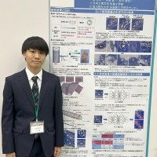

# 0. 写真

***

# 1. 名前, 呼ばれ方, 役職

一宮 光悦(いちのみや こうえつ)です！

「みや」と呼ばれています！「みやくん」と読んでください！インターンです！

***

# 2. 経歴

学歴

都立六本木高校→日本工業大学先進工学部情報メディア工学科所属

職歴

研究のお手伝い数回

***

# 3. 強み

- 忍耐力

    - 決めた目標が達成できるまで忍耐強く取り組むことができます！

- 研究経験

    - 学部１年生から病理画像の研究活動をしています。学部２年生の時に電気学会U-21学生研究発表会「優秀賞」を受賞しました！

***

# 4. 弱み

- 朝が弱い

    - 朝はあまりやる気が起きないので、お昼くらいから本腰をいれていきます。

***

# 5. 趣味など

ゲームが大好きです！特にFPSというジャンルを遊んでいます(FPS歴７年)と寝ることが大好きです！
