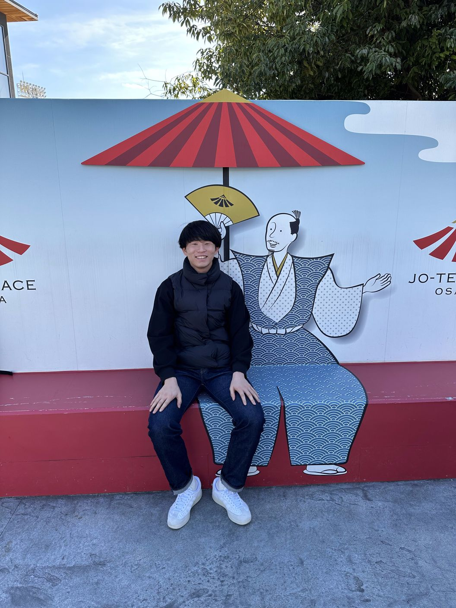

# 0. 写真

***

# 1. 名前, 呼ばれ方, 役職

中原律樹（なかはらりつき）です！「りつき」と呼ばれています！データサイエンス領域を担当する予定です！

***

# 2. 経歴

学歴

東北学院高校（宮城）　→　電気通信大学（2021年入学→2025年院進予定）

職歴

コンビニ2年　→　塾講2年

***

# 3. 強み

- 計画性

    - 何事もコツコツやっていくタイプなので、締め切り前に焦ってやるようなことはあまりないです

- 体力

    - ずっと体育会系だったので、ハードワークできます！

***

# 4. 弱み

- 臨機応変に対応する力

    - 想定外のことを聞かれたりすると、かたまってしまうことがあります

- 口数が少ない

    - あまり喋らない方かもしれません！

***

# 5. 趣味など

サッカー、ラジオです！

サッカーは小3から大3までやってました！

ラジオは霜降りとオードリーのオールナイトニッポンをよく聞いてます！