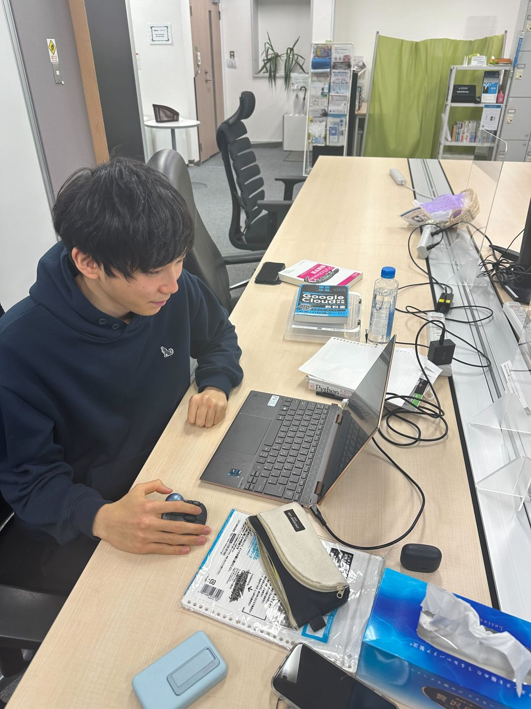

# 0. 写真

***

# 1. 名前, 呼ばれ方, 役職

初澤正悠(はつざわ　まさはる)です．

呼ばれかたは，「はつ」　です

データ基盤を担当してます！！！

***

# 2. 経歴

学歴

土浦日本大学高等学校卒業

芝浦工業大学入学

***

# 3. 強み

- 習慣づけて，続けること

    - 1つのことを，飽きることなく続けることができます．

***

# 4. 弱み

- 理解力

    - 初めて扱うことなどは，少し理解に時間がかかってしまいます．

***

# 5. 趣味など

サッカー観戦，映画をよく見ます！！