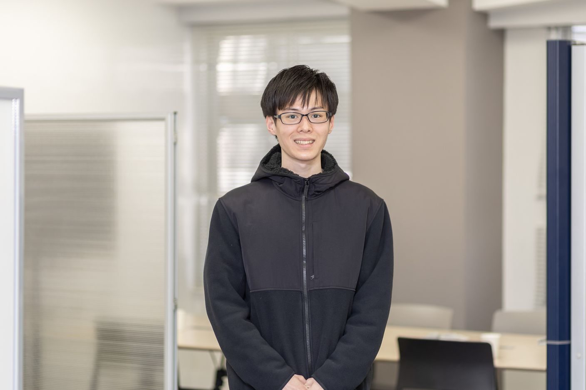

# 0. 写真

***

# 1. 名前, 呼ばれ方, 役職

宮川 大輝(みやかわ はるき)です。インターン1期生です！

***

# 2. 経歴

学歴

埼玉県立春日部東高校→日本工業大学先進工学部情報メディア工学科所属

 

職歴

塾講師・コンビニクルーのアルバイトを経験(2021年7月から)

データ分析のアルバイト(2023年3月)

***

# 3. 強み

- 熱意

    - エンジニアとして成長するために意欲・熱意をもって日々を過ごしています。

- 優先順位を決めて一点突破

    - 優先順位を立てて１つひとつタスクを終わらせることで、大学の授業と週7のアルバイトを両立させます。

- 周りを見ながら行動可能

    - 塾講師の経験から周りの反応を見ながら対応を変えるスキルを身につけました。

- 論理的思考に抵抗がない

    - 数学やアルゴリズムを考えることに苦痛が少ないです。

***

# 4. 弱み

- ストレス耐性があまりない

    - 怒られるとブルーになってしまいます。しかし、壁にぶち当たったときこそ成長するための試練だと考えることを意識し、向き合うようにしています。

- マルチタスクが苦手

    - 同時複数のことに集中するタイプではないです。エッセンシャル思考を意識しています。

- 実務経験が乏しい

    - これからどんどん実務経験を増やしていきたいです。

- 人混みに弱い

    - 人口密度が高いところにいると体調を崩します。

***

# 5. 趣味など

ソフトテニス・パズルゲーム・競技プログラミング