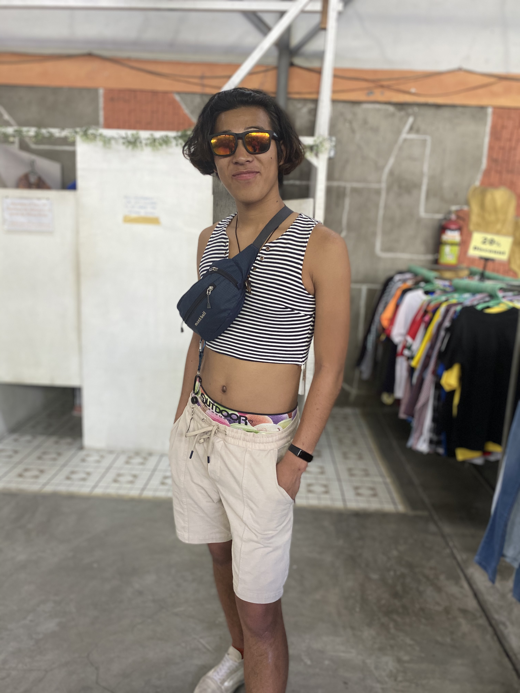
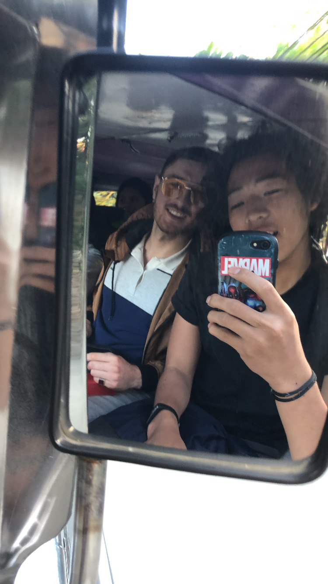
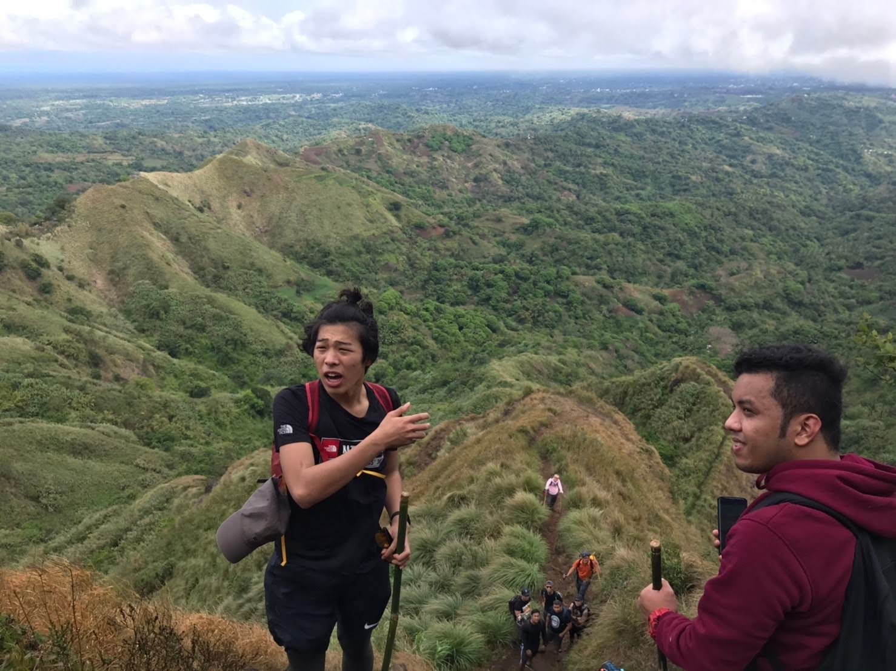

# 0. 写真

***

# 1. 名前, 呼ばれ方, 役職

岸本　桂(岸本 桂)です！「kk」と呼ばれています！岸本、けい、kk、キー、など呼んでいただければと思います。
インフラエンジニアをやっています！

***

# 2. 経歴

学歴

神戸市立科学技術高等学校（機械工学科）→関西国際大学（英語コミュニケーション学部）

職歴

高校
ホテルのウェイター、万葉クラブのホールスタッフ

大学
飲食店（お好み焼き、スペイン料理）、コストコ、テレアポ（Google Map店内バージョン導入、電気会社変更のテレアポ）、デリバリー兼キッチン

社会人
クラウドエース

***

# 3. 強み

- 継続力

    - サッカーを9年間継続、成績最悪の英語の克服（TOEIC 345 -> 835）、日経新聞の毎日読み続け（3年目）

- 情報収集

    - 主に国際関係、IT業界、株式関連、経済の情報を収集しています。深堀があまりできていないとこが課題（朝読むだけでも1hかかるため）

- やる気

    - 何もせず寝たことがない。チャンスがあればいつでも飛び込める準備を。

- 巻き込み

    - 今まで、サッカーでの活動、ゼミでの活動で巻き込んだ経験がよくある。難しかった時もあったが、最後までやり遂げることができた。

***

# 4. 弱み

- 理解の深さ

    - 一つのことに対して、深く理解するのに時間がかかる。幅広く浅くの知識が多い。

- 発信能力

    - 外部への発信がまだまだできていない。

- チェンジを求める情熱

    - チャレンジ and チェンジ。中学の理科の先生にいただいた言葉。社会人になってからの弱み。もっとチャレンジして、チェンジしていきたい。

***

# 5. 趣味など

サッカー、マリンスポーツ、美味しいご飯を食べること、チョコザップで清めるなどが大好きです。
以下、写真です。

