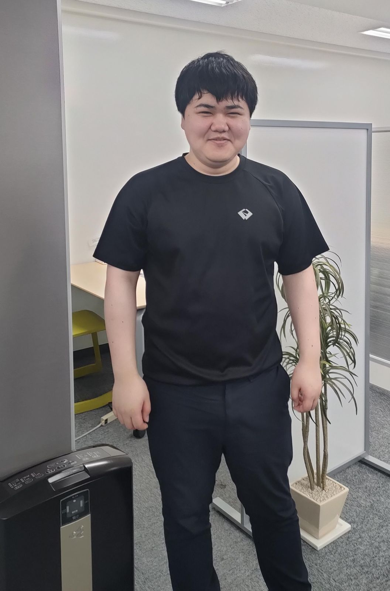

# 0. 写真

***

# 1. 名前, 呼ばれ方, 役職

川﨑広大(かわさきこうだい)です！「こうだい」と呼ばれています！気軽にこうだいと読んでください．

大学では画像処理と深層学習を研究しており，現在は画像処理を主にやってます！

***

# 2. 経歴

学歴

つくば工科高校→日本工業大学先進工学部データサイエンス学科

職歴

高校の時に飲食店バイト→大学の時に塾講師，研究の手伝いのバイト→pantarhei

***

# 3. 強み

- 画像処理による研究力

    - 研究会や学会でたくさん発表しており，電気学会u-21で優秀賞を取ったりしました．また，一度集中すると１日中作業をしてしまいます．

- コミュニケーション力

    - コミュニケーションは苦手ではなく，初対面は少し緊張しますが，すぐ話せるようになると思います．

- お酒の強さ

    - 好きなお酒は，日本酒ですが，ほかにもウィスキーやビールも好きでそれなりに飲めます．

- ボードゲームができる

    - 将棋やチェスなどがある程度でき，将棋では将棋ウォーズで２級です．

***

# 4. 弱み

- 説明力

    - 得られた結果や進捗をわかりやすく報告することが苦手です．現職の上司にも指摘されてるので直したいです．

- エンジンかかるまでに時間がかかる

    - 本腰を入れようとしてから2時間後くらいに本腰を入れ始めます．

***

# 5. 趣味など

将棋，アニメ，ゲーム(apex)です！！