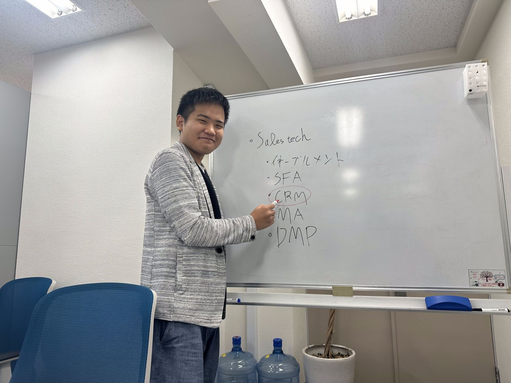

# 0. 写真

***

# 1. 名前, 呼ばれ方, 役職

板倉 和哉(いたくら かずや)です！「パウエル」と呼ばれています！パウエル、ぱうぱうなど「ぱう〇〇」みたいな感じで読んでください！インターンです！

***

# 2. 経歴

学歴

 

開智日本橋学園中学入学→開智日本橋学園高等学校進学→高１の時に中退→高校程度卒業認定試験合格→名城大学飛び級受験不合格→日本工業大学先進工学部情報メディア工学科所属

 

職歴

中退の後に知り合いの会社でバイト→大学時に焼肉屋でアルバイト

***

# 3. 強み

- モンスト

    - ７年以上プレイしています。天魔の孤城というイベントで初回制覇者0.4%の実力があります。

- コミュニケーション力

    - 新しい出会いや人とのつながりがすごい好きなタイプです。モンストの配信などもしていた過去がありコミュニケーションの輪は広いと思います。

***

# 4. 弱み

- 説明力

    - 得られた結果や進捗をわかりやすく報告することが苦手です。早口になる癖もあるのでもう１度言ってと言われることもあります。

- エンジンかかるまでに時間がかかる

    - やり始めて10分くらい経たないとエンジンがかからない。

- 経験があまりない

    - 学校の授業外でのプログラミングの経験があまりない。

***

# 5. 趣味など

ゲーム（モンスト、パズドラ）、麻雀、会話大好きです！！