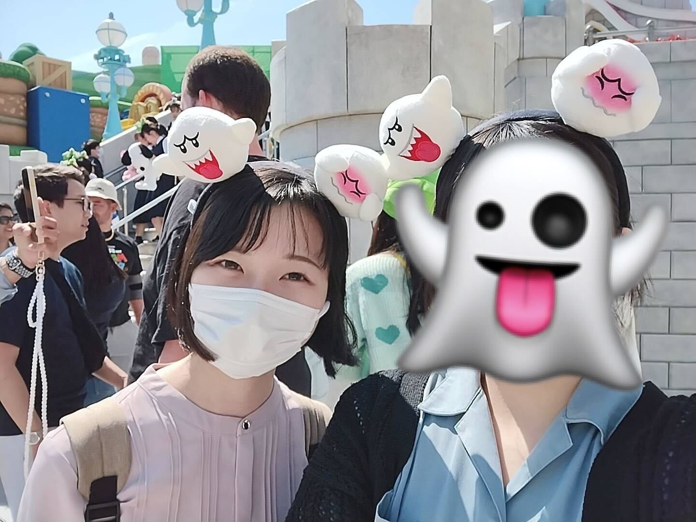

# 0. 写真

***

# 1. 名前, 呼ばれ方, 役職

藤堂 光(とうどう ひかり)です。「れあ」と呼ばれています！なんちゃってエンジニアです

***

# 2. 経歴

放送大学教養学部情報コース 4年

***

# 3. 強み

なし

***

# 4. 弱み

- 眠気
- 空腹
- 運動ムリ

***

# 5. 趣味など

ライブ、旅行 
最近PEOPLE1とマカロニえんぴつ推し。RADWIMPS歴長め
