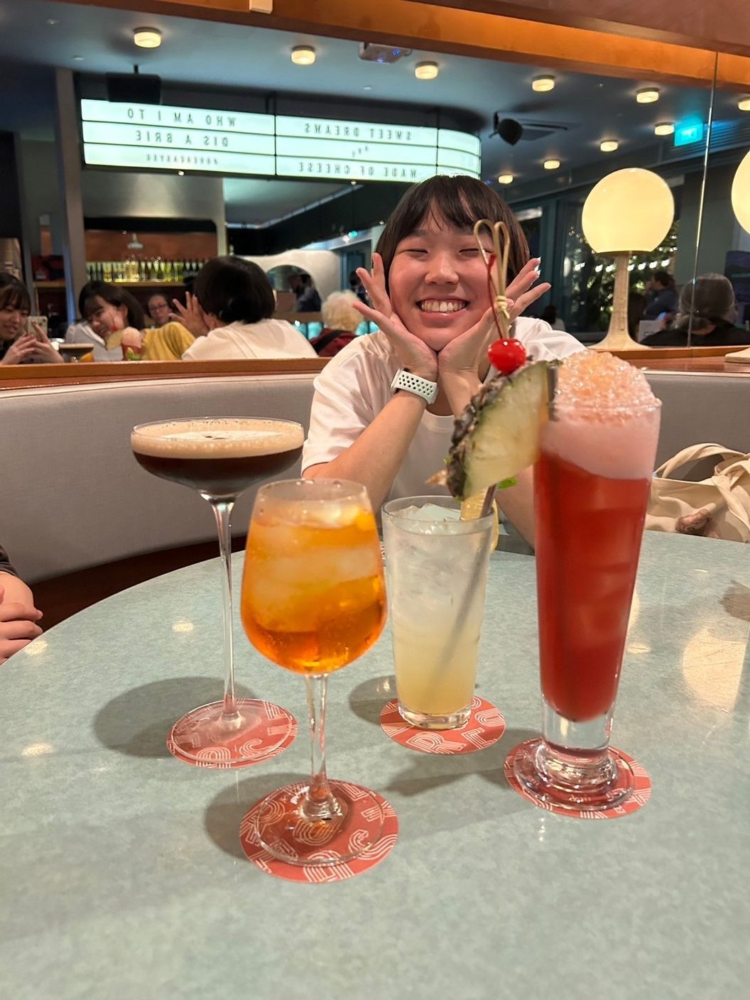

# 0. 写真

***

# 1. 名前, 呼ばれ方, 役職

高橋 音羽(たかはしおとわ)です！「おとわ」と呼ばれています！エンジニア目指しています！

***

# 2. 経歴

学歴

武蔵野女子学院高校→武蔵野大学データサイエンス学部データサイエンス学科所属

職歴

塾講師1年間→パンの販売

***

# 3. 強み

- 酒

    - ほとんどの酒飲めます

- コミュニケーション力

    - コミュ障ではありません

- 挑戦力

    - 国際学会に出たことあります。

***

# 4. 弱み

- 文章力

    - 国語は全体的に苦手

- 朝

    - 朝苦手

***

# 5. 趣味など

スポーツ観戦、料理