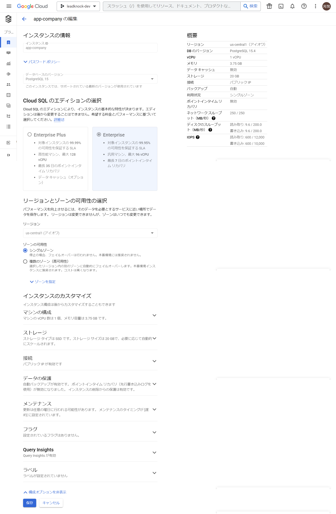
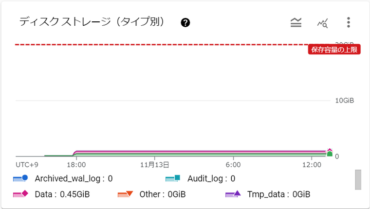
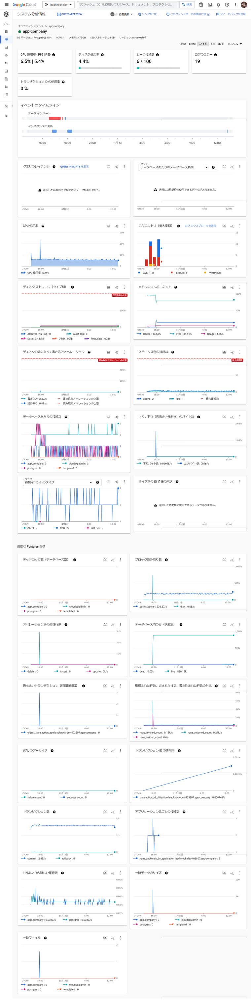

*   1 [0. 結論](#0.結論)
*   2 [1. 概要](#1.概要)
*   3 [2. 費用](#2.費用)
*   4 [3. 容量](#3.容量)
*   5 [4. ログ](#4.ログ)

# 0. 結論
**費用(為替レート：149.175円)**
|      | 日    | 月     | 年      |
| ---- | ----- | ------ | ------- |
| 費用 | 114円 | 3,420円 | 41,040円 |

**容量**

0.45GiB

# 1. 概要

**インスタンの情報**

# 2. 費用

| 日 | 月  | 年   | 
| ---- | ------- | ------- |
| 114円   | 3,420円 | 41,040円 |

# 3. 容量

0.45GiB

# 4. ログ

確認：2023/11/13 13:18

