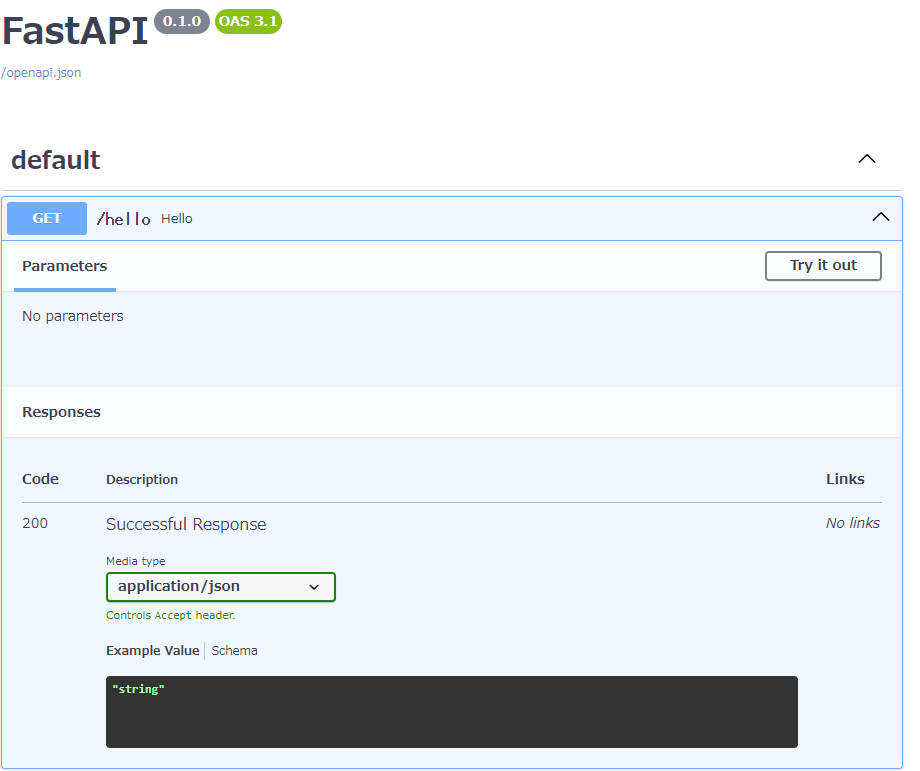
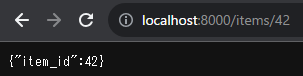
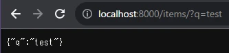
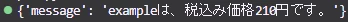

- [0. 結論](#0-結論)
- [1. 概要](#1-概要)
- [2. FastAPIとは](#2-fastapiとは)
- [3. docker + Hello World!](#3-docker--hello-world)
  - [3.1. docker-compose関連ファイルの作成](#31-docker-compose関連ファイルの作成)
  - [3.2. イメージのビルド](#32-イメージのビルド)
  - [3.3. poetryによるPython環境のセットアップ](#33-poetryによるpython環境のセットアップ)
  - [3.4. FastAPIのインストール](#34-fastapiのインストール)
  - [3.5. Hello World!](#35-hello-world)
- [4. パスパラメータ](#4-パスパラメータ)
  - [4.1. パスパラメータの基本的な使用例](#41-パスパラメータの基本的な使用例)
- [5. クエリパラメータ](#5-クエリパラメータ)
  - [5.1. クエリパラメータの基本的な使用例](#51-クエリパラメータの基本的な使用例)
  - [5.2. オプションのクエリパラメータ](#52-オプションのクエリパラメータ)
  - [5.3. 複数のクエリパラメータの受け取り](#53-複数のクエリパラメータの受け取り)
- [6. リクエストボディ](#6-リクエストボディ)
  - [6.1. リクエストボディの基本的な使用例](#61-リクエストボディの基本的な使用例)
- [7. レスポンスボディ](#7-レスポンスボディ)
  - [7.1. レスポンスモデルの基本的な使用例](#71-レスポンスモデルの基本的な使用例)
- [8. リクエストボディとレスポンスモデルの違い](#8-リクエストボディとレスポンスモデルの違い)
  - [8.1. リクエストボディの処理](#81-リクエストボディの処理)
  - [8.2. レスポンスモデルの指定](#82-レスポンスモデルの指定)
- [9. 参考](#9-参考)


  

# 0. 結論
FastAPIちょっとわかるになった

あと、Swagger UI便利

# 1. 概要
[INTERN-110: FastAPIの基礎的な学習完了](https://pantarhei-hub.atlassian.net/browse/INTERN-110)
 

# 2. FastAPIとは
PythonでかけるWebフレームワーク

・リクエストとレスポンスのスキーマ定義に合わせて自動的にSwagger UIのドキュメントが生成される

・上記のスキーマを明示的に定義することにより、型安全な開発が可能

・ASGIに対応しているので、非同期処理を行うことができ、高速

# 3. docker + Hello World!
## 3.1. docker-compose関連ファイルの作成

`docker-compose.yaml`
```
version: '3'
services:
  demo-app:
    build: .
    volumes:
      - .dockervenv:/src/.venv
      - .:/src
    ports:
      - 8000:8000  # ホストマシンのポート8000を、docker内のポート8000に接続する
```
`Dockerfile`
```
# python3.11のイメージをダウンロード
FROM python:3.11-buster
ENV PYTHONUNBUFFERED=1

WORKDIR /src

# pipを使ってpoetryをインストール
RUN pip install poetry

# poetryの定義ファイルをコピー (存在する場合)
COPY pyproject.toml* poetry.lock* ./

# poetryでライブラリをインストール (pyproject.tomlが既にある場合)
RUN poetry config virtualenvs.in-project true
RUN if [ -f pyproject.toml ]; then poetry install --no-root; fi

# uvicornのサーバーを立ち上げる
ENTRYPOINT ["poetry", "run", "uvicorn", "api.main:app", "--host", "0.0.0.0", "--reload"]
```
## 3.2. イメージのビルド
```
$ docker-compose build
```
## 3.3. poetryによるPython環境のセットアップ
```
$ docker-compose run --entrypoint "poetry init --name leadnock-api --dependency fastapi --dependency uvicorn[standard] --dependency sqlalchemy --dependency 'cloud-sql-python-connector[pg8000]'" leadknock-api
```
Authorのパートのみ `n` の入力

## 3.4. FastAPIのインストール
```
$ docker-compose run --entrypoint "poetry install --no-root" demo-app
```
新しいPythonパッケージを追加した場合などは以下のようにイメージを再ビルド
```
$ docker-compose build --no-cache
```

## 3.5. Hello World!
```
from fastapi import FastAPI
app = FastAPI()
@app.get("/hello")
async def hello():
    return {"message": "hello world!"}
```
localhostにアクセスすると



上記のような**Swagger UI**が生成される

# 4. パスパラメータ
FastAPIでは、パスパラメータを使用して、URLの一部を変数として取得できる。

## 4.1. パスパラメータの基本的な使用例
```
from fastapi import FastAPI
app = FastAPI()
@app.get("/items/{item_id}")
def read_item(item_id: int):
    return {"item_id": item_id}
```
上記の例では、`/items/{item_id}`というパスが定義されている。

`{item_id}`はパスパラメータであり、リクエストがこのエンドポイントに送信されると、FastAPIは自動的にその値を`item_id`として関数に渡します。

`/items/42`へのGETリクエストは`{"item_id": 42}`というレスポンスを返す。



# 5. クエリパラメータ
クエリパラメータは、URLのクエリ文字列を使用してデータをサーバーに送信する方法です。FastAPIでは、クエリパラメータを関数の引数として受け取ることができます。以下に、FastAPIでクエリパラメータを利用する方法の詳細を示します。

## 5.1. クエリパラメータの基本的な使用例
```
from fastapi import FastAPI
app = FastAPI()
@app.get("/items/")
def read_item(q: str):
    return {"q": q}
```
上記の例では、`/items/`エンドポイントにGETリクエストが送信された際に、`q`というクエリパラメータを受け取り、その値を含むレスポンスを返す。

例えば、`/items/?q=test`に対するリクエストは` {"q": "test"} `を返す。



## 5.2. オプションのクエリパラメータ

クエリパラメータは通常、必須のものとして扱われるが、オプションのクエリパラメータも指定できる。これを行うには、引数にデフォルト値を指定する。
```
from fastapi import FastAPI
app = FastAPI()
@app.get("/items/")
def read_item(q: str = None):
    return {"q": q}
```
上記の例では、`q`がオプションのクエリパラメータとなり、クライアントが提供しない場合は`None`がデフォルト値として使用される。

## 5.3. 複数のクエリパラメータの受け取り**
```
from fastapi import FastAPI
app = FastAPI()
@app.get("/items/")
def read_item(q: str = None, limit: int = 10):
    return {"q": q, "limit": limit}
```
上記の例では、`q`と`limit`という2つのクエリパラメータを受け取る。


# 6. リクエストボディ
リクエストボディは、HTTPリクエストの一部としてデータをサーバーに送信するためのメカニズムです。FastAPIでは、リクエストボディのデータを取得するために、Pydanticモデルを使用することが一般的です。以下に、リクエストボディの処理について詳しく説明します。

## 6.1. リクエストボディの基本的な使用例
```
from typing import Union
from fastapi import FastAPI
from pydantic import BaseModel

class Item(BaseModel):
    name: str
    description: Union[str, None] = None
    price: int
    tax: Union[float, None] = None

@app.post("/items/")
async def create_item(item: Item):
    return {"message": f"{item.name}は、税込み価格{int(item.price*item.tax)}円です。"}
```
上記の例では、`Item`というモデルを作成し、それを引数として持つ関数が`/items/`エンドポイントにPOSTリクエストを受け付ける。

`Union`ってなんぞ・・・2つの型が代入される可能性があることを明示できる。(これがないとエラー)

`Optional`って書き方でもいいみたい・・・`Optional[str] = None`

API叩いて確認
```
import requests

url = "http://localhost:8000/items/"
payload = {"name": "example", "description": "test", "price": 42.0, "tax": 5.0}
headers = {"Content-Type": "application/json", "accept": "application/json"}

response = requests.post(url, json=payload, headers=headers)
print(response.json())
```


# 7. レスポンスボディ

FastAPIでは、エンドポイントが返すレスポンスの形式を指定するために、レスポンスモデルを使用でき、これにより、FastAPIはレスポンスを自動的に検証し、ドキュメントに表示することができる。

## 7.1. レスポンスモデルの基本的な使用例
```
from fastapi import FastAPI

app = FastAPI()

class ItemResponse(BaseModel):
    name: str
    description: Union[str, None] = None
    price: float

@app.post("/items/", response_model=ItemResponse)
async def create_item(item: ItemResponse):
    return item
```
上記の例では、ItemResponseというクラスを作成し、それをresponse_model引数としてcreate_item関数に指定している。これにより、create_item関数が返すデータがItemResponseモデルに準拠していることがFastAPIによって確認されます。

# 8. リクエストボディとレスポンスモデルの違い

リクエストボディとレスポンスモデルの違いが良くわからんからGPTに聞いてみた。

1. リクエストボディ

  ・**役割**: リクエストボディはクライアントからサーバーにデータを送信するために使用されます。

  ・**概要**: クライアントがエンドポイントにデータを送信するとき、そのデータは通常リクエストボディに含まれます。リクエストボディは、HTMLフォーム、JSONデータ、ファイルのアップロードなど、様々な形式でデータを受け取ることができます。

  ・**FastAPIでの処理**: リクエストボディのデータはPydanticモデルやBodyなどを使用して、エンドポイントの関数に渡され、データのバリデーションや変換が行われます。

2. レスポンスモデル

  ・**役割**: レスポンスモデルはサーバーからクライアントに返されるデータの形式を指定します。

  ・**概要**: エンドポイントが処理を実行し、クライアントにデータを返すとき、そのデータは通常レスポンスボディに含まれます。レスポンスモデルは、返されるデータの形式を指定し、FastAPIはこれを検証して適切な形式に変換します。

  ・**FastAPIでの処理**: レスポンスモデルは、エンドポイントの関数においてresponse_model引数を使用して指定され、FastAPIがデータを指定されたモデルに変換してクライアントに返します。

簡潔に言えば、リクエストボディはクライアントからのデータの形式を指定しサーバーに送信するためのものであり、レスポンスモデルはサーバーからクライアントに返されるデータの形式を指定する。

## 8.1. リクエストボディの処理

クライアントがデータを送信する場合：
```
from fastapi import FastAPI, HTTPException
from pydantic import BaseModel

app = FastAPI()

class Item(BaseModel):
    name: str
    description: Union[str, None] = None
    price: int
    tax: Union[float, None] = None

@app.post("/items/")
async def create_item(item: Item):
    # リクエストボディのデータをDBに登録する処理
    # 例えば、ORM（SQLAlchemyを使ったり）を利用してデータベースに登録する
    # ...

    # 登録が成功した場合はクライアントに成功レスポンスを返す
    return {"message": "Item created successfully"}
```
## 8.2. レスポンスモデルの指定

サーバーがデータをクライアントに返す場合：
```
from fastapi import FastAPI
from pydantic import BaseModel

app = FastAPI()

class ItemResponse(BaseModel):
    name: str
    description: Union[str, None] = None
    price: float

@app.get("/items/{item_id}", response_model=ItemResponse)
async def read_item(item_id: int):
    # データベースからアイテムを取得する処理
    # 例えば、ORM（SQLAlchemyを使ったり）を利用してデータベースからデータを取得する
    # ...

    # 取得したデータをレスポンスモデルに変換してクライアントに返す
    return {"name": "Example", "description": "Test", "price": 42.0}
```
なるほどなー

# 9. 参考
[チュートリアル - ユーザーガイド - FastAPI](https://fastapi.tiangolo.com/ja/tutorial/)

[fastAPI入門 - Qiita](https://qiita.com/mossan_hoshi/items/dea5742e46a979601140)

[FastAPI入門](https://zenn.dev/sh0nk/books/537bb028709ab9)

[FastAPIで学ぶPythonによるREST API開発の基本](https://zenn.dev/nameless_sn/articles/fastapi_tutorial_for_rest)

[Python の Union と Optional ってなに？ | 民主主義に乾杯](https://python.ms/union-and-optional/#_1-union-%E5%9E%8B)


