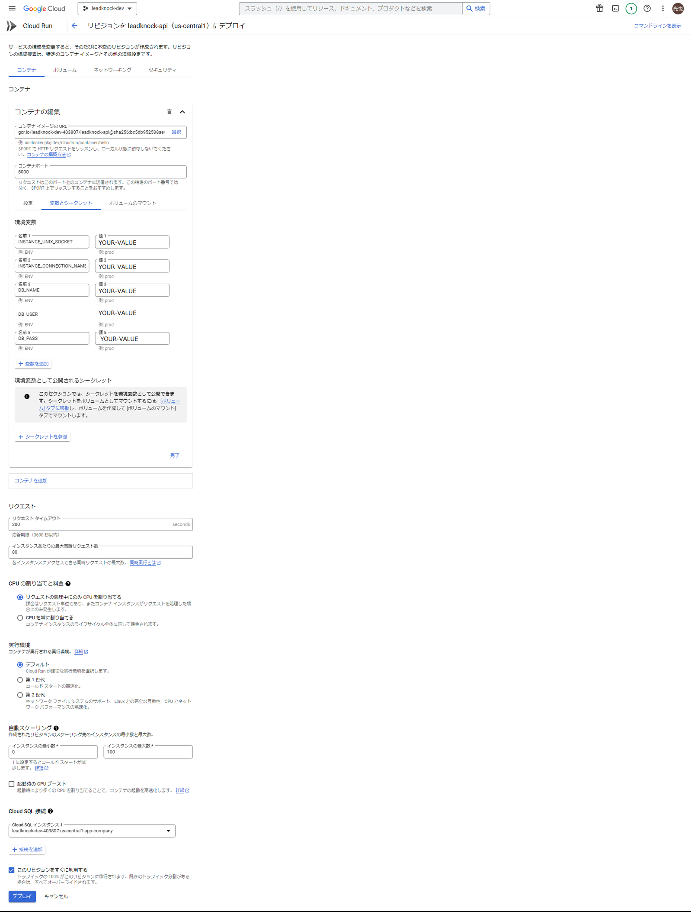
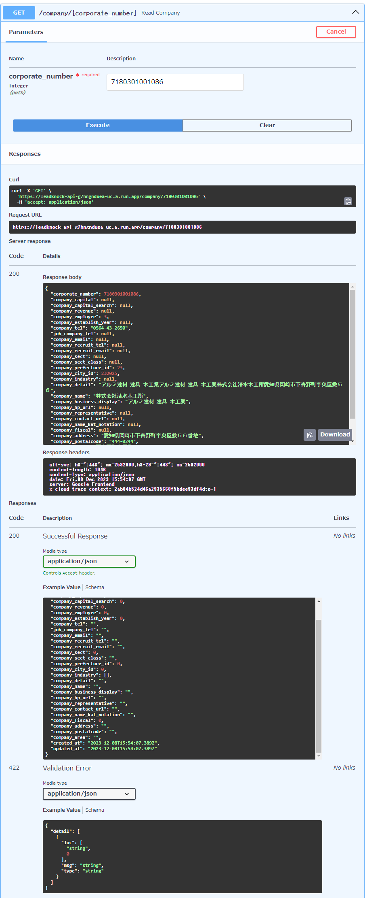

# 目次

- [0. 結論](#0-結論)
- [1. 概要](#1-概要)
- [2. プロジェクト・ファイル構成](#2-プロジェクト・ファイル構成)
  - [Docker関連](#docker関連)
    - [docker-compose.yaml](#docker-composeyaml)
    - [Dockerfile](#dockerfile)
    - [entrypoint.sh](#entrypointsh)
  - [コード関連](#コード関連)
    - [main.py](#mainpy)
    - [database.py](#databasepy)
    - [models.py](#modelspy)
    - [schemas.py](#schemaspy)
    - [crud.py](#crudpy)
- [3. Cloud Runの構築](#3-cloud-runの構築)
  - [gcloud CLI認証](#gcloud-cli認証)
  - [CLIにプロジェクトを設定](#cliにプロジェクトを設定)
  - [gcloud CLIでdockerコマンドの設定を行う](#gcloud-cliでdockerコマンドの設定を行う)
  - [dockerイメージのビルドとアップロード](#dockerイメージのビルドとアップロード)
    - [poetryファイルがない場合](#poetryファイルがない場合)
      - [イメージのビルド](#イメージのビルド)
      - [poetryによるPython環境のセットアップ](#poetryによるpython環境のセットアップ)
      - [パッケージのインストール](#パッケージのインストール)
    - [poetryファイルがある場合](#poetryファイルがある場合)
      - [dockerイメージのビルドとアップロード](#dockerイメージのビルドとアップロード-1)
      - [リポジトリにDockerイメージをpush](#リポジトリにdockerイメージをpush)
- [4. Cloud Runの設定](#4-cloud-runの設定)
- [5. Swagger UIでAPIを叩いてみる](#5-swagger-uiでapiを叩いてみる)
- [6. 実装で詰まった箇所](#6-実装で詰まった箇所)
  - [ADC 認証](#adc-認証)
- [7. 参考](#7-参考)


# 0. 結論

[FastAPI - Swagger UI ](https://leadknock-api-g7hngnduea-uc.a.run.app/docs)

Cloud RunからCloud SQLのデータを引っ張れるようになった

Google Cloud 難しい

# 1. 概要
[INTERN-111: APIサーバとDBサーバの連携の仕方を学習する 完了](https://pantarhei-hub.atlassian.net/browse/INTERN-111)
 
# 2. プロジェクト・ファイル構成
```
.
├── .dockervenv
├── .venv
├── api
│   ├── __pycache__
│   ├── crud.py
│   ├── database.py
│   ├── main.py
│   ├── models.py
│   └── schemas.py
├── docker-compose.yaml
├── Dockerfile
├── Dockerfile.cloud
├── entrypoint.sh
├── key.json
├── poetry.lock
└── pyproject.toml
```
## Docker関連

### docker-compose.yaml
```
version: '3'
services:
  leadknock-api:
    build: .
    volumes:
      - ./key.json:/key.json:ro
      - .dockervenv:/src/.venv
      - .:/src
    ports:
      - 8000:8000  # ホストマシンのポート8000を、docker内のポート8000に接続する
    environment:
      - GOOGLE_APPLICATION_CREDENTIALS=/key.json　# 設定しないとコンテナからSQLにアクセスできない
      - WATCHFILES_FORCE_POLLING=true  # 環境によってホットリロードのために必要
      - DB_USER= # e.g. 'my-db-user'
      - DB_PASS= # e.g. 'my-db-user'
      - DB_NAME= # e.g. 'my-db-user'
      - INSTANCE_CONNECTION_NAME= # e.g. 'MY-PROJECT_ID:us-central1:MY-DB-INSTANCE'
```
### Dockerfile
```
# python3.11のイメージをダウンロード
FROM python:3.11-buster
# pythonの出力表示をDocker用に調整
ENV PYTHONUNBUFFERED=1

WORKDIR /src

# pipを使ってpoetryをインストール
RUN pip install poetry

# poetryの定義ファイルをコピー (存在する場合)
COPY pyproject.toml* poetry.lock* ./

# デプロイに必要
COPY api api
COPY entrypoint.sh ./

# poetryでライブラリをインストール (pyproject.tomlが既にある場合)
RUN poetry config virtualenvs.in-project true
RUN if [ -f pyproject.toml ]; then poetry install --no-root; fi

# uvicornのサーバーを立ち上げる
ENTRYPOINT ["bash", "entrypoint.sh"]
```
### entrypoint.py
```
#!/bin/bash

# uvicornのサーバーを立ち上げる
poetry run uvicorn api.main:app --host 0.0.0.0 --reload
```

## コード関連

### main.py
```
from fastapi import FastAPI, HTTPException, Depends, Query
from sqlalchemy.orm import Session
from api.database import get_db
import api.crud as crud
import api.schemas as schemas
from fastapi.middleware.cors import CORSMiddleware

from typing import List

app = FastAPI()
app.add_middleware(
    CORSMiddleware,
    allow_origins=["*"],
    allow_credentials=True,
    allow_methods=["*"],
    allow_headers=["*"],
)

# Test
@app.get("/")
async def hello():
    return {"message": "hello world"}

@app.get("/company/{corporate_number}", response_model=schemas.Company)
async def read_company(corporate_number: int, db: Session = Depends(get_db)):
    db_company = crud.get_company(db, corporate_number)
    if db_company is None:
        raise HTTPException(status_code=404, detail="Company not found")
    return db_company
```
### database.py
```
import os
from google.cloud.sql.connector import Connector, IPTypes
import pg8000
from sqlalchemy.orm import sessionmaker
from sqlalchemy.ext.declarative import declarative_base
import sqlalchemy

# 環境変数から接続情報を取得

# 環境変数の取得
db_instance_connection_name = os.environ["INSTANCE_CONNECTION_NAME"]
db_user = os.environ["DB_USER"]  # e.g. 'my-db-user'
db_pass = os.environ["DB_PASS"]  # e.g. 'my-db-password'
db_name = os.environ["DB_NAME"]  # e.g. 'my-database'
ip_type = IPTypes.PUBLIC

connector = Connector()
def getconn() -> pg8000.dbapi.Connection:
    conn: pg8000.dbapi.Connection = connector.connect(
        db_instance_connection_name,
        "pg8000",
        user=db_user,
        password=db_pass,
        db=db_name,
        ip_type=ip_type,
    )
    return conn

# The Cloud SQL Python Connector can be used with SQLAlchemy
# using the 'creator' argument to 'create_engine'
pool = sqlalchemy.create_engine(
    "postgresql+pg8000://",
    creator=getconn,
    # ...
)

# SessionLocalという名前のデータベースセッションクラスを作成
SessionLocal = sessionmaker(autocommit=False, autoflush=False, bind=pool)

# SQLAlchemyベースモデルを作成
Base = declarative_base()

# データベースセッションを取得するためのヘルパー関数を定義
def get_db():
    db = SessionLocal()
    try:
        yield db
    finally:
        db.close()
```

### models.py
```
from sqlalchemy import Column, Integer, BigInteger, Text, TIMESTAMP, ARRAY
from api.database import Base

class Company(Base):
    __tablename__ = "app_company"

    corporate_number = Column(BigInteger, primary_key=True, index=True)
    company_capital = Column(Integer)
    company_capital_search = Column(Integer)
    company_revenue = Column(Integer)
    company_employee = Column(Integer)
    company_establish_year = Column(Integer)
    company_tel = Column(Text)
    job_company_tel = Column(Text)
    company_email = Column(Text)
    company_recruit_tel = Column(Text)
    company_recruit_email = Column(Text)
    company_sect = Column(Integer)
    company_sect_class = Column(Text)
    company_prefecture_id = Column(Integer)
    company_city_id = Column(Integer)
    company_industry = Column(ARRAY(Integer))
    company_detail = Column(Text)
    company_name = Column(Text)
    company_business_display = Column(Text)
    company_hp_url = Column(Text)
    company_representative = Column(Text)
    company_contact_url = Column(Text)
    company_name_kat_notation = Column(Text)
    company_fiscal = Column(Integer)
    company_address = Column(Text)
    company_postalcode = Column(Text)
    company_area = Column(Text)
    created_at = Column(TIMESTAMP(timezone=True), server_default="now()")
    updated_at = Column(TIMESTAMP(timezone=True), server_default="now()", onupdate="now()")
```
### schemas.py
```
from pydantic import BaseModel
from typing import List, Optional
from datetime import datetime

class CompanyBase(BaseModel):
    corporate_number: int
    company_capital: Optional[int] = 0
    company_capital_search: Optional[int] = 0
    company_revenue: Optional[int] = 0
    company_employee: Optional[int] = 0
    company_establish_year: Optional[int] = 0
    company_tel: Optional[str] = ""
    job_company_tel: Optional[str] = ""
    company_email: Optional[str] = ""
    company_recruit_tel: Optional[str] = ""
    company_recruit_email: Optional[str] = ""
    company_sect: Optional[int] = 0
    company_sect_class: Optional[str] = ""
    company_prefecture_id: Optional[int] = 0
    company_city_id: Optional[int] = 0
    company_industry: Optional[List[int]] = []
    company_detail: Optional[str] = ""
    company_name: Optional[str] = ""
    company_business_display: Optional[str] = ""
    company_hp_url: Optional[str] = ""
    company_representative: Optional[str] = ""
    company_contact_url: Optional[str] = ""
    company_name_kat_notation: Optional[str] = ""
    company_fiscal: Optional[int] = 0
    company_address: Optional[str] = ""
    company_postalcode: Optional[str] = ""
    company_area: Optional[str] = ""

class CompanyCreate(CompanyBase):
    pass

class Company(CompanyBase):
    created_at: datetime
    updated_at: datetime

    class Config:
        orm_mode = True
```
`Optional`でNullを許容しないとエラー吐く
`primary_key`ついてるやつ以外初期値を空にしないとエラー吐く？

### crud.py
```
from sqlalchemy.orm import Session
from api.models import Company

def get_company(db: Session, corporate_number: int):
    return db.query(Company).filter(Company.corporate_number == corporate_number).first()
```
# 3. Cloud Runの構築

## gcloud CLI認証
```
$ gcloud auth login
```
## CLIにプロジェクトを設定
```
$ gcloud config set project {GCPのプロジェクトID}
```
以下のように返ってくれば成功

`Updated property [core/project].`

## gcloud CLIでdockerコマンドの設定を行う
```
$ gcloud auth configure-docker
```
確認がでたら`Y`を入力

## dockerイメージのビルドとアップロード
### poetryファイルがない場合
#### イメージのビルド
```
$ docker compose build
```
#### poetryによるPython環境のセットアップ
```
$ docker compose run --entrypoint "poetry init --name leadnock-api --dependency fastapi --dependency uvicorn[standard] --dependency sqlalchemy --dependency "cloud-sql-python-connector[pg8000]"" leadknock-api
```
Authorのパートのみ` n `の入力

#### パッケージのインストール
```
$ docker compose run --entrypoint "poetry install --no-root" leadknock-api
```
新しいPythonパッケージを追加した場合などは以下のようにイメージを再ビルド
```
$ docker compose build --no-cache
```
### poetryファイルがある場合
#### dockerイメージのビルドとアップロード
```
$ docker build -t gcr.io/{GCPのプロジェクトID}/{Dockerのサービス名}:latest --platform linux/amd64 -f Dockerfile.cloud .
```
#### リポジトリにDockerイメージをpush
```
$ docker push gcr.io/{GCPのプロジェクトID}/{Dockerのサービス名}:latest
```
ここでエラーが出る場合`Container Registry API`を有効にしたらいけるかも
以下のコマンドでイメージが正しくpushされたことを確認
```
$ gcloud container image list
```
自分の環境だとエラー吐くけど問題なかった

# 4. Cloud Runの設定



# 5. Swagger UIでAPIを叩いてみる
[FastAPI - Swagger UI ](https://leadknock-api-g7hngnduea-uc.a.run.app/docs)

DBに存在するcorporate_numberを入力
今回は`7180301001086`



# 6. 実装で詰まった箇所
## ADC 認証

ローカル環境だと`gcloud auth application-default login`で認証できるがDockerだとできなかった

[アプリケーションのデフォルト認証情報を設定する  |  Authentication  |  Google Cloud ](https://cloud.google.com/docs/authentication/provide-credentials-adc?hl=ja#how-to)

グーグルさんによるとサービス アカウント キーとやらを作ればいいらしい

[クライアント ライブラリを使用して認証する  |  Authentication  |  Google Cloud ](https://cloud.google.com/docs/authentication/client-libraries?hl=ja)

これを参考に作ってみた
説明にはowner権限与えろって書いてあったけどCloud SQL クライアンとを付与した


サービスアカウントの使い方はこのサイトを参考にした

[Docker 開発環境の中から GCP サービスへの認証を通すかんたんなやり方 - Qiita ](https://qiita.com/castaneai/items/1a5c02c3031ef394b33e)

# 6. 参考

[Cloud RunからCloud SQLに接続する ](https://zenn.dev/kthrlab_blog/articles/9b7edc3786a844)

[Docker 開発環境の中から GCP サービスへの認証を通すかんたんなやり方 - Qiita ](https://qiita.com/castaneai/items/1a5c02c3031ef394b33e)

[FastAPI｜DB接続してCRUDするPython製APIサーバーを構築 - Qiita ](https://qiita.com/mtitg/items/47770e9a562dd150631d)

[クイックスタート: Cloud Run から Cloud SQL for MySQL に接続する  |  Google Cloud ](https://cloud.google.com/sql/docs/mysql/connect-instance-cloud-run?hl=ja)

[アプリケーションのデフォルト認証情報を設定する  |  Authentication  |  Google Cloud ](https://cloud.google.com/docs/authentication/provide-credentials-adc?hl=ja#how-to)

[クライアント ライブラリを使用して認証する  |  Authentication  |  Google Cloud ](https://cloud.google.com/docs/authentication/getting-started?hl=ja)

[GitHub - GoogleCloudPlatform/cloud-sql-python-connector: A Python library for connecting securely to your Cloud SQL instances. ](https://github.com/GoogleCloudPlatform/cloud-sql-python-connector)

