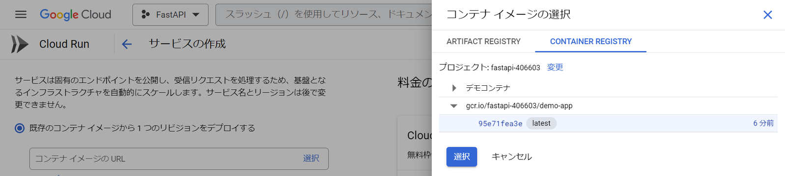
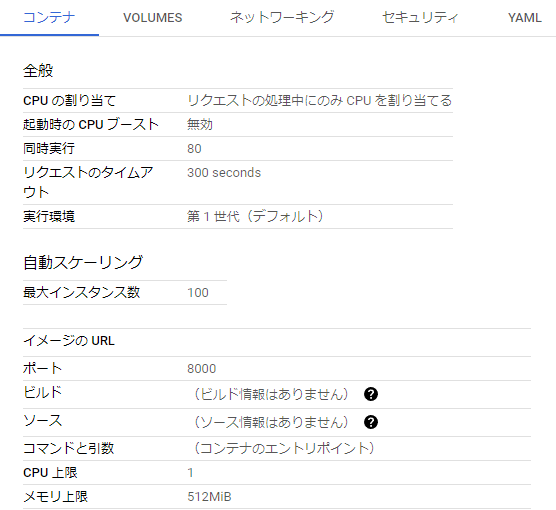

# 目次

- [0. 結論](#0-結論)
- [1. 概要](#1-概要)
- [2. デプロイするAPI](#2-デプロイするapi)
  - [単一のクエリパラメータ](#単一のクエリパラメータ)
  - [オプションのクエリパラメータ](#オプションのクエリパラメータ)
  - [複数のクエリパラメータ](#複数のクエリパラメータ)
  - [リクエストボディ](#リクエストボディ)
  - [レスポンスモデル](#レスポンスモデル)
  - [全部くっつけたやつ](#全部くっつけたやつ)
- [3. Cloud Runの構築](#3-cloud-runの構築)
  - [docker-compose関連ファイルの作成](#docker-compose関連ファイルの作成)
  - [gcloud CLI認証](#gcloud-cli認証)
  - [CLIにプロジェクトを設定](#cliにプロジェクトを設定)
  - [gcloud CLIでdockerコマンドの設定を行う](#gcloud-cliでdockerコマンドの設定を行う)
  - [dockerイメージのビルドとアップロード](#dockerイメージのビルドとアップロード)
  - [リポジトリにDockerイメージをpush](#リポジトリにdockerイメージをpush)
- [4. Cloud Runの設定と起動](#4-cloud-runの設定と起動)
- [5. APIを叩いてみる](#5-apiを叩いてみる)


# 0. 結論
デプロイできた↓

[FastAPI - Swagger UI](https://demo-app-4foucacvfa-uc.a.run.app/docs#)

# 1. 概要 
 [INTERN-112: FastAPIのコンテナをCloud Runにデプロイ完了](https://remotesalesproject.atlassian.net/browse/INTERN-112)
 
# 2. デプロイするAPI
## 単一のクエリパラメータ
```
from fastapi import FastAPI

app = FastAPI()

@app.get("/get_items/")
def read_item(q: str):
    return {"q": q}
```
## オプションのクエリパラメータ
```
from fastapi import FastAPI

app = FastAPI()

@app.get("/get_items_option/")
def read_item(q: str = None):
    return {"q": q}
```
## 複数のクエリパラメータ
```
from fastapi import FastAPI

app = FastAPI()

@app.get("/get_items_multiple/")
def read_item(q: str = None, limit: int = 10):
    return {"q": q, "limit": limit}
```
## リクエストボディ
```
from typing import Union
from fastapi import FastAPI
from pydantic import BaseModel

class Item(BaseModel):
    name: str
    description: Union[str, None] = None
    price: int
    tax: Union[float, None] = None

@app.post("/post_items/")
async def create_item(item: Item):
    return {"message": f"{item.name}は、税込み価格{int(item.price*item.tax)}円です。"}
```
## レスポンスモデル
```
from fastapi import FastAPI

app = FastAPI()

class ItemResponse(BaseModel):
    name: str
    description: Union[str, None] = None
    price: float

@app.post("/items_response/", response_model=ItemResponse)
async def create_item_response(item: ItemResponse):
    return item
```

各々の詳細な説明は[INTERN-110 FastAPIの基礎的な学習](https://github.com/PantaRhei-Developer/WIKI-PantaRhei/blob/main/WorkMemo/INTERN-110%20FastAPI%E3%81%AE%E5%9F%BA%E7%A4%8E%E7%9A%84%E3%81%AA%E5%AD%A6%E7%BF%92.md) を参照

## 全部くっつけたやつ
```
from typing import Union
from fastapi import FastAPI
from pydantic import BaseModel
from fastapi.middleware.cors import CORSMiddleware

app = FastAPI()
app.add_middleware(
    CORSMiddleware,
    allow_origins=["*"],
    allow_credentials=True,
    allow_methods=["*"],
    allow_headers=["*"],
)

@app.get("/")
def hello():
    return {"message" "Hello World!"}

@app.get("/get_items/")
def read_item(q: str):
    return {"q": q}

@app.get("/get_items_option/")
def read_item(q: str = None):
    return {"q": q}

@app.get("/get_items_multiple/")
def read_item(q: str = None, limit: int = 10):
    return {"q": q, "limit": limit}

class Item(BaseModel):
    name: str
    description: Union[str, None] = None
    price: int
    tax: Union[float, None] = None

@app.post("/post_items/")
async def create_item(item: Item):
    return {"message": f"{item.name}は、税込み価格{int(item.price*item.tax)}円です。"}

class ItemResponse(BaseModel):
    name: str
    description: Union[str, None] = None
    price: float

@app.post("/items_response/", response_model=ItemResponse)
async def create_item_response(item: ItemResponse):
    return item
```
# 3. Cloud Runの構築
## docker-compose関連ファイルの作成

`docker-compose.yaml`

```
version: '3'
services:
  demo-app:
    build: .
    volumes:
      - .dockervenv:/src/.venv
      - .:/src
    ports:
      - 8000:8000  # ホストマシンのポート8000を、docker内のポート8000に接続する
    environment:
      - WATCHFILES_FORCE_POLLING=true # 環境によってホットリロードのために必要
```

`Dockerfile.cloud`

```
# python3.11のイメージをダウンロード
FROM python:3.11-buster
# pythonの出力表示をDocker用に調整
ENV PYTHONUNBUFFERED=1

WORKDIR /src

# pipを使ってpoetryをインストール
RUN pip install poetry

# poetryの定義ファイルをコピー (存在する場合)
COPY pyproject.toml* poetry.lock* ./

# デプロイに必要
COPY api api
COPY entrypoint.sh ./

# poetryでライブラリをインストール (pyproject.tomlが既にある場合)
RUN poetry config virtualenvs.in-project true
RUN if [ -f pyproject.toml ]; then poetry install --no-root; fi

# uvicornのサーバーを立ち上げる
ENTRYPOINT ["bash", "entrypoint.sh"]
```

## gcloud CLI認証
```
$ gcloud auth login
```
## CLIにプロジェクトを設定
```
$ gcloud config set project {GCPのプロジェクトID}
```
以下のように返ってくれば成功

`Updated property [core/project].`

## gcloud CLIでdockerコマンドの設定を行う
```
$ gcloud auth configure-docker
```
確認できたら`Y`を入力

## dockerイメージのビルドとアップロード
```
$ docker build -t gcr.io/dataflow-337314/leadknock-api:latest --platform linux/amd64 -f Dockerfile.cloud .
```
## リポジトリにDockerイメージをpush
```
$ docker push gcr.io/dataflow-337314/leadknock-api:latest
```
ここでエラーが出る場合`Container Registry API`を有効にしたらいけるかも

以下のコマンドでイメージが正しくpushされたことを確認
```
$ gcloud container image list
```
# 4. Cloud Runの設定と起動



さっきpushしたコンテナを選択



オプションはこんな感じ

デプロイできた↓

[FastAPI - Swagger UI](https://demo-app-4foucacvfa-uc.a.run.app/docs#)

# 5. APIを叩いてみる
```
import requests

url = "https://demo-app-4foucacvfa-uc.a.run.app/post_items/"
payload = {"name": "example", "description": "test", "price": 42.0, "tax": 5.0}
headers = {"Content-Type": "application/json", "accept": "application/json"}

response = requests.post(url, json=payload, headers=headers)
print(response.json())
```


できた


