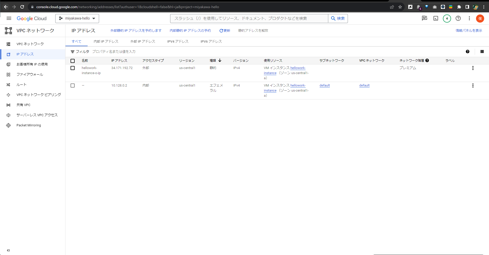
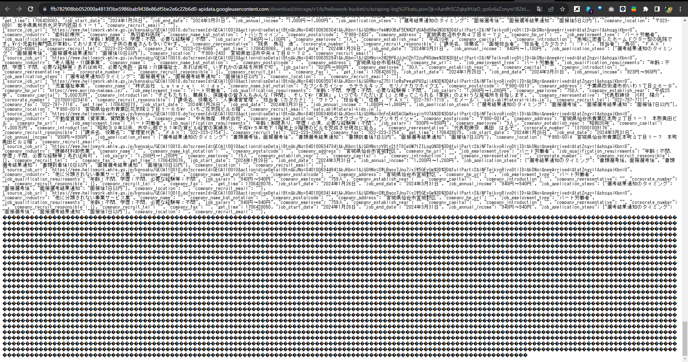
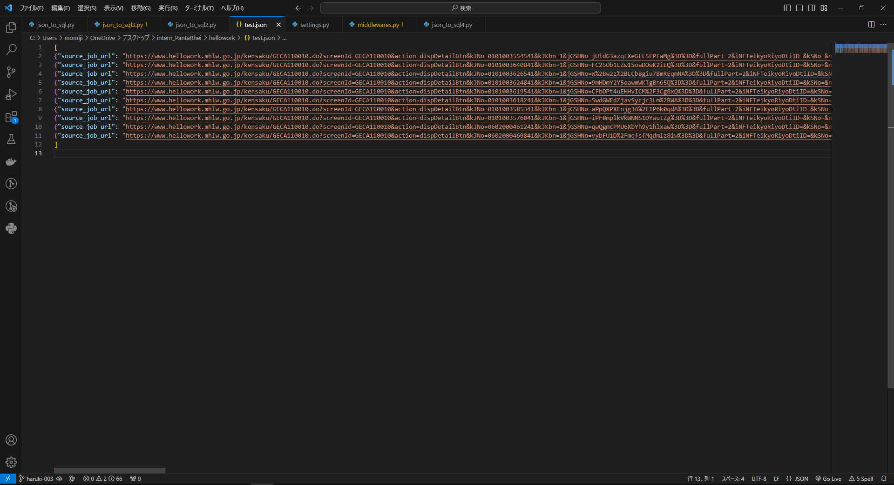
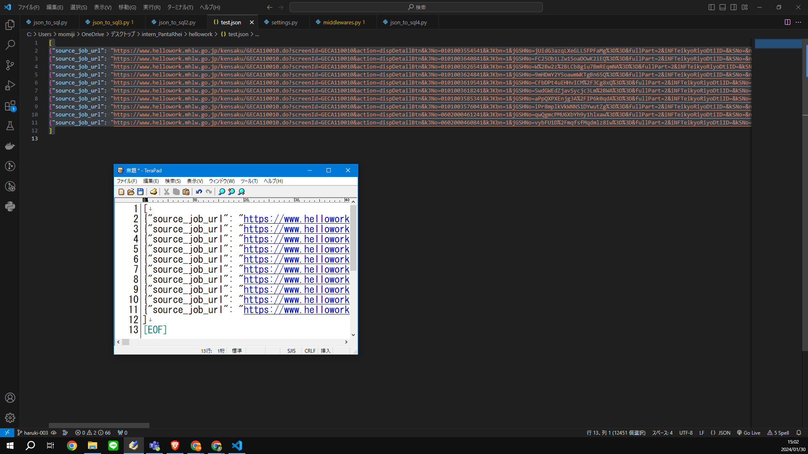
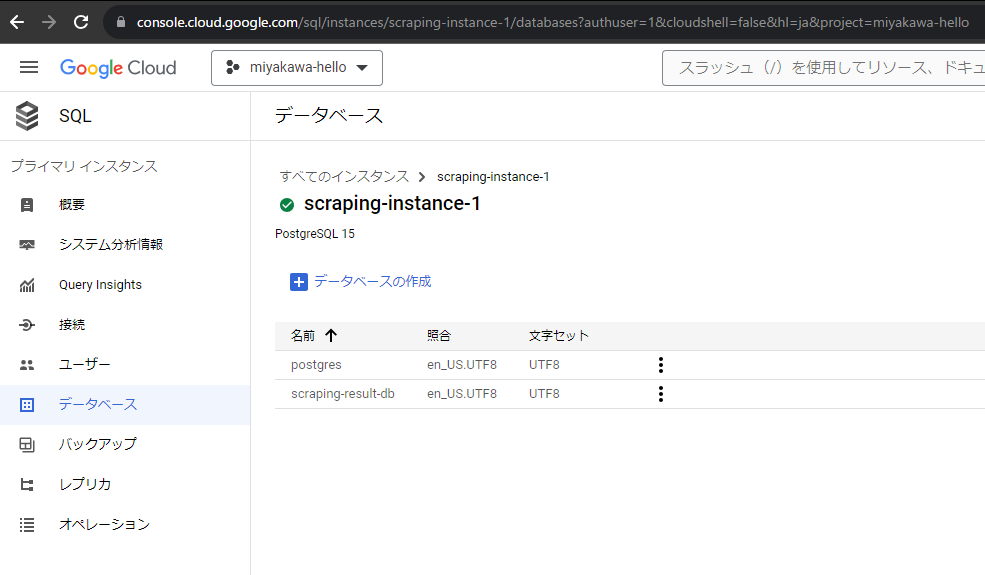

0. [結論](#0-結論)
1. [概要](#1-概要)
2. [ワークログ](#2-ワークログ)
    1. [json_to_sql.pyの作成](#20-json_to_sqlpyの作成)
        - [コードの説明](#コードの説明)
        - [実行結果](#実行結果)
    2. [実行がタイムアウト](#21-実行がタイムアウト)
        - [問題](#問題)
        - [実行したこと](#実行したこと)
            - [SQLへの接続を承認](#sqlへの接続を承認)
        - [結果](#結果)
    3. [ValueError: Expected object or value](#22-valueerror-expected-object-or-value)
        - [問題](#問題-1)
        - [実行したこと](#実行したこと-1)
            - [jsonファイルの確認](#jsonファイルの確認)
        - [結果](#結果-1)
    4. [UnicodeDecodeError: 'utf-8' codec can't decode byte 0x8c in position 276: invalid start byte](#23-unicodedecodeerror-utf-8-codec-cant-decode-byte-0x8c-in-position-276-invalid-start-byte)
        - [問題](#問題-2)
        - [実行したこと](#実行したこと-2)
            - [encodingの値をshift-jisに変更](#encodingの値をshift-jisに変更)
            - [scrapyの設定を調査](#scrapyの設定を調査)
                - [文字列の貼り付けについて](#文字列の貼り付けについて)
        - [結果](#結果-2)
    5. [sqlalchemy.exc.ProgrammingError: (psycopg2.ProgrammingError) can't adapt type 'dict'](#24-sqlalchemyexcprogrammingerror-psycopg2programmingerror-cant-adapt-type-dict)
        - [問題](#問題-3)
        - [実行したこと](#実行したこと-3)
            - [to_sqlの引数dtypeをJSON形式に変更](#to_sqlの引数dtypeをjson形式に変更)
            - [文字エンコーディング](#文字エンコーディング)
        - [結果](#結果-3)


# 0. 結論
かなり沼が深かったが，GCEからCloud SQLに接続し，指定したテーブルにjsonデータを挿入する事ができた．しかし，日本語の情報が文字コードのまま保存されてしまう．（以下のチケットで解消）
[INTERN-190: 文字コードのまま保存されるバグを解消完了](https://remotesalesproject.atlassian.net/browse/INTERN-190)

以下は，修正に修正を加えたjson_to_sql.pyだ．ただし，文字コードのままSQLに保管されてしまう．完全版は”INTERN-190”のチケットで作成した．

```
import pandas as pd
from sqlalchemy import create_engine
from sqlalchemy.types import JSON, String
from google.cloud import storage
import json

# データベース接続情報
db_user = 'postgres'
db_password = 'パスワード'
db_name = 'scraping-result-db'
db_instance_ip = 'XX.XXX.XX.XX'
db_instance_name = 'SQLのインスタンス名'

# Google Cloud Storageからデータを読み込む
#json_file_path = f'gs://hellowork-bucket/scraping-log/test.json'

# DataFrameの作成
df = pd.read_json(json_file_path, encoding="utf-8")
df['get_time'] = pd.to_datetime(df['get_time']).dt.strftime('%Y-%m-%d %H:%M:%S')

# エンジンの作成
engine = create_engine(f'postgresql+psycopg2://{db_user}:{db_password}@{db_instance_ip}/{db_name}', echo=True)

# DataFrameのデータをCloud SQLのテーブルに挿入する
df.to_sql('scraping_result_tbl00', con=engine, if_exists='append', index=False, method='multi', chunksize=5000,
            dtype={'job_application_steps': JSON, 'company_recruit_responsible': JSON})

```

# 1. 概要
[pandas.DataFrame.to_sql — pandas 2.2.2 documentation ](https://pandas.pydata.org/docs/reference/api/pandas.DataFrame.to_sql.html)
[pandas.read_json — pandas 2.2.2 documentation ](https://pandas.pydata.org/docs/reference/api/pandas.read_json.html)
[codecs --- Codec registry and base classes ](https://docs.python.org/ja/3/library/codecs.html)
[INTERN-120: GCSのjsonデータをcloudSQLにインポートする完了](https://remotesalesproject.atlassian.net/browse/INTERN-120)
 

# 2. ワークログ
最終的には，GCSのjsonファイルをGCEでDataFrameに変換し，DataFrameをPostgreSQLに保存するようにする．

まずは，GCSからjsonファイルを取得するのではなく，GCS上にtest.jsonを作成し，test.jsonをSQLへ保存することを試す．

## 2.0. json_to_sql.pyの作成
```
import pandas as pd
from sqlalchemy import create_engine
from sqlalchemy.types import JSON, String
from google.cloud import storage
import json

# データベース接続情報
db_user = 'postgres'
db_password = 'パスワード'
db_name = 'scraping-result-db'
db_instance_ip = 'XX.XXX.XX.XX'
db_instance_name = 'SQLのインスタンス名'

# Google Cloud Storageからデータを読み込む
json_file_path = 'gs://hellowork-bucket/scraping-log/test.json'

# DataFrameの作成
df = pd.read_json(json_file_path, encoding="utf-8", orient='records')
# エンジンの作成
engine = create_engine(f'postgresql+psycopg2://{db_user}:{db_password}@{db_instance_ip}/{db_name}', echo=True)

# DataFrameのデータをCloud SQLのテーブルに挿入する
df.to_sql('scraping_result_tbl00', con=engine, if_exists='append', index=False, method='multi', chunksize=5000)
```

上の内容のjson_to_sql.pyを作成し，GCEにインポートし実行する．

### ※コードの説明
・pandas.read_jsonの引数encoding，orientは明示的に設定したが，引数の設定をしなくても動く．

・pandas.to_sqlのデフォルトでは，SQLへの挿入が１レコードずつで，SQLへの挿入に時間がかかる．methodとchunksizeの設定をすることで，chunksizeの数のレコードをまとめて挿入してくれる．
[Pandasのto_sqlで行が多すぎて時間がかかる or エラーになった時に... - Qiita ](https://qiita.com/ku_a_i/items/77f4680651e628517db9)

・pandas.to_sqlのdtypeに何も指定しないと，自動的に型を割り振るようだ．
[Pandas DataFrame.to_sql()でカラムの型を指定する - Qiita ](https://qiita.com/kaizinZ/items/2d6e30f24bbe3de027f6)

実行がタイムアウトされる．原因はGCEがCloud SQLに接続できないところにある．

実行結果
結論を言うと，いくつかエラーが出た．そのエラーについて以下でまとめておく．

## 2.1. 実行がタイムアウト
### 2.1.0. 問題
GCE上でjson_to_sql.pyを実行すると，タイムアウトされる．Linuxの場合は300秒がデフォルトのようだ．
[1.16. タイムアウト制限の変更 Red Hat Enterprise Linux 8 | Red Hat Customer Portal](https://access.redhat.com/documentation/ja-jp/red_hat_enterprise_linux/8/html/using_systemd_unit_files_to_customize_and_optimize_your_system/proc_changing-the-timeout-limit_assembly_working-with-systemd-unit-files#:~:text=%E6%8C%87%E5%AE%9A%E3%81%97%E3%81%AA%E3%81%84%E5%A0%B4%E5%90%88%E3%80%81%E3%82%BF%E3%82%A4%E3%83%A0%E3%82%A2%E3%82%A6%E3%83%88%E3%81%AE,%E5%A0%B4%E5%90%88%E3%81%AF%20300%20%E7%A7%92%E3%81%A7%E3%81%99%E3%80%82)

原因は，接続先のPostgreSQLが見つからないことにあった．

### 2.1.1. 実行したこと
#### 2.1.1.0. SQLへの接続を承認
CloudSQLで接続するネットワークを追加した．GCE上でデータベースに接続するコードを実行するため，GCEインスタンスの外部IPを追加することで，接続が許可される．

※注意
デフォルトでは，GCEインスタンスの外部IPは起動ごとに変更されてしまうため，週次バッチ化のためには外部IPアドレスを固定する設定が必要だ．GoogleCloudのVPCネットワークというリソースを使用することで，GCEインスタンスの外部静的IPアドレスを予約することができる．



外部静的IPアドレスをSQLに承認させよう．

#### 2.1.1.1. IAMで権限付与
これは念のためであるが，GCEインスタンスにオーナー権限を付与した．ただし，実際の運用においては最低限の権限が望ましい．

### 2.1.2. 結果
タイムアウトが解消された．

 

## 2.2. ValueError: Expected object or value
### 2.2.0. 問題

> Traceback (most recent call last):
>   File "/home/kabaz7294/kari.py", line 19, in <module>
>     df = pd.read_json(json_file_path, encoding="utf-8", orient='records')
>   File "/home/kabaz7294/.local/lib/python3.9/site-packages/pandas/io/json/_json.py", line 815, in read_json
>     return json_reader.read()
>   File "/home/kabaz7294/.local/lib/python3.9/site-packages/pandas/io/json/_json.py", line 1025, in read
>     obj = self._get_object_parser(self.data)
>   File "/home/kabaz7294/.local/lib/python3.9/site-packages/pandas/io/json/_json.py", line 1051, in _get_object_parser
>     obj = FrameParser(json, **kwargs).parse()
>   File "/home/kabaz7294/.local/lib/python3.9/site-packages/pandas/io/json/_json.py", line 1187, in parse
>     self._parse()
>   File "/home/kabaz7294/.local/lib/python3.9/site-packages/pandas/io/json/_json.py", line 1400, in _parse
>     ujson_loads(json, precise_float=self.precise_float), dtype=None
> ValueError: Expected object or value

このようなバリューエラーが出てくることがある．これは，pandas.read_jsonの実行で，予想できないなにかがあったというエラーである．

### 2.2.1. 実行したこと
#### 2.2.1.0. jsonファイルの確認
スクレイピングに何らかの異常があった場合，CloudSQL上のjsonファイルが以下のように文字化けが起こることがある．



また，スクレイピングが途中で終了した場合，jsonファイルの末尾に”]”がない事がある．これは，下のチケットで解決させる．
[INTERN-191 壊れたjsonファイルを修復する ](https://pantarhei-hub.atlassian.net/wiki/spaces/Intern/pages/456458322)

結論を言うと，文字化け部分を削除し，jsonファイルの末尾をきちんと"]“にすることで，pandas.read_jsonは正常に実施させた．

### 2.2.2. 結果
エラー解消．

## 2.3. UnicodeDecodeError: 'utf-8' codec can't decode byte 0x8c in position 276: invalid start byte
### 2.3.0. 問題

> Traceback (most recent call last):
>   File "/home/kabaz7294/kari.py", line 19, in <module>
> df = pd.read_json(json_file_path, encoding="utf-8", orient='records')
>   File "/home/kabaz7294/.local/lib/python3.9/site-packages/pandas/io/json/_json.py", line 791, in read_json
>     json_reader = JsonReader(
>   File "/home/kabaz7294/.local/lib/python3.9/site-packages/pandas/io/json/_json.py", line 905, in init
>     self.data = self._preprocess_data(data)
>   File "/home/kabaz7294/.local/lib/python3.9/site-packages/pandas/io/json/_json.py", line 917, in _preprocess_data
>     data = data.read()
>   File "/usr/lib/python3.9/codecs.py", line 322, in decode
>     (result, consumed) = self._buffer_decode(data, self.errors, final)
> UnicodeDecodeError: 'utf-8' codec can't decode byte 0x8c in position 276: invalid start byte

どうやら，pandas.read_jsonの行でencodingに関するエラーが出ているようだ．

### 2.3.1. 実行したこと
#### 2.3.1.0. encodingの値をshift-jisに変更
試しに，shift-jisに変更してみたら，jsonファイルをDataFrameとして読み込みすることができた．jsonファイルは通常Unicodeの文字セットが使用されるようなので，pandas.read_jsonの引数encodingには"utf-8“を使用していた．
[JSON開発者ガイド](https://docs.oracle.com/cd/F19136_01/adjsn/json-character-sets-and-encoding.html#GUID-2BD7911A-0201-4BEC-906E-D174267B438A)

しかし，スクレイピング結果のtest.jsonはshift-jisで書かれていたようだ．

#### 2.3.1.1. scrapyの設定を調査
念のため，scrapyのsettings.pyを確認する．

```
FEED_EXPORT_ENCODING = 'utf-8'
```

このように書いてあるということは，”utf-8“で結果が出力されるはず．他のスクレイピング結果（json）を見てみると，きちんと”utf-8”であった．つまり，scrapyのコードに問題があるわけではない．

#### 2.3.1.1. 文字列の貼り付けについて
結論を言うと，test.jsonを作成する際にミスがあった．

test.jsonはスクレイピングの結果から10レコードほどコピーをし，メモアプリに貼り付けることで作成したものだ．

文字をコピーして貼り付けた場合，コピー元と同じ文字コードになるとは限らない．貼り付けた先のファイルやアプリの文字コードに自動で変換して保存されたようだった．

例えば，以下のようにutf-8の文字列をコピーし，TeraPadに貼り付けてみる．



すると，以下のようにshift-jisが使用される．



とても勉強になった．

### 2.3.2. 結果
エラー解消．

ちなみに，CloudSQLでPostgreSQLのデータベースを作成した場合，デフォルトではUTF-8になっている．shift-jisで作ったDataFrameをpandas.to_sqlするのは，かみあわせがわるくなるため，一部始終でutf-8を扱った．



## 2.4. sqlalchemy.exc.ProgrammingError: (psycopg2.ProgrammingError) can't adapt type 'dict'
### 2.4.0. 問題
sqlalchemyはPythonでSQLを扱うときに使用されるライブラリだ．今回のエラーはsqlalchemyではDataFrameの辞書型をPostgreSQLに合わせることができないというエラーだ．コードで言うと，pandas.to_sqlの行でエラーが発生した．

辞書形式で値が格納されているカラムは以下の２つだ．
```
'job_application_steps'
'company_recruit_responsible'
```

### 2.4.1. 実行したこと
#### 2.4.1.0. to_sqlの引数dtypeをJSON形式に変更
エラーを検索すると，pandas.to_sqlのdtypeをjson形式にする解決策があるようだ．実際にやってみることにした．

[SQLAlchemy (psycopg2.ProgrammingError) can't adapt type 'dict'](https://stackoverflow.com/questions/56808425/sqlalchemy-psycopg2-programmingerror-cant-adapt-type-dict)

to_sqlの行を以下のように変更．

```
df.to_sql('scraping_result_tbl00', con=engine, if_exists='append', index=False, method='multi', chunksize=5000,
            dtype={'job_application_steps': JSON, 'company_recruit_responsible': JSON})
```

結論を言うと，エラーは解消できたが，下のように，日本語がUnicodeとしてSQLに保存されてしまう．

> 'job_application_steps__1':
> '{"\\u9078\\u8003\\u7d50\\u679c\\u901a\\u77e5\\u306e\\u30bf\\u30a4\\u30df\\u30f3\\u30b0":
> "\\u9762\\u63a5\\u9078\\u8003\\u5f8c",
> "\\u9762\\u63a5\\u9078\\u8003\\u7d50\\u679c\\u901a\\u77e5":
> "\\u9762\\u63a5\\u5f8c7\\u65e5\\u4ee5\\u5185"}'

#### 2.4.1.1. 文字エンコーディング
辞書型のカラムをjson形式にエンコードすることでうまくいくとの記事を発見した．jsonでエンコーディングしているので，うまくいく気が市内が，一度試してみることにした．

[psycopg2.ProgrammingError: can't adapt type 'dict'が発生したときの対処法 #Python3 #PostgreSQL9.6 - 紙一重の積み重ね ](https://www.yokoyan.net/entry/2018/05/11/130000)

やはりjson形式に変換しているため，2.4.1.0と同じ結果になった．

### 2.4.2. 結果
エラー解消したが，文字コードのままSQLに挿入される．
