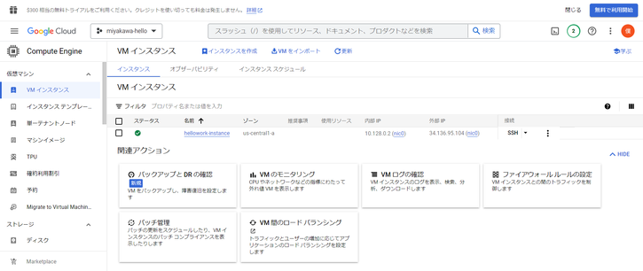
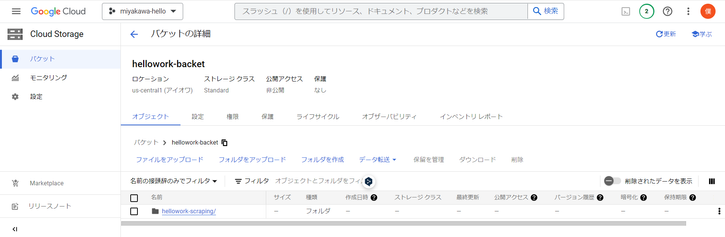
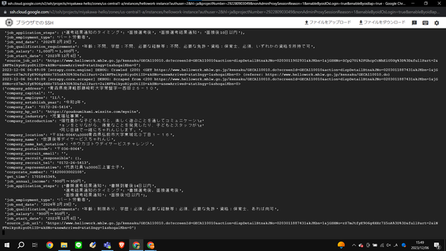

*   1 [0\. 結論](#0.-結論)
*   2 [1\. 概要](#1.-概要)
*   3 [2\. ワークログ](#2.-ワークログ)
    *   *   3.1.1 [compute engineで，インスタンスの作成](#compute-engineで，インスタンスの作成)
    *   3.2 [ログイン](#ログイン)
    *   3.3 [GCSにscrapyフォルダをアップロード](#GCSにscrapyフォルダをアップロード)
    *   3.4 [GCEへのインストール](#GCEへのインストール)
    *   3.5 [GCS上にアップロードしたフォルダをGCEインスタンスにダウンロード](#GCS上にアップロードしたフォルダをGCEインスタンスにダウンロード)
    *   3.6 [GCEのインスタンス上でスクレイピングを実行してみる](#GCEのインスタンス上でスクレイピングを実行してみる)

# 0\. 結論

git・python・scrapyをGCE上でインストールした。その後、インスタンス上でscrapingした。

# 1\. 概要

[INTERN-122: エンジンに必要なプログラムのアップロード＆インストールDone](https://remotesalesproject.atlassian.net/browse/INTERN-122)

# 2\. ワークログ

このタスクをする前に、インスタンス（GCE）・バケット（GCS）を作成している。それぞれ、hellowork-instance、hellowork-backetという名前だ。

### **compute engineで，インスタンスの作成**

Open screencapture-console-cloud-google-compute-instancesAdd-2024-04-07-15\_37\_02.pdf


screencapture-console-cloud-google-compute-instancesAdd-2024-04-07-15\_37\_02.pdf

07 Apr 2024, 04:26 PM

## ログイン

下の画面からSSH接続を行い、コマンドプロンプトを表示。



Compute Engin画面

黒い画面で以下のコードを実行することで、ログインできる。

```
gcloud auth login
```

## GCSにscrapyフォルダをアップロード



Cloud Storageの画面でフォルダをアップロードする。今回はhellowork-scrapingフォルダをアップロード。

## GCEへのインストール

インストールするものはpython・git・scrapyの3つ。

```
sudo apt update
sudo apt install python3 python3-pip
pip3 install scrapy
sudo apt install git
```

以下のコードでバージョンが表示されるため、問題なくインストールされているみたいだ。

```
scrapy --version
git --version
```

## GCS上にアップロードしたフォルダをGCEインスタンスにダウンロード

hellowork-scrapingというフォルダを作成し、先程GCS上にアップロードしたフォルダをダウンロードする。

```
mkdir ~/hellowork-scraping
gsutil cp -r gs://hellowork-backet/hellowork-scraping /home/ユーザ名/
```

## GCEのインスタンス上でスクレイピングを実行してみる

```
cd hellowork-scraping
scrapy crawl hellowork -o result.csv
```

Open image-20231206-064918.png

