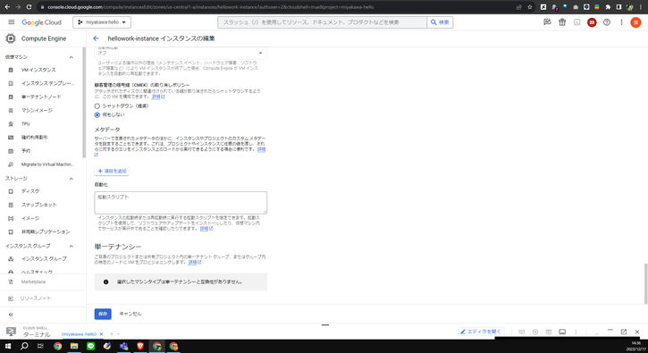

- [0. 結論](#0-結論)
- [1. 概要](#1-概要)
- [2. ワークログ](#2-ワークログ)
  - [GCEの起動スクリプトで実行](#-GCEの起動スクリプトで実行)
  - [rc.localで.shファイルを自動実行](#-rc.localで.shファイルを自動実行)
  - [systemdサービスで.shファイルを自動実行](#-systemdサービスで.shファイルを自動実行)


# 0. 結論

かなり沼ってしまったが、インスタンス起動をトリガーにscrapingを実行し、json形式のlogデータをGCSに保存する事ができた。

# 1. 概要

[INTERN-126: GCE起動をトリガーにscraping実行Done](https://remotesalesproject.atlassian.net/browse/INTERN-126)  

[Ubuntu 20.04 LTS でも rc.local は使える - Qiita](https://qiita.com/taraijpn/items/2ec3acead27be2f7bd50)  

[Google Compute Engineでcronを使って日次バッチ処理を実行する – marketechlabo](https://www.marketechlabo.com/batch-processing-on-gce/)  

[Ubuntuで起動時に自動でShellScriptを実行する方法 - Qiita](https://qiita.com/MAI_onishi/items/74edc40a667dd2dc633e)  
  

# 2. ワークログ

やり方を3つ試した。結論を先に言うと、2.2.のやり方でうまく動くようになった。

## GCEの起動スクリプトで実行

GCEには起動スクリプトがある。



ここに、以下はコマンドを書き込み、保存する。ちなみに、インスタンスは停止していないと保存できないので、注意が必要。

```shell
#!/bin/bash

screen -S scraping
cd /hellowork-scraping/hellowork-scraping
start_scraping_time=$(date '+%Y%m%d_%H%M')
scrapy crawl hellowork -o project/result_${start_scraping_time}.json
gsutil cp /project/result_${start_scraping_time}.json gs://hellowork-bucket/scraping-log/

rm /home/ユーザ名/hellowork-scraping/hellowork-scraping/project/result_${start_scraping_time}.json
cd /

gcloud compute instances stop hellowork-instance --zone=us-central1-a
```

その後、インスタンスを起動し、スクリーンをチェック。

```shell
screen -ls
```

しかし、screenは作成されていなかった。このことから、起動スクリプトを読み込めていないことがわかる。

**結論：失敗**

## rc.localで.shファイルを自動実行

[Ubuntu 20.04 LTS でも rc.local は使える - Qiita](https://qiita.com/taraijpn/items/2ec3acead27be2f7bd50)

上の記事には、rc.localの設定をすることで、起動時に自動的に実行することができるみたい。

沼りそうなので、起動スクリプトをstart\_scraping.shに記述し、GCEインスタンスに保存することにした。

[Google Compute Engineでcronを使って日次バッチ処理を実行する – marketechlabo](https://www.marketechlabo.com/batch-processing-on-gce/)

上記の記事を参考にし、start\_scraping.shを作成。

```shell
#!/bin/bash
screen -S scraping cd /hellowork-scraping/hellowork-scraping start_scraping_time=$(date '+%Y%m%d_%H%M')
scrapy crawl hellowork -o project/result_${start_scraping_time}.json
gsutil cp /project/result_${start_scraping_time}.json gs://hellowork-bucket/scraping-log/
rm /home/ユーザ名/hellowork-scraping/hellowork-scraping/project/result_${start_scraping_time}.json
cd /
sleep 5m
shutdown -h now
exit 0
```

start\_scraping.shを作成し、/home/ユーザ名/に、アップロード。その後、以下の手順で行う。

1.  `sudo nano /etc/rc.local`でrc.localを保存する。このnanoはvimでもOK。
    
2.  その後の編集画面で、以下の内容を記述。(念のためshによる実行コマンドにしておく。)
    
    ```shell
    #!/bin/sh -e
    sh /home/ユーザ名/start_scraping.sh
    exit 0
    ```
    
    入力完了したら、`Ctrl + o` キーを押し、ファイル名の確認後Enterを押すことで保存。`Ctrl + x`で元のコマンド画面に戻る。
    
3.  以下のコマンドで `rc.local` ファイルとstart\_scraping.shに実行可能な権限を与える。
    
    ```shell
    sudo chmod +x /etc/rc.local
    sudo chmod +x /home/ユーザ名/start_scraping.sh
    ```
    
4.  `ls -l /home/ユーザ名/start_scraping.sh`で権限を確認。
    
5.  再起動する。
    
    `sudo reboot`
    

この後、インスタンスにssh接続し、`cat /var/log/syslog | grep "start_scraping.sh"`でログを確認する。  
結果、うまくいかない。ログにあるエラーからshファイル内の改行の読み取りで問題があるようだ。下のコマンドを実行して解決。もう一度、インスタンスの再起動とssh接続をしてみる。

```shell
dos2unix /home/ユーザ名/start_scraping.sh
```

しかし、まだ動かない。ログからscrapyコマンドを認識していないことが発覚。start\_scraping.sh内のpathをより明示的に変更した。

```shell
#!/bin/bash
export PATH=$PATH:/home/ユーザ名/.local/bin
screen -S scraping
cd /home/ユーザ名/hellowork-scraping/hellowork-scraping
start_scraping_time=$(date '+%Y%m%d_%H%M')
/home/ユーザ名/.local/bin/scrapy crawl hellowork -o /home/ユーザ名/hellowork-scraping/hellowork-scraping/project/result_${start_scraping_time}.json

gsutil cp /home/ユーザ名/hellowork-scraping/hellowork-scraping/project/result_${start_scraping_time}.json gs://hellowork-bucket/scraping-log/
rm /home/ユーザ名/hellowork-scraping/hellowork-scraping/project/result_${start_scraping_time}.json
cd /
sleep 5m
shutdown -h now
exit 0
```

しかし、やはりログにはscrapyコマンドを認識していないと書いてある。間違いなく、scrapyのある場所は正しい。よくわからん。

**結論：失敗**

## systemdサービスで.shファイルを自動実行

[Ubuntuで起動時に自動でShellScriptを実行する方法 - Qiita](https://qiita.com/MAI_onishi/items/74edc40a667dd2dc633e)

上記の記事を参考にしたやり方で、やっと起動時にscrapingを自動実行させることができました。

1.  start\_scraping.shを作成し、/home/ユーザ名/に、アップロード。
    
    ```shell
    #!/bin/bash
    
    export PATH=$PATH:/home/ユーザ名/.local/bin
    screen -d -m -S scraping
    cd /home/ユーザ名/hellowork-scraping/hellowork-scraping
    start_scraping_time=$(date '+%Y%m%d_%H%M')
    /home/ユーザ名/.local/bin/scrapy crawl hellowork -o /home/ユーザ名/hellowork-scraping/hellowork-scraping/project/result_${start_scraping_time}.json
    gsutil cp /home/ユーザ名/hellowork-scraping/hellowork-scraping/project/result_${start_scraping_time}.json gs://hellowork-bucket/scraping-log/
    rm /home/ユーザ名/hellowork-scraping/hellowork-scraping/project/result_${start_scraping_time}.json
    
    cd /
    sleep 5m
    shutdown -h now
    exit 0
    ```
    
2.  `sudo vim /etc/systemd/system/auto_shell.service`でユニットファイルを作成する。
    
3.  ユニットファイルに以下の内容を記述する。
    
    ```shell
    [Unit]
    Description=Auto Shell Service
    After=network.target
    
    [Service]
    ExecStart=/home/ユーザ名/start_scraping.sh
    User=ユーザ名
    Group=ユーザ名
    WorkingDirectory=/home/ユーザ名/
    Restart=always
    
    [Install]
    WantedBy=multi-user.target
    ```
    
    入力完了したら、`Esc` キーを押してコマンドモードに移行。`:wq` と入力して `Enter` キーを押すと「保存して終了」になる。
    
4.  `systemd` にユニットファイルを再読み込みさせます。
    
    `sudo systemctl daemon-reload`
    
5.  サービスを有効化して、次回の起動時に自動的に起動するように設定します。
    
    `sudo systemctl enable auto_shell.service`
    

この後、再起動させ、screen -lsでscrapingが作成されていれば成功！！

`sudo journalctl -xe | grep "auto_shell.service"`

上記のコマンドで、`"auto_shell.service"`のログを受け取ることでも確認できる。

このように3つ目の方法で試してみると、成功する。
