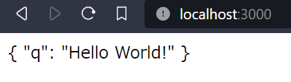
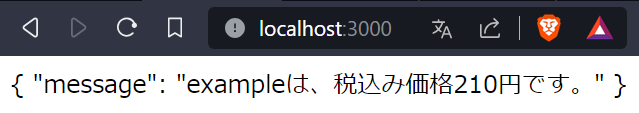

# 目次

0. [結論](#0-結論)
1. [概要](#1-概要)
2. [axiosとは](#2-axiosとは)
    - [leadknockで使われているaxios](#leadknockで使われているaxios)
3. [Axios Moduleの基本文法](#3-axiosmoduleの基本文法)
    - [呼び出し方](#呼び出し方)
    - [GET メソッド](#get-メソッド)
    - [POST メソッド](#post-メソッド)
    - [PUT メソッド](#put-メソッド)
    - [DELETE メソッド](#delete-メソッド)
    - [ヘッダーの設定](#ヘッダーの設定)
    - [同期・非同期制御](#同期・非同期制御)
    - [.then()](#then)
    - [async/await](#asyncawait)
    - [例外処理](#例外処理)
4. [FastAPIで作ったものをAxios Moduleで叩いてみる](#4-fastapiで作ったものをaxios-moduleで叩いてみる)
    - [GET メソッド](#get-メソッド-1)
    - [POST メソッド](#post-メソッド-1)


# 0. 結論
Axios Moduleを使って簡単なAPIを叩けるようになった

leadknockのAPIの叩き方とは違うみたい

# 1. 概要
[INTERN-130: axiosの概要調査完了](https://remotesalesproject.atlassian.net/browse/INTERN-130)
 

# 2. axiosとは
[Axiom 入門 | Axios Docs ](https://axios-http.com/ja/docs/intro)

[利用ガイド：Axiosの使い方を完全解説 ](https://apidog.com/jp/blog/axios-introduction/#:~:text=%E3%81%A8%E6%80%9D%E3%81%84%E3%81%BE%E3%81%99%E3%80%82-,Axios%E3%81%A8%E3%81%AF,%E3%81%97%E3%82%84%E3%81%99%E3%81%8F%E3%81%AA%E3%81%A3%E3%81%A6%E3%81%84%E3%81%BE%E3%81%99%E3%80%82)

・ブラウザから[XMLHttpRequests](https://developer.mozilla.org/en-US/docs/Web/API/XMLHttpRequest)を作成する

・Node.js から [http](http://nodejs.org/api/http.html) リクエストを作成する

・[Promise API](https://developer.mozilla.org/en-US/docs/Web/JavaScript/Reference/Global_Objects/Promise) をサポート

・インターセプトの要求と応答

・リクエストとレスポンスのデータを変換

・リクエストをキャンセル

・JSON データの自動変換

・[XSRF](http://en.wikipedia.org/wiki/Cross-site_request_forgery) から保護するためのクライアント側のサポート

AxiosはJavaScriptで使えるHTTPクライアントライブラリです。PromiseベースのAPIを提供しているので非同期処理が扱いやすく、JSONデータの自動変換も行ってくれるためレスポンスデータの処理がしやすくなっています。

## leadknockで使われているaxios

Nuxt2では`Axios Module`というのが使われているらしい

# 2. Axios Moduleの基本文法
[Nuxt.jsでaxiosの使い方と設定方法を紹介 ](https://ma-vericks.com/blog/nuxt-axios/)

## 呼び出し方
```
<script>
	export default {
		async asyncData({ $axios }) {
			// 取得先のURL
			const url = "API_URL";
			// リクエスト（Get）
			const response = await $axios.$get(url);
			// 配列で返ってくるのでJSONにして返却
			return {
				posts: response
			};
		}
	};
</script>
```
## GET メソッド
主にデータを取得するAPIで使用されます。
```
const response = await $axios.$get
    (url, {
        params: {
            // パラメータを指定
            id: 123
        }
    });
```
GET メソッドでは、クエリパラメータは第二引数の params オブジェクトに指定します。

## POST メソッド
主にデータを登録するAPIで使用されます。
```
const response = await $axios.$post
    (url, {
        id: 123,
        name: hoge
    });
```
POST メソッドでは、データは第二引数に JSON 形式で指定します。

## PUT メソッド
主にデータを更新するAPIで使用されます。
```
const response = await $axios.$put
    (url, {
        id: 123,
        name: hoge
    });
```
PUT メソッドも POST と同様に、第二引数に JSON 形式でデータを指定します。

## DELETE メソッド
訳通りに削除するAPIで使用されます.

```
const response = await $axios.$delete
    (url, {
        data: {
            id: 123,
            name: hoge
        }
    });
```
DELETE メソッドでは、データは第二引数の data オブジェクトに設定します。

## ヘッダーの設定
ファイルを送信する際やベーシック認証情報を含める場合に使用します。

```
const response = await $axios.$post
    (url, {
        id: 123,
        name: hoge
    },
    { header : 
        { 'Content-Type': 'application/x-www-form-urlencoded' }
    });
```
ヘッダーの設定は第三引数に JSON 形式で指定します。

 ## 同期・非同期制御
`.then()`

非同期通信後の処理を記述する方法です。
```
const response =　$axios.$post
    (url, {
        id: 123,
        name: hoge
    }).then(function(response) {

    // ここにリクエストが帰ってきた後の処理を書く
    console.log(response);
  });
```
`.then() `を使うと後続の処理を記述できますが、呼び出し元には戻るので注意が必要です。

`async/await`
Node.js version 7 以降で使用可能な同期的な書き方です。
```
async function() {
const response =　await $axios.$post
    (url, {
        id: 123,
        name: hoge
    });
    console.log(response);
};
```
`async` を関数の前に付け、同期処理が必要な部分に` await `を使用します。

## 例外処理
```
const response =　$axios.$post
    (url, {
        id: 123,
        name: hoge
    }).catch(function(error) {
        // エラー時の処理を書く
        console.log('ERROR!')
    });
```
エラー時の処理を記述するには` .catch() `を使用します。エラーが発生した場合、ここで指定した処理が実行されます。

# 3. FastAPIで作ったものをAxios Moduleで叩いてみる
叩いているAPIは下記

https://demo-app-4foucacvfa-uc.a.run.app/docs#/default/read_item_get_items__get 

## GET メソッド
```
<template>
  <div>
    {{ posts }}
  </div>
</template>

<script>
export default {
  async asyncData({ $axios }) {
    // 取得先のURL
    const url = "https://demo-app-4foucacvfa-uc.a.run.app/get_items/";
    // リクエスト（Get）
    const response = await $axios.$get(url, {
      params: {
        // パラメータを指定
        q: "Hello World!",
      },
    });

    return { posts: response };
  },
};
</script>
```



## POSTメゾット
```
<template>
  <div>
    {{ posts }}
  </div>
</template>

<script>
export default {
  async asyncData({ $axios }) {
    // 取得先のURL
    const url = "https://demo-app-4foucacvfa-uc.a.run.app/post_items/";
    // リクエスト（Get）
    const response = await $axios.$post(url, {
      name: "example",
      description: "test",
      price: 42.0,
      tax: 5.0,
    });

    return { posts: response };
  },
};
</script>
```



　めちゃ簡単


