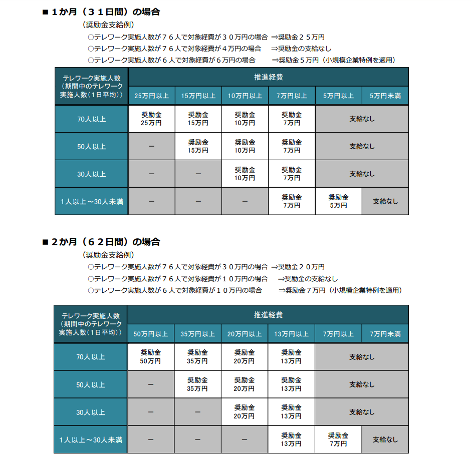

# 目次

- [0. 結論](#0-結論)
- [1. 概要](#1-概要)
- [2. ワークログ](#2-ワークログ)

#0.結論

もらえても13万なので受けない。

# 1.概要
[INTERN-134: テレワーク推進強化奨励金完了](https://remotesalesproject.atlassian.net/browse/INTERN-134)
 
# 2.ワークログ
[テレワーク推進強化奨励金 ｜ 東京しごと財団　雇用環境整備課 ](https://www.shigotozaidan.or.jp/koyo-kankyo/boshu/tele-suisinkyoka.html)

期限

令和6年5月17日まで

申請前に３つ(1.2.3)の登録等が必要。そのうえで4を満たさないと行かない

1.東京都が実施する「テレワーク東京ルール」実施企業宣言へ登録していること

  a.[「テレワーク東京ルール」実践企業宣言 ](https://www.telework-rule.metro.tokyo.lg.jp/)

2.「テレワーク東京ルール」実践企業宣言サイト上の「マイページ」にて本奨励金の事前エントリー登録をしていること

3.「テレワーク東京ルール」実践企業宣言サイトにおいて、東京都が実施する「テレワーク推進リーダー」制度への申請・研修・登録まで完了し、「推進リーダー」設置済表示のある宣言書がマイページ上で発行されていること

4.「テレワーク推進強化期間」中（令和３年12月６日～令和6年3月31日）において、申請企業が設定した「テレワーク実施期間（1か月・２か月）」に「週３日・社員の７割以上」のテレワークを実施していること

対象事業者の要件

(https://www.shigotozaidan.or.jp/koyo-kankyo/boshu/documents/s050922-bosyuyoko.pdf　6.7ページ)

1.中小企業で、都内に本店登記があり、従業員数が300人以下。

2.都内に勤務する常時雇用する労働者のうち 1 名は、申請日時点で６か月以上継続して雇用しており、かつ雇用保険被保険者であること。

3.都税の未納がないこと。

4.過去5年間に法令違反がなく、労働関係法令を遵守していること。

5.風俗営業や業務の適正化に関する法律に基づく特定の事業を行っていないこと。

6.暴力団員や関係者ではないこと。

7.東京都が実施する「テレワーク東京ルール」実践企業宣言に登録し、「テレワーク推進リーダー」制度への申請・研修・登録が完了していること。

8.テレワーク推進期間中において、週3日以上、社員7割以上がテレワークを実施していること。

9.その他、財団理事長が適当でないと判断した場合は奨励金の対象外。

支給申請

郵送の場合

  支給申請書類を一式そろえて以下の宛先に送る。締切日当日消印有効。

    〒１０２－００７２ 

    東京都千代田区飯田橋三丁目８番５号 住友不動産飯田橋駅前ビル 11 階 

    公益財団法人東京しごと財団 企業支援部 雇用環境整備課「テレワーク推進強化奨励金」事務局

  必ず「申請書類在中」と記載のうえ、追跡可能な記録の残る方法で提出。

電子申請の場合

  支給申請に必要な書類一式をすべて揃えて、デジタル庁が運営する補助金の電子申請システム(Ｊグランツ)の申請フォームから提出しないといけない。

