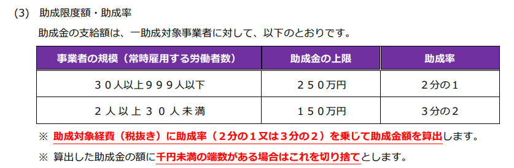
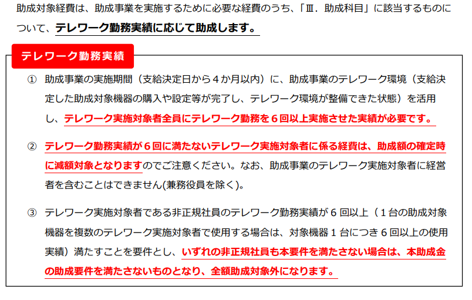
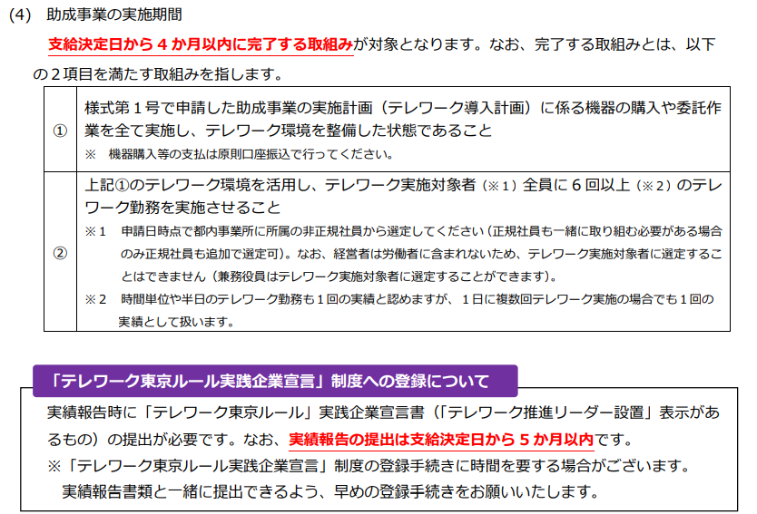
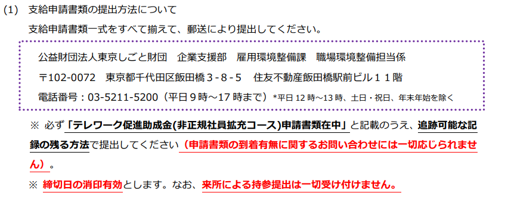
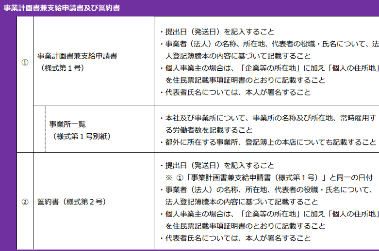
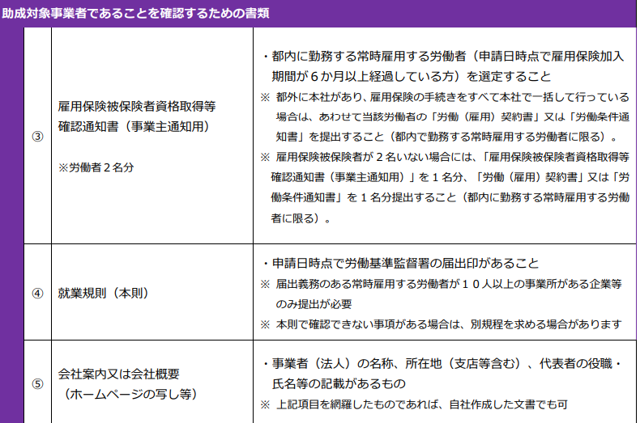
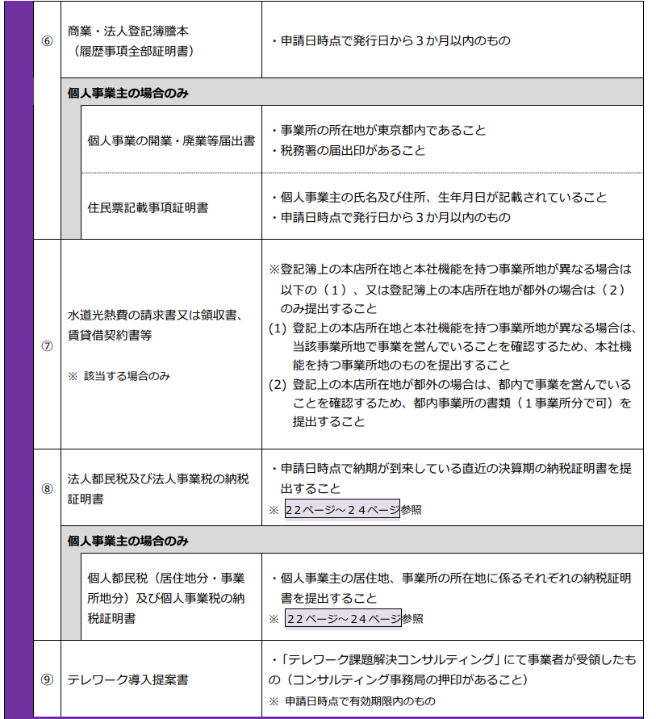
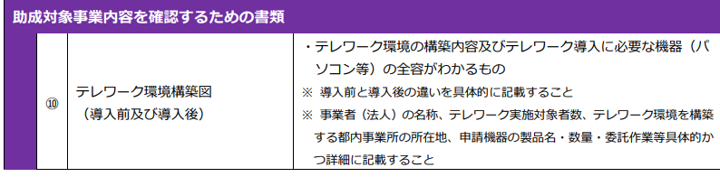
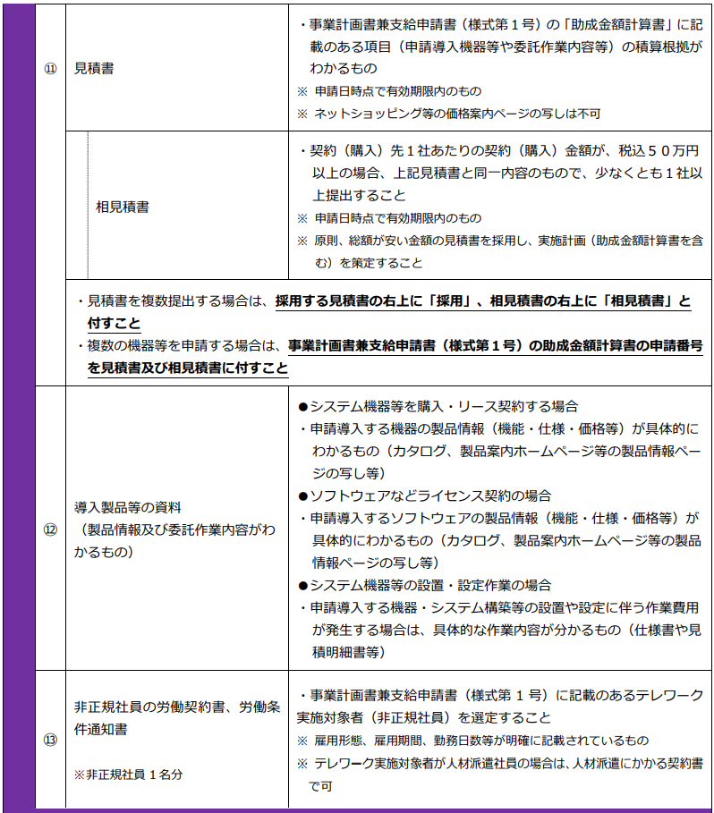

# 目次

- [0. 結論](#0-結論)
- [1. 概要](#1-概要)
- [2. ワークログ](#2-ワークログ)

# 0. 結論
https://workstyle.metro.tokyo.lg.jp/about/ 

リンクからテレワーク課題解決コンサルティングを受け、「テレワーク導入提案書」を受領しないといけない。

郵送でしか申し込めない。

必要な書類

1.事業計画書兼支給申請書 （様式第１号）

2.誓約書（様式第２号）

必要な書類

1.雇用保険被保険者資格取得等確認通知書（事業主通知用）　※労働者２名分

2.就業規則（本則）

3.会社案内又は会社概要（ホームページの写し等）

4.商業・法人登記簿謄本（履歴事項全部証明書） 

5.法人都民税及び法人事業税の納税 証明書

6.テレワーク導入提案書(「テレワーク課題解決コンサルティング」にて事業者が受領したもの)

7.テレワーク環境構築図 （導入前及び導入後）

8.見積書

9.導入製品等の資料 （製品情報及び委託作業内容がわ かるもの）

10.非正規社員の労働契約書、労働条 件通知書 ※非正規社員 1 名分

# 1. 概要
 [INTERN-136: テレワーク促進助成金（令和5年度）完了](https://remotesalesproject.atlassian.net/browse/INTERN-136)
 
[テレワーク促進助成金（令和6年度） ｜ 東京しごと財団　雇用環境整備課 ](https://www.shigotozaidan.or.jp/koyo-kankyo/joseikin/telesoku.html)

# 2. ワークログ

非正規社員拡充コースは都内事業所に所属の非正規社員へのテレワーク拡充に係る在宅勤務、モバイル勤務等を可能とするテレワーク機器・ソフトウェア等のテレワーク環境整備に係る経費の助成。

**注意事項**

郵送しかない。

以下の助成金を申請しているとこの助成金は申込めない

・令和5年度実施「テレワーク導入ハンズオン支援助成金」

・令和4年度実施「テレワーク促進助成金」

・令和4年度実施「テレワーク導入ハンズオン支援助成金」

・令和3年度実施「テレワーク促進助成金」

・令和2年度実施「テレワーク定着促進助成金」

・令和元・2年度実施「事業継続緊急対策（テレワーク）助成金」

・平成30年度～令和元年度実施「テレワーク活用・働く女性応援助成金（テレワーク活用推進コース／テレワーク機器導入事業）」

・平成28・29年度実施「女性の活躍推進等職場環境整備助成金／多様な勤務形態の実現事業（1）在宅勤務、モバイル勤務、リモートワーク等を可能とする情報通信機器等の導入による多様な勤務形態の実現のための環境整備」

・令和元・2年度実施「はじめてテレワーク（テレワーク導入促進整備補助金）」

　（ただし、拡充にかかる部分のみ本助成金の申請が可能）

申込前にテレワーク課題解決コンサルティングを受け、「テレワーク導入提案書」を受領しないといけない。

https://workstyle.metro.tokyo.lg.jp/ 

助成金を使うタイミング

 支給決定日以降に発注・契約・購入したものにしかこの助成金は使えない。

助成金対象経費

１.助成事業のテレワーク環境を活用し、テレワーク実施対象者全員にテレワーク勤務を６回以上実施させた実績が必要です。

2.テレワーク勤務実績が６回に満たないテレワーク実施対象者に係る経費は、助成額の確定時に減額対象となる。テレワーク実施対象者に経営者を含むことはできない(兼務役員を除く)。

3.テレワーク実施対象者である非正規社員のテレワーク勤務実績が 6 回以上（１台の助成対象機器を複数のテレワーク実施対象者で使用する場合は、対象機器 1 台につき 6 回以上の使用実績）満たすことを要件とし、いずれの非正規社員も本要件を満たさない場合は、本助成金の助成要件を満たさないものとなり、全額助成対象外になります。

助成金事業の実施期間

支給日から4か月以内に完了する取り組みが対象

実績報告提出時までに東京都が実施する「テレワーク東京ルール実践企業宣言」制度へ登録し、「テレワーク推進リーダー設置」表示のある宣言書がウェブサイト上で発行されている必要がある。

送り先

[テレワーク促進助成金＜非正規社員拡充コース＞（令和5年度） ｜ 東京しごと財団　雇用環境整備課 ](https://www.shigotozaidan.or.jp/koyo-kankyo/boshu/05-telesoku_hiseiki.html#youshiki)

書類の入力方法など

## 必要書類
入力書類

1.事業計画書兼支給申請書 （様式第１号）

2.誓約書（様式第２号） 

必要な書類

1.雇用保険被保険者資格取得等確認通知書（事業主通知用）　※労働者２名分

2.就業規則（本則）

3.会社案内又は会社概要（ホームページの写し等）

4.商業・法人登記簿謄本（履歴事項全部証明書） 

5.法人都民税及び法人事業税の納税 証明書

6.テレワーク導入提案書(「テレワーク課題解決コンサルティング」にて事業者が受領したもの)

7.テレワーク環境構築図 （導入前及び導入後）

8.見積書

9.導入製品等の資料 （製品情報及び委託作業内容がわ かるもの）

10.非正規社員の労働契約書、労働条 件通知書 ※非正規社員 1 名分

