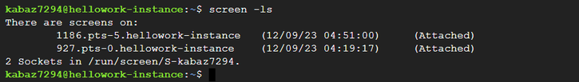

- [0. 結論](#0-結論)
- [1. 概要](#1-概要)
- [2. ワークログ](#2-ワークログ)
    *   3.1 [スクリーンのインストールを確認](#スクリーンのインストールを確認)
    *   3.2 [スクリーン作成](#スクリーン作成)
    *   3.3 [スクリーンに入る](#スクリーンに入る)
    *   3.4 [セッションから退出する](#セッションから退出する)
    *   3.5 [セッションを削除する](#セッションを削除する)

# 0. 結論

スクリーンによって、僕のパソコンが動いていなくても、インスタンス上でスクレイピングすることができた。

# 1. 概要

[【超便利】screenコマンドの基本｜一覧や実例付きでわかりやすい](https://itc.tokyo/linux/screen-command/)  
[作業がグッと楽になる screen を使おう！](https://bacchi.me/linux/how-2-use-screen/)  
[Linux screenコマンド使い方 - Qiita](https://qiita.com/hnishi/items/3190f2901f88e2594a5f)  
[INTERN-137: コマンド "screen"の使い方Done](https://remotesalesproject.atlassian.net/browse/INTERN-137)

# 2. ワークログ

以下はコマンドで実行する。

## スクリーンのインストールを確認

`screen -v`

バージョンが表示さればインストールできている。

## スクリーン作成

`screen -S スクリーン名`

## スクリーンに入る

作成したスクリーンに入るためには、PIDを読み込む必要がある。

`screen -ls`

lsでPIDを確認する。  
  



もし、読み込みたいPIDがAttachedであれば、以下のコードでスクリーンに入れる。

`screen -rx 927（数字はセッションによって変わる）`

Dettachedであれば、以下のコードだ。

`screen -r 927（数字はセッションによって変わる）`

## セッションから退出する

`Ctrl` + `a`を押した後、`d`を押してセッションをバックグラウンドに移動する。

例えば、セッションに接続している途中で `Ctrl` + `a` を押し、次に `d` を押すと、セッションがバックグラウンドに移動できる。  
  

## セッションを削除する

セッションを削除するやり方は複数ある。

1.  `screen -ls`でセッション一覧を表示し、`screen -X -S <セッション名> quit`でセッションを削除する方法:
    
    ```
    # まず、セッション一覧を表示
    screen -ls
    
    # 削除したいセッション名を指定して削除
    screen -X -S <セッション名> quit`
    
2.  `kill`コマンドを使用して`screen`プロセスを終了する方法:
    
    ```
    # screenプロセスのPIDを取得
    ps aux | grep screen
    
    # 取得したPIDを使用してプロセスを終了
    kill -9 <PID>
    ```
    
3.  **セッション内で**`Ctrl` + `a`を押してから`:`を押し、`quit`と入力してセッションを終了する方法:
    
    ```
    # セッション内で
    Ctrl + a : quit
    ```
    
4.  **セッション内で**`exit`コマンドを使用して終了する方法:
    
    ```
    # セッション内で
    exit
    ```
