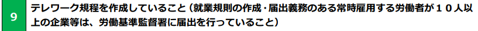

- [0. 結論](#0-結論)
- [1. 概要](#1-概要)
- [2. ワークログ](#2-ワークログ)

# 0. 結論
条件を満たしているかの確認が必要。

値段は100万円。助成率は1/2。

テレワーク推進助成金を申請中は申し込みができない。

またテレワーク定着促進フォローアップ助成金を申請中はテレワーク推進助成金を申し込めない。

テレワーク促進助成金（令和5年度）との違いを明確にしないといけない。

# 1. 概要
[INTERN-138: テレワーク定着促進フォローアップ助成金完了](https://remotesalesproject.atlassian.net/browse/INTERN-138)
 
[テレワーク定着促進フォローアップ助成金 ｜ 東京しごと財団　雇用環境整備課 ](https://www.shigotozaidan.or.jp/koyo-kankyo/boshu/05_follow.html)

# 2. ワークログ
期限令和6年1月31日（水曜日）まで

 この助成金

 

助成金の上限は100万円　助成率は1/2

申込前に以下のものを受けないといけない

[テレワーク定着への課題解決アドバンス事業 ](https://telework-followup.metro.tokyo.lg.jp/)
 
注意事項

以下の助成金を申請している場合は申込めない

 

## 確認事項

 

 

 

これらを満たしているか。

以上の条件を満たさないといけない。

