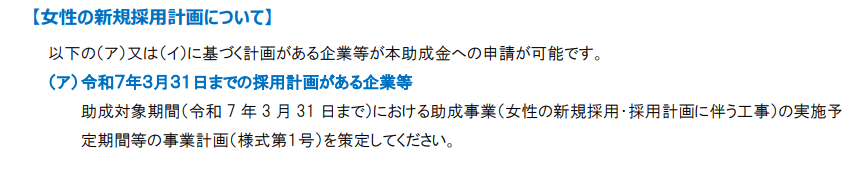
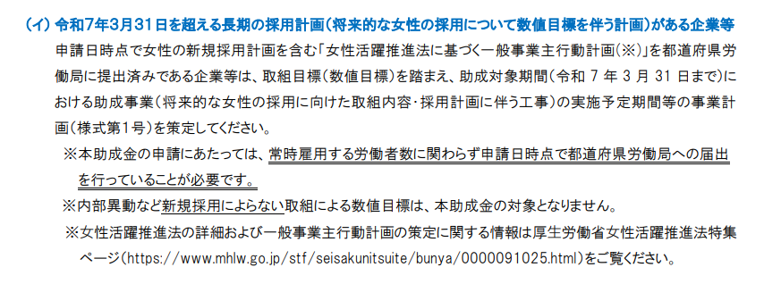
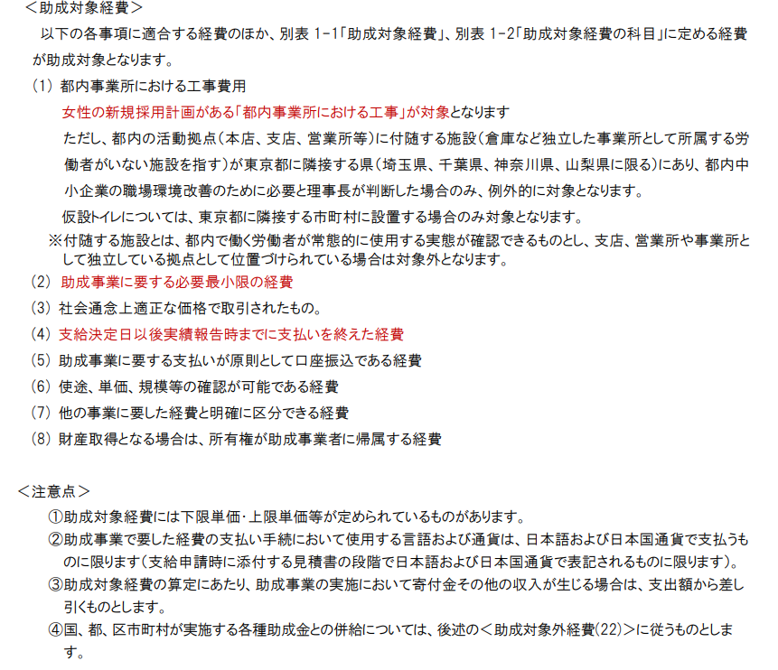

# 目次

0. [結論](#結論)
1. [概要](#概要)
2. [ワークログ](#ワークログ)

# 0. 結論
 申込期限が短いので申し込むならはやくしないといけない。

これから女性を採用しようとしている企業が対象。

女性専用設備を作るための工事や、購入に対する助成金。

 

# 1. 概要
[INTERN-139: 令和５年度　女性の活躍推進助成金（ジョカツ！）完了](https://remotesalesproject.atlassian.net/browse/INTERN-139)
 
[令和５年度　女性の活躍推進助成金 ｜ 東京しごと財団　雇用環境整備課 ](https://www.shigotozaidan.or.jp/koyo-kankyo/boshu/05jokatsu.html)

# 
2. ワークログ
期限12月15日

助成金額500万円。助成率は2/3。

以下を申請していると申し込めない

○令和３年度～令和４年度実施

　「女性の活躍推進助成金」

○令和２年度実施

　「【テレワーク活用・働く女性応援事業】女性の活躍推進助成金（女性の活躍推進事業）」

○平成３０年度～令和元年度実施

　「テレワーク活用・働く女性応援助成金（女性の活躍推進事業）」

○平成２８年度～平成２９年度実施

　「女性の活躍推進等職場環境整備助成金（女性の活躍推進事業）」

女性の採用計画がある企業しか申し込めない。

女性専用設備（トイレ、洗面所、更衣室、ロッカーの設置、休憩室、シャワー室、洗濯機の設置、仮眠室、ベビールーム、工事現場に設置する仮設トイレ）の整備を行う場合に、当該整備に係る費用の一部を助成するという助成金。

対象について

① 採用活動期間は最低３か月以上を計画しないといけない。

 ② 採用者の雇用期間は１か月以上であることとし、雇用形態は問われない。

 女性の新規採用計画がある「都内事業所における工事」が対象となる。詳しくは以下の画像を。

