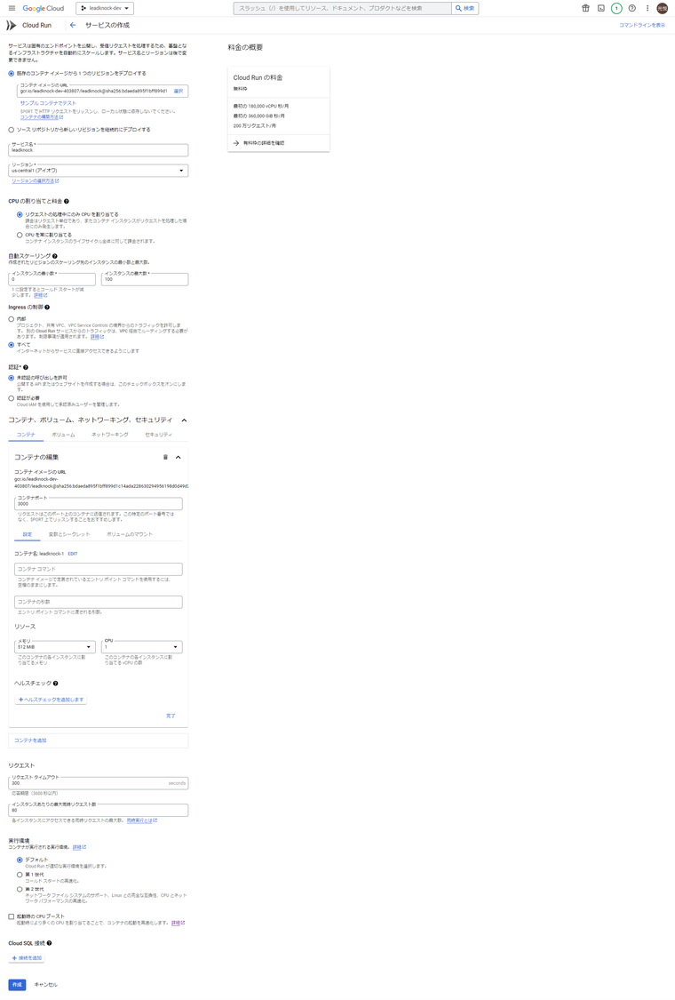

*   1 [0. 結論](#0.結論)
*   2 [1. 概要](#1.概要)
*   3 [2. Cloud Runの構築](#2.CloudRunの構築)
    *   3.1 [2.1. Cloud Runの構築](#2.1.CloudRunの構築)
    *   3.2 [2.2. Cloud Runの構築](#2.2.CloudRunの構築)
    *   3.3 [2.3. Cloud Runの構築](#2.3.CloudRunの構築)
    *   3.4 [2.4. Cloud Runの構築](#2.4.CloudRunの構築)
    *   3.5 [2.5. Cloud Runの構築](#2.5.CloudRunの構築)
*   4 [3. Cloud Runの設定と起動](#3.CloudRunの設定と起動)
*   5 [4. 参考](#4.参考)

# 0. 結論

デプロイできた↓

https://leadknock-g7hngnduea-uc.a.run.app/ 

# 1. 概要

https://pantarhei-hub.atlassian.net/browse/INTERN-140 

# 2. Cloud Runの構築

docker-compose関連ファイルの作成

`Dockerfile`
```
FROM node:16-bullseye-slim

WORKDIR /usr/src/app

COPY package.json yarn.lock ./
RUN yarn

COPY . .

EXPOSE 3000

ENV HOST=0.0.0.0
ENV PORT=3000

RUN yarn generate

CMD [ "yarn", "start" ]
```

## **gcloud CLI認証**
```
$ gcloud auth login
```
## **CLIにプロジェクトを設定**
```
$ gcloud config set project {GCPのプロジェクトID}
```
以下のように返ってくれば成功

`Updated property [core/project].`

## **gcloud CLIでdockerコマンドの設定を行う**

```
$ gcloud auth configure-docker
```
確認がでたら`Y`を入力

## **dockerイメージのビルドとアップロード**
```
$ gcloud builds submit --tag gcr.io/<YOUR_GOOGLE_CLOUD_PROJECT_ID>/leadknock .
```
# 3. Cloud Runの設定と起動


デプロイできた↓

https://leadknock-g7hngnduea-uc.a.run.app/ 

# 4. 参考
[Cloud Run でNuxtを動かす - y-ohgi's blog ](https://y-ohgi.blog/entry/2019/04/30/Cloud_Run_%E3%81%A7Nuxt%E3%82%92%E5%8B%95%E3%81%8B%E3%81%99)

[Google Cloud Run](https://v2.nuxt.com/deployments/google-cloud-run/)
