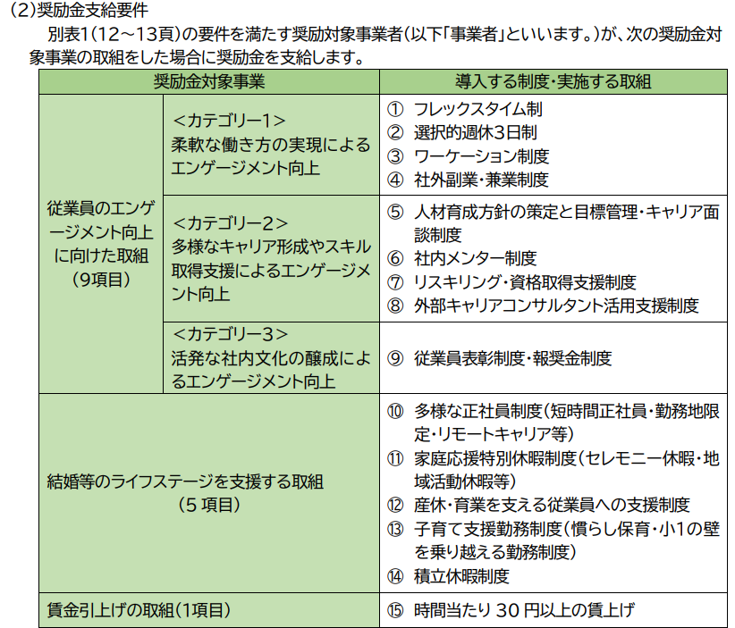
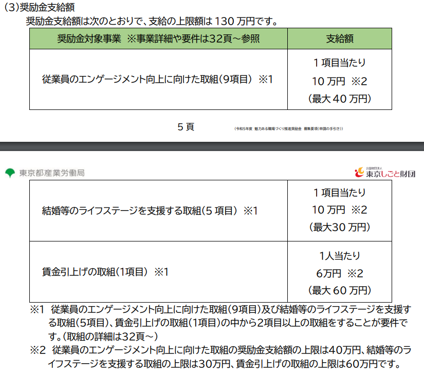
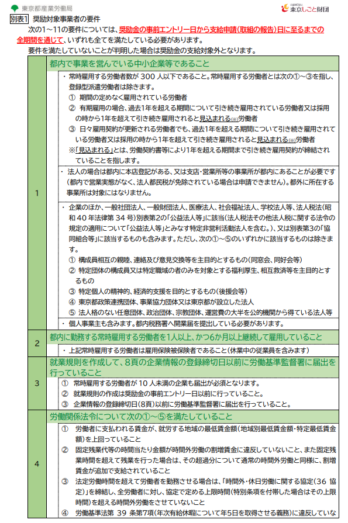
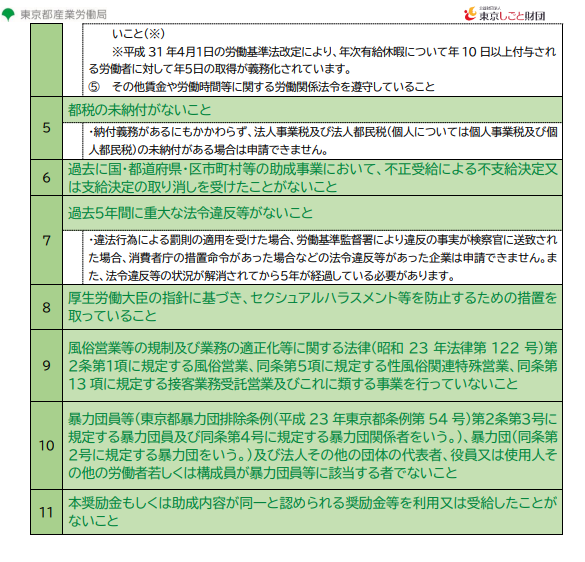
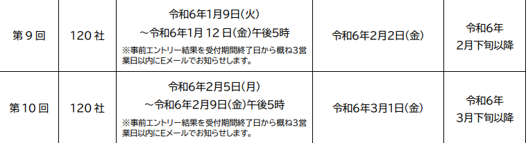
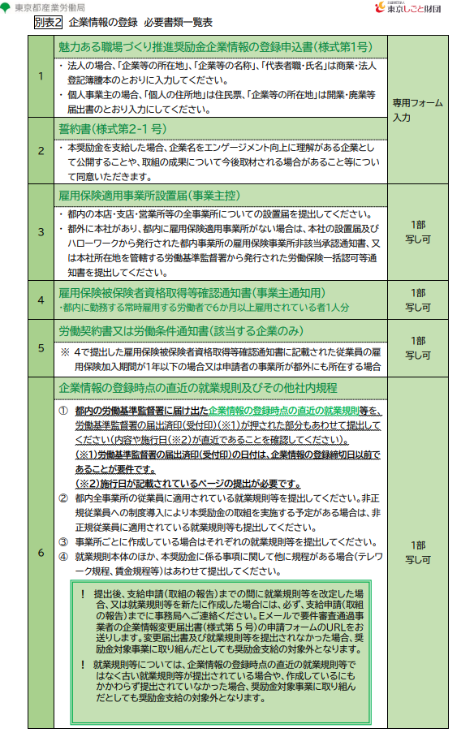
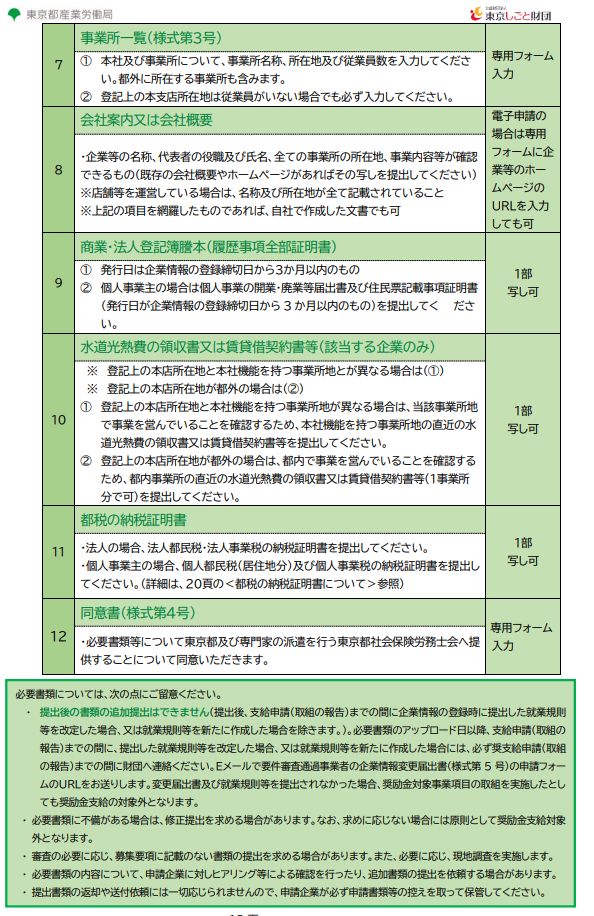

# 目次

0. [結論](#結論)
1. [概要](#概要)
2. [ワークログ](#ワークログ)

# 0. 結論
事前エントリーをしないといけない。

# 1. 概要
[INTERN-141: 魅力ある職場づくり推進奨励金完了](https://remotesalesproject.atlassian.net/browse/INTERN-141)
 
[魅力ある職場づくり推進奨励金 ｜ 東京しごと財団　雇用環境整備課 ](https://www.shigotozaidan.or.jp/koyo-kankyo/boshu/tokyoengagement.html)

# 2. ワークログ

奨励金額は大きい。

事前エントリーをして抽選に受かると申し込める。

対象事業者になるために雇用保険を結ばないといけない。

対象事業者の要件

２を満たしているかの確認が必要。

あと2回しかない。

期限は

  第９回令和6年1月12日まで

  第10回令和6年2月9日まで

 
事前エントリーサイト

[令和6年度 魅力ある職場づくり推進奨励金 ](https://www.tokyo-engagement.jp/)

エントリーの手順 

https://www.tokyo-engagement.jp/doc/r5/R5_jizenentry-manual.pdf

ちゃんと見ながらやらないといけない
 
# 必要書類
1.雇用保険適用事業所設置届

2.雇用保険被保険者資格取得等確認通知書（事業主通知用）

・都内に勤務する常時雇用する労働者で６か月以上雇用されている者１人分

3.労働契約書又は労働条件通知書

4.企業情報の登録時点の直近の就業規則及びその他社内規程

5.商業・法人登記簿謄本（履歴事項全部証明書）

6.都税の納税証明書

