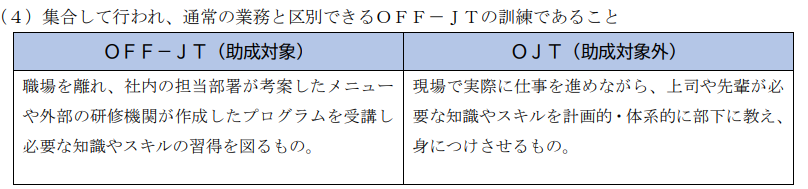
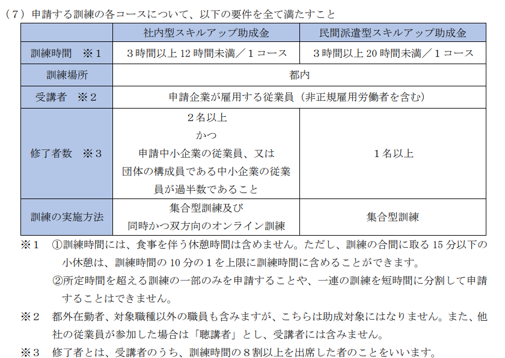
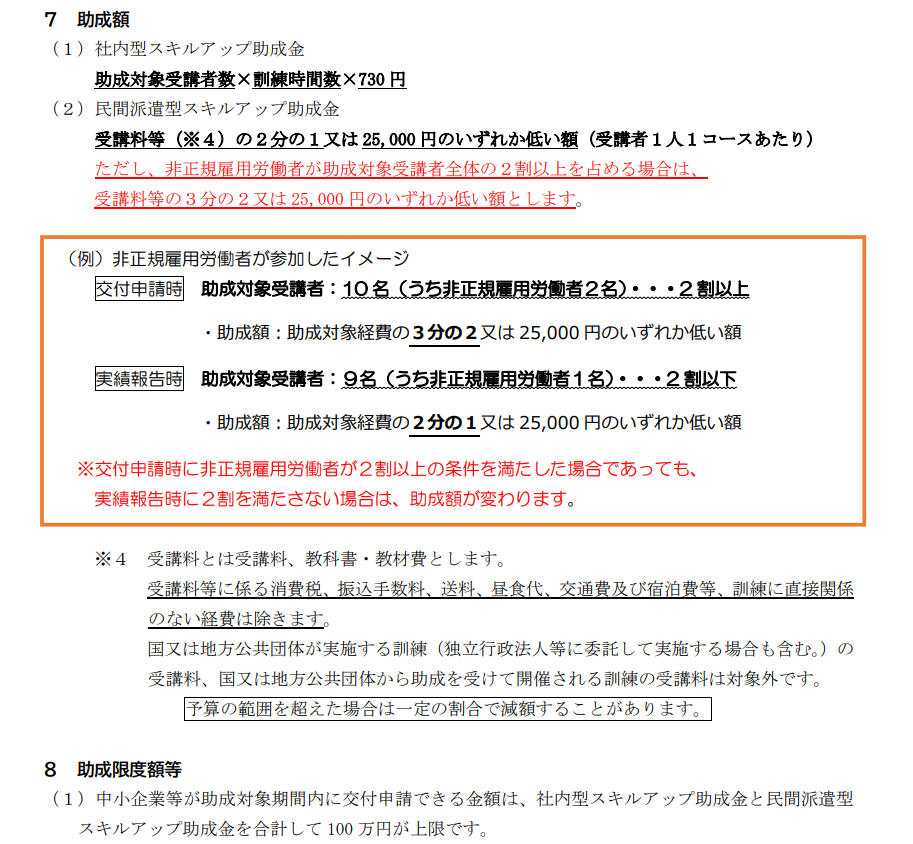
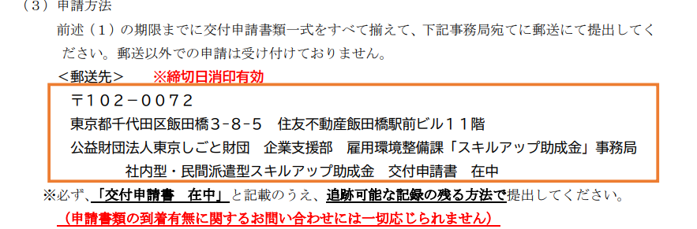
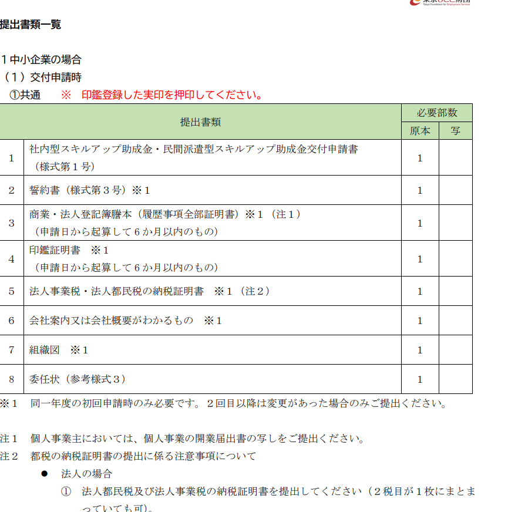
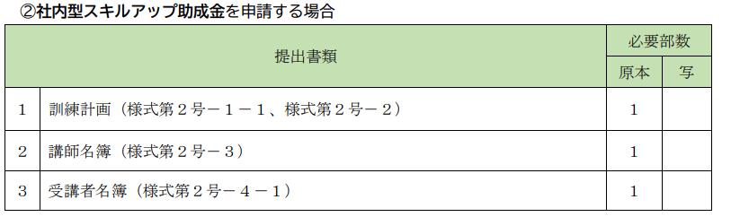

# 目次

0. [結論](#結論)
1. [概要](#概要)
2. [ワークログ](#ワークログ)

# 0. 結論
郵送しか無理。
 

必要書類

入力書類

1.社内型スキルアップ助成金・民間派遣型スキルアップ助成金交付申請書 （様式第１号）

2.誓約書（様式第３号）

3.訓練計画（様式第２号－１－１、様式第２号－２）

4.講師名簿（様式第２号－３）

5.受講者名簿（様式第２号－４－１）

必要書類

1.商業・法人登記簿謄本（履歴事項全部証明書）

2.印鑑証明書 

3.法人事業税・法人都民税の納税証明書

4.会社案内又は会社概要がわかるもの

5.組織図

# 1. 概要
[INTERN-143: 社内型スキルアップ助成金・民間派遣型スキルアップ助成金BACKLOG](https://remotesalesproject.atlassian.net/browse/INTERN-143)

[令和５年度　社内型スキルアップ助成金・民間派遣型スキルアップ助成金（中小企業人材スキルアップ支援事業） ｜ 東京しごと財団　雇用環境整備課 ](https://www.shigotozaidan.or.jp/koyo-kankyo/boshu/skillup.html)

# 2. ワークログ
申請できるものにあたると思うけどわからないので確認が必要。

訓練に要する経費を受講者に負担させていないこと。訓練を通常の勤務時間内に行い通常の賃金を支払っていること。やむを得ず通常の勤務時間外に 訓練を行う場合には必要な割増賃金等を支払っていること。を満たさないといけないので訓練を受ける時間を業務時間にあたるように変更が必要。

訓練の条件

社内型スキルアップ助成金は、中小企業等が自ら企画し実施する訓練であるもの。

民間派遣型スキルアップ助成金は、中小企業が従業員を教育機関等に派遣し実施する訓 練であること。

教育機関等の受講案内及び受講料が一般に公開されており、受講者１人１コースあたりの受 講料があらかじめ定められているものに限ります。

助成金

1人最大100時間まで

宛先

[令和５年度　社内型スキルアップ助成金・民間派遣型スキルアップ助成金（中小企業人材スキルアップ支援事業） ｜ 東京しごと財団　雇用環境整備課](https://www.shigotozaidan.or.jp/koyo-kankyo/boshu/skillup.html) 

このリンクから交付申請書、契約書をダウンロードできる。

 
## 提出書類
入力書類

1.社内型スキルアップ助成金・民間派遣型スキルアップ助成金交付申請書 （様式第１号）

2.誓約書（様式第３号）

3.訓練計画（様式第２号－１－１、様式第２号－２）

4.講師名簿（様式第２号－３）

5.受講者名簿（様式第２号－４－１）

必要書類

1.商業・法人登記簿謄本（履歴事項全部証明書）

2.印鑑証明書 

3.法人事業税・法人都民税の納税証明書

4.会社案内又は会社概要がわかるもの

5.組織図

提出書類一覧

