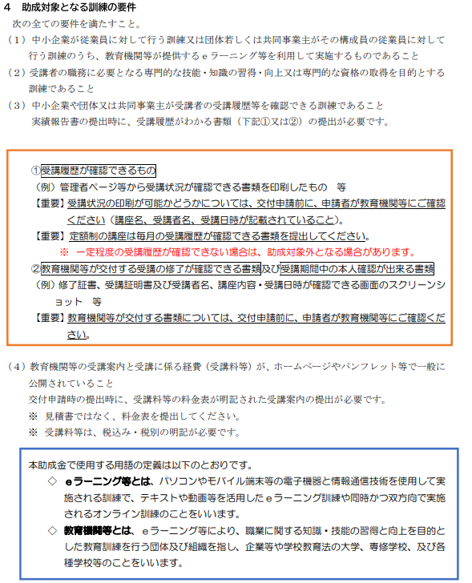
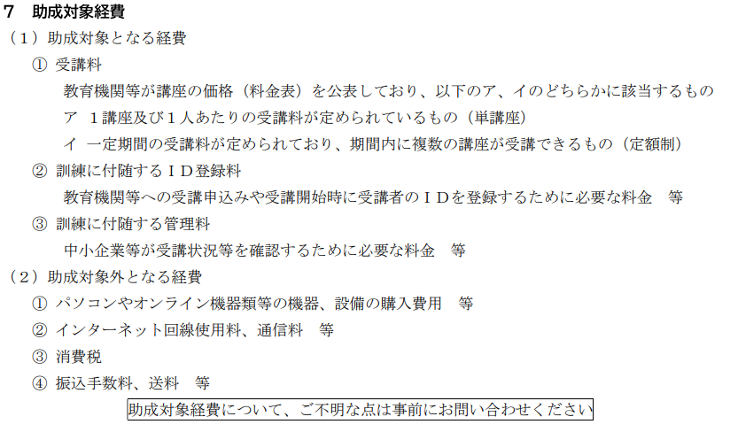
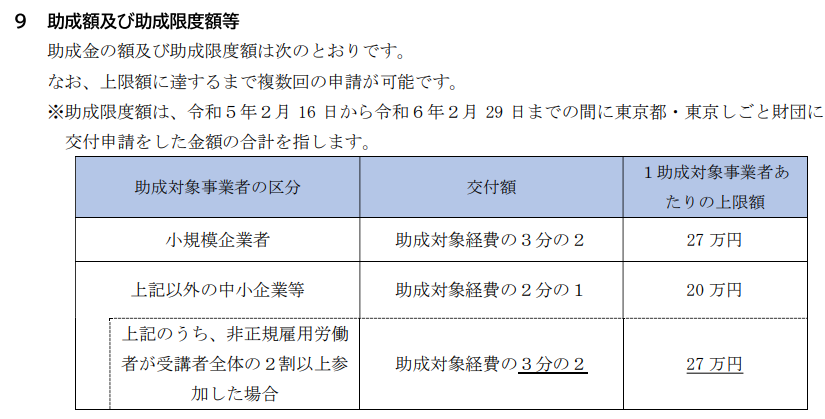
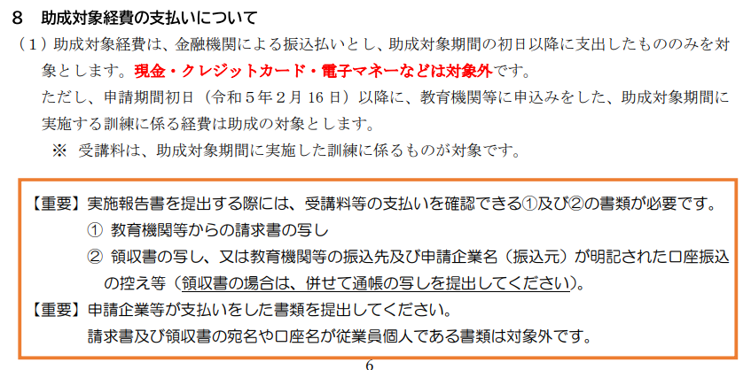
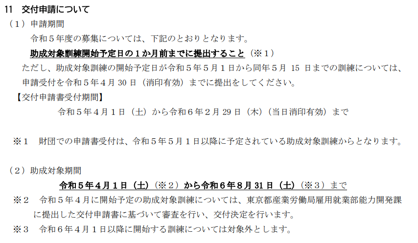

# 目次

0. [結論](#結論)
1. [概要](#概要)
2. [ワークログ](#ワークログ)

# 0. 結論
条件を満たしている。

eランニング等を使いたいなら申請をする。

 

# 1. 概要
[INTERN-146: 令和5年度オンラインスキルアップ助成金完了](https://remotesalesproject.atlassian.net/browse/INTERN-146)
 
[令和5年度オンラインスキルアップ助成金（中小企業人材スキルアップ支援事業） ｜ 東京しごと財団　雇用環境整備課](https://www.shigotozaidan.or.jp/koyo-kankyo/boshu/online.html)

# 2. ワークログ
 条件は社内型スキルアップ助成金と同じなので満たしている。

対象となる訓練はeランニング等を使っているオンライン教育に関するもの

助成対象の経費

助成率2/3

最大27万円

 

銀行などの振り込み払いにしないといけない。

訓練開始日の1か月前に申請しないといけない

