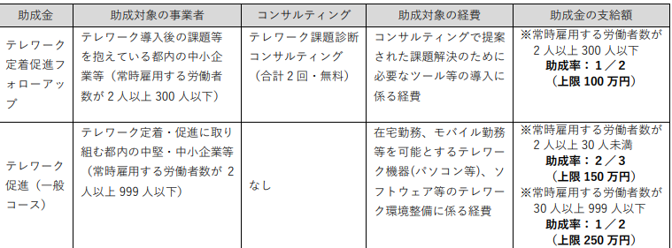

# 目次

0. [結論](#結論)
1. [概要](#概要)
2. [ワークログ](#ワークログ)

# 0. 結論
テレワーク推進助成金(テレワークをするためにかかる費用を助けてくれる)

魅力ある職場づくり推進奨励金(特定の制度を導入するともらえる)

社内型スキルアップ助成金・民間派遣型スキルアップ助成金(社内で勉強会などを開くともらえる)

令和５年度DXリスキリング助成金(DXに関する外部の教育機関に入るのを援助)

を申し込む

# 1. 概要
[INTERN-147: 申請できる助成金のリストアップ完了](https://remotesalesproject.atlassian.net/browse/INTERN-147)
 
以下の６個が申し込めそうなのでその調査

# 2. ワークログ
[INTERN-138 テレワーク定着促進フォローアップ助成金](https://remotesalesproject.atlassian.net/wiki/spaces/Intern/pages/444956873)
 
[テレワーク定着促進フォローアップ助成金 ｜ 東京しごと財団　雇用環境整備課](https://www.shigotozaidan.or.jp/koyo-kankyo/boshu/05_follow.html)

申込期限令和6年1月31日まで

条件を満たしているかの確認が必要。

助成金は100万円。助成率は1/2。

テレワーク推進助成金を申込中は申込ができない.

[INTERN-136 テレワーク促進助成金（令和5年度）](https://remotesalesproject.atlassian.net/wiki/spaces/Intern/pages/443383877)

[テレワーク促進助成金（令和6年度） ｜ 東京しごと財団　雇用環境整備課](https://www.shigotozaidan.or.jp/koyo-kankyo/joseikin/telesoku.html)

条件を満たしているかの確認が必要。

助成金は150万円。助成率は2/3。

テレワーク定着促進フォローアップ助成金を申請中は申込ができない。

申込令和6年1月31日まで

支給額が多いテレワーク推進助成金にする。

## 確認点
常時雇用する労働者が2名以上いるか。

雇用保険被保険者がいないといけないので結ぶ必要がある。

https://workstyle.metro.tokyo.lg.jp/about/ を受けないと申し込めない。

非正規社員拡充コースは非正規社員が対象。

[INTERN-141 魅力ある職場づくり推進奨励金](https://remotesalesproject.atlassian.net/wiki/spaces/Intern/pages/444924335)

[魅力ある職場づくり推進奨励金 ｜ 東京しごと財団　雇用環境整備課](https://www.shigotozaidan.or.jp/koyo-kankyo/boshu/tokyoengagement.html)

エントリーして抽選に受かると申し込める。

対象事業の要件を確認後事前エントリー。

どの制度を取り入れるかの話し合いが必要。

事前エントリーがあと２回申し込める。

期限は

  第９回令和6年1月12日まで

  第10回令和6年2月9日まで。

確認点
常時雇用する労働者が2名以上いるか。

雇用保険被保険者がいないといけないので結ぶ必要がある。

[12.INTERN-143 社内型スキルアップ助成金・民間派遣型スキルアップ助成金](https://remotesalesproject.atlassian.net/wiki/spaces/Intern/pages/446300162)

[令和５年度　社内型スキルアップ助成金・民間派遣型スキルアップ助成金（中小企業人材スキルアップ支援事業） ｜ 東京しごと財団　雇用環境整備課](https://www.shigotozaidan.or.jp/koyo-kankyo/boshu/skillup.html)

申し込めるので今から申し込む

マックス100万円

社内型スキルアップ助成金

  訓練者数×訓練時間×730

民間派遣型助成金

  受講料の2/3または25000円の低いほう

社内型スキルアップ助成金をもらう方針で申し込む。

訓練開始の１ヶ月以上前に申請が必要

申請期限令和6年2月29日まで 

## 確認事項
社内型スキルアップの計画書を書かないといけない。(訓練の前の1ヶ月以上前に提出しないといけないので1.2か月後の稼働表まで考えないといけなさそう)

[13. INTERN-146 令和5年度オンラインスキルアップ助成金](https://remotesalesproject.atlassian.net/wiki/spaces/Intern/pages/446267441)

[令和5年度オンラインスキルアップ助成金（中小企業人材スキルアップ支援事業） ｜ 東京しごと財団　雇用環境整備課](https://www.shigotozaidan.or.jp/koyo-kankyo/boshu/online.html)

令和６年２月２日（木）まで

条件は満たしている、

eランニング等のオンライン教材を導入するなら申し込む。

助成率2/3

助成金27万円。

これを申し込むなら下のDXリスキリング助成金を申し込むでよい。

 

[14.令和５年度　DXリスキリング助成金（中小企業人材スキルアップ支援事業） ｜ 東京しごと財団　雇用環境整備課](https://www.shigotozaidan.or.jp/koyo-kankyo/boshu/dx.html)

DXに限定した助成金。(定額制のものは含まれない)

助成率2/3

助成金64万

申請期限令和6年2月29日まで

