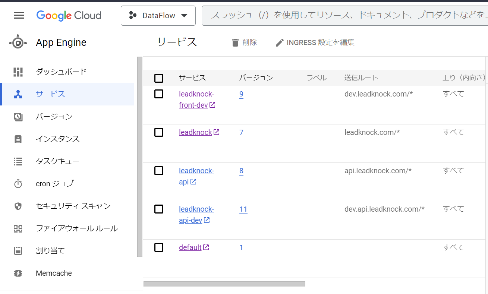
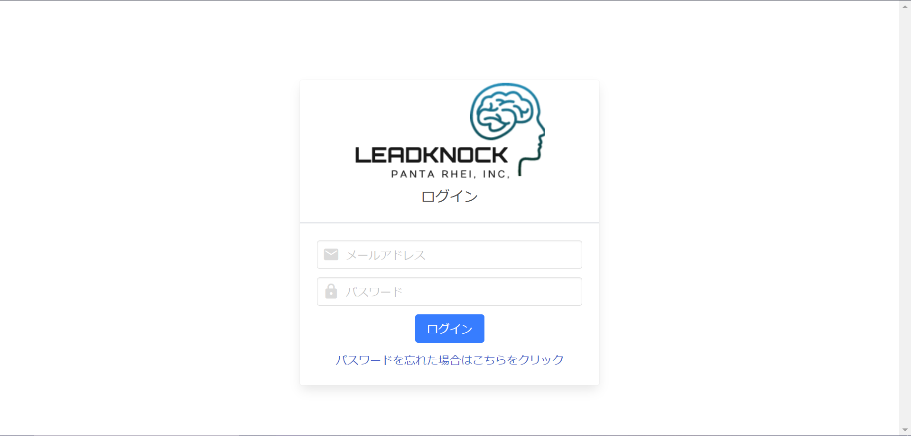
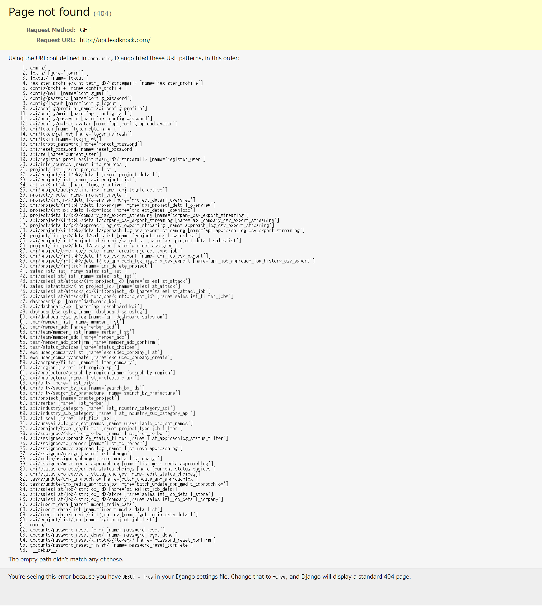
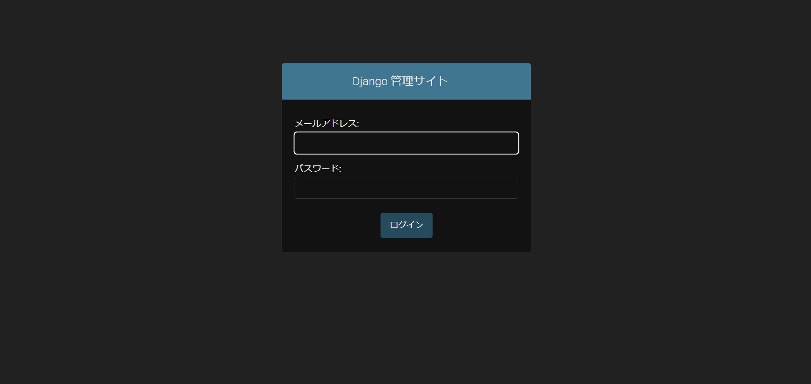

# 目次

0. [結論](#結論)
1. [概要](#概要)
2. [GAEサービス](#gaeサービス)
    - [フロントエンド](#フロントエンド)
    - [バックエンド](#バックエンド)

# 0. 結論
CloudSQLにインスタンスを作成してadminアカウントあればサービスに入れそう

# 1. 概要
[INTERN-152: DataFlowプロジェクトのGAEの中身の調査完了](https://remotesalesproject.atlassian.net/browse/INTERN-152)
 
# 2. GAEサービス

## フロントエンド
・leadknock-front-dev(開発環境)

・leadknock(本番環境)

adminアカウントあれば入れそう？

## バックエンド
・leadknock-api-dev(開発環境)

・leadknock-api(本番環境)

