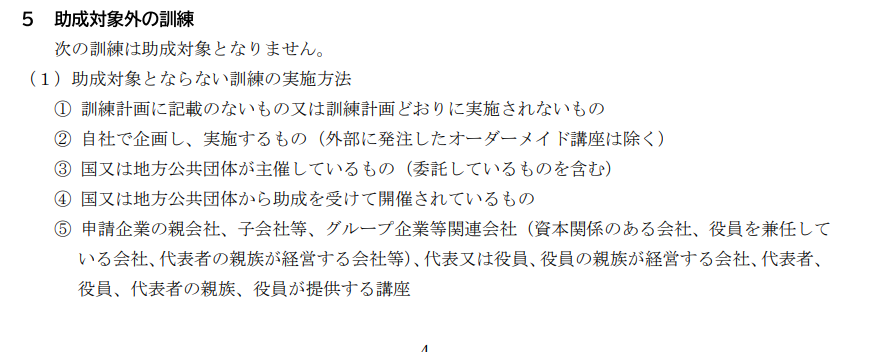
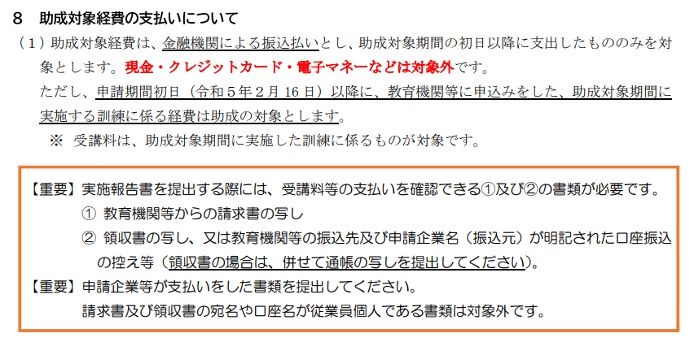

# 目次

0. [結論](#結論)
1. [概要](#概要)
2. [ワークログ](#ワークログ)

# 0.結論
郵送のみ

入力書類

1.ＤＸリスキリング助成金交付申請書（様式第１号）

2.誓約書（様式第３号）

3.訓練計画書（様式第２号）

4.受講者名簿（様式第２号－２）

5.交付申請時 書類提出チェック用紙

6.組織図 

必要書類

1.商業・法人登記簿謄本（履歴事項全部証明書）

2.印鑑証明書

3.法人事業税・法人都民税の納税証明書

4.会社案内又は会社概要がわかるもの

5.受講案内

 

# 1.概要
 [INTERN-155: 令和５年度DXリスキリング助成金BACKLOG](https://remotesalesproject.atlassian.net/browse/INTERN-155)
 
 [令和５年度　DXリスキリング助成金（中小企業人材スキルアップ支援事業） ｜ 東京しごと財団　雇用環境整備課 ](https://www.shigotozaidan.or.jp/koyo-kankyo/boshu/dx.html)

# 2.ワークログ
助成金

助成率2/3

助成金額64万

| 交付額 | 1助成対象事業者あたりの上限額 |
| ------ | ------------------------------ |
| 助成対象経費の3分の2 | 64万円 |

訓練の要件

## 助成対象外の訓練

## 経費について

申請期間

宛先

## 提出書類
入力書類

1.ＤＸリスキリング助成金交付申請書（様式第１号）

2.誓約書（様式第３号）

3.訓練計画書（様式第２号）

4.受講者名簿（様式第２号－２）

5.交付申請時 書類提出チェック用紙

6.組織図

必要書類

1.商業・法人登記簿謄本（履歴事項全部証明書）

2.印鑑証明書

3.法人事業税・法人都民税の納税証明書

4.会社案内又は会社概要がわかるもの

5.受講案内

