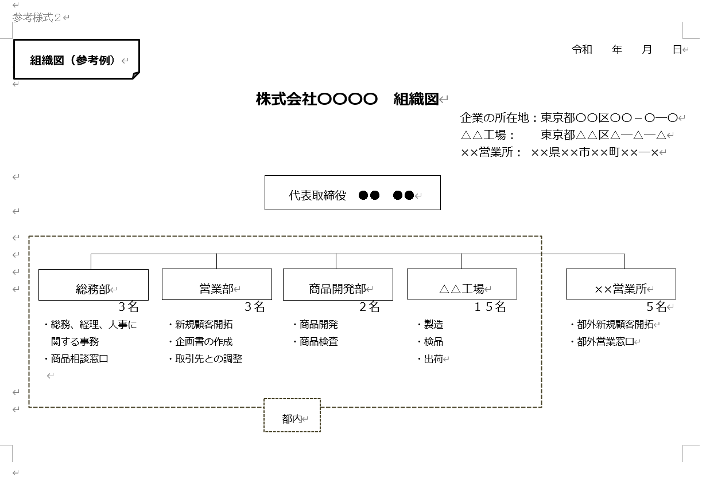

# 目次

0. [結論](#結論)
1. [概要](#概要)
2. [ワークログ](#ワークログ)

# 0. 結論

| 状態                             | 説明                                |
| -------------------------------- | ----------------------------------- |
| 社内型スキルアップ助成金・民間派遣型スキルアップ助成金交付申請書 | 訓練計画書が完成しないと書けない。  |
| 誓約書                           | サインとチェックをするだけ          |
| 訓練計画                         | 稼働日を決めないと書けない          |
| 講師名簿                         |                                     |
| 受講者名簿                       | 訓練計画書完成後着手                |
| 組織図                           | 確認待ち                            |

# 1. 概要
[INTERN-159: 提出書類の作成レビュー中](https://remotesalesproject.atlassian.net/browse/INTERN-159)

# 2. ワークログ
**社内型スキルアップ助成金・民間派遣型スキルアップ助成金交付申請書**

**訓練計画・実績表**

**受講者名簿**

**講師名簿**

**組織図**

