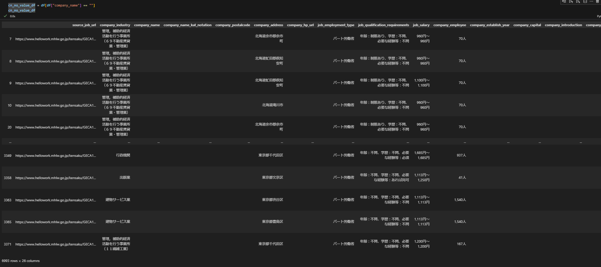
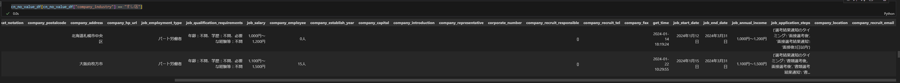

# 目次

0. [結論](#結論)
1. [概要](#概要)
2. [ワークログ](#ワークログ)
    - [DataFrameの作成](#dataframeの作成)
    - [会社名がない求人について分析](#会社名がない求人について分析)
        - [会社名がないレコードのみ抽出したDataFrameをcn_no_value_dfとして定義](#会社名がないレコードのみ抽出したdataframeをcn_no_value_dfとして定義)
        - [会社名がない求人数](#会社名がない求人数)
        - [産業をチェック](#産業をチェック)
        - [会社の住所をチェック](#会社の住所をチェック)

# 0. 結論
会社名がない求人はすべて行政機関と言える．(n=6993)

# 1. 概要
[INTERN-183: helloworkのcompany_nameがつかない企業についての傾向を調査完了](https://remotesalesproject.atlassian.net/browse/INTERN-183)
 

# 2. ワークログ
## 2.0. DataFrameの作成
DataFrameは5つのjsonデータを縦に結合することで，行数75990のDataFrameを作成した．ただし，重複する行はない

```
import pandas as pd
import numpy as np

pd.set_option('display.max_columns', 30)

df1 = pd.read_json("result_test.json", encoding='utf-8', orient='records')
df2 = pd.read_json("result_20240115_0316.json", encoding='utf-8', orient='records')
df3 = pd.read_json("result_20240122_0259.json", encoding='utf-8', orient='records')
df4 = pd.read_json("result_20240124_1541.json", encoding='utf-8', orient='records')
df5 = pd.read_json("result_20240127_0226.json", encoding='utf-8', orient='records')

df = pd.concat([df1, df2, df3, df4, df5])
```

## 2.1. 会社名がない求人について分析
### 2.1.0. 会社名がないレコードのみ抽出したDataFrameをcn_no_value_dfとして定義

```
cn_no_value_df = df[df["company_name"] == ""]
```



### 2.1.1. 会社名がない求人数
会社名がない求人数は6993で，約1割存在した．

```
len(cn_no_value_df)
###結果###
6993
```
2.1.2. 産業をチェック

```
cn_no_value_df["company_industry"].unique()

###結果###
array(['管理，補助的経済活動を行う事業所（６９不動産賃貸業・管理業）', '一般貨物自動車運送業', '行政機関', '水産食料品製造業',
       '老人福祉・介護事業', '児童福祉事業', '家具・建具・畳小売業', '建築材料卸売業', '他に分類されない事業サービス業',
       'その他の機械器具卸売業', '公認会計士事務所，税理士事務所', '一般診療所', 'すし店', '労働者派遣業',
       '他に分類されない小売業', '障害者福祉事業', '電気工事業', 'パン・菓子製造業', '高等教育機関',
       '野菜缶詰・果実缶詰・農産保存食料品製造業', '経済団体', '食料・飲料卸売業', '市町村機関',
       '管理，補助的経済活動を行う事業所（３９情報サービス業）', '建物サービス業', '産業廃棄物処理業',
       'その他の繊維製品製造業', '一般廃棄物処理業', 'その他の飲食料品小売業', 'スポーツ用品・がん具・娯楽用品・楽器小売業',
       '農畜産物・水産物卸売業', '幼稚園', '土木建築サービス業', '紙製品製造業',
       '和装製品・その他の衣服・繊維製身の回り品製造業', '病院', 'その他のプラスチック製品製造業',
       'その他の家具・装備品製造業', '電線・ケーブル製造業', '燃料小売業', '書籍・文房具小売業', '自動車整備業',
       '計量器・測定器・分析機器・試験機・測量機械器具・理化学機械器', '事業協同組合（他に分類されないもの）',
       '食堂，レストラン（専門料理店を除く）', '耕種農業', '医薬品・化粧品等卸売業', '保険媒介代理業', 'ニット生地製造業',
       '潤滑油・グリース製造業（石油精製業によらないもの）', 'その他の飲食店', '産業機械器具卸売業', '不動産管理業',
       '不動産代理業・仲介業', '不動産賃貸業（貸家業，貸間業を除く）', 'その他の食料品製造業', '都道府県機関', '警備業',
       '医薬品・化粧品小売業', '情報処理・提供サービス業', 'その他の専門サービス業', '他に分類されない卸売業',
       '各種商品卸売業', '婦人・子供服小売業', '通信販売・訪問販売小売業', '学習塾', '航空機・同附属品製造業',
       '共済事業，少額短期保険業', 'その他の社会保険・社会福祉・介護事業', 'ボルト・ナット・リベット・小ねじ・木ねじ等製造業',
       '金属被覆・彫刻業，熱処理業（ほうろう鉄器を除く）', 'こん包業', '他に分類されない生活関連サービス業', '損害保険業',
       '暖房・調理等装置，配管工事用附属品製造業', '繊維品卸売業（衣服，身の回り品を除く）', '菓子・パン小売業',
       '金属加工機械製造業', 'その他の道路貨物運送業', '他に分類されない非営利的団体', '自然科学研究所', '健康相談施設',
       '各種食料品小売業', '印刷業', '旅館，ホテル', 'プラスチックフィルム・シート・床材・合成皮革製造業',
       '石工・れんが・タイル・ブロック工事業', '幼保連携型認定こども園', 'その他の織物・衣服・身の回り品小売業',
       'その他のはん用機械・同部分品製造業', '畜産農業', '電子デバイス製造業', '仏教系宗教', 'その他の設備工事業',
       '織物業', '洗濯業', '一般土木建築工事業', '他に分類されないサービス業', '配達飲食サービス業', 'そば・うどん店',
       '自動車小売業', '食肉小売業', '石油・鉱物卸売業', '美容業', 'その他の化学工業', 'その他の電気機械器具製造業',
       'スポーツ施設提供業', '事務用機械器具製造業', '酒場，ビヤホール', 'その他のゴム製品製造業', '旅行業',
       '計量証明業', '社会保険労務士事務所', '機械器具小売業（自動車，自転車を除く）', '有機化学工業製品製造業',
       '他に分類されない教育，学習支援業', '金属素形材製品製造業', '工業用プラスチック製品製造業', '写真機・時計・眼鏡小売業',
       '再生資源卸売業', '電子回路製造業', '歯科診療所', '外衣・シャツ製造業（和式を除く）',
       'その他の運輸に附帯するサービス業', '土木工事業（舗装工事業を除く）',
       '管理，補助的経済活動を行う事業所（７４技術サービス業）', '遊戯場', '医療に附帯するサービス業', '衣服卸売業',
       'その他の道路旅客運送業', 'と畜場', '管理，補助的経済活動を行う事業所（８５社会保険・社会福祉・介',
       '公証人役場，司法書士事務所，土地家屋調査士事務所', '管理，補助的経済活動を行う事業所（５３建築材料，鉱物・金属材',
       'その他の職別工事業', '経営コンサルタント業，純粋持株会社', '専修学校，各種学校', '一般乗用旅客自動車運送業',
       '貨物運送取扱業（集配利用運送業を除く）', '管理，補助的経済活動を行う事業所（７７持ち帰り・配達飲食サー',
       '製糸業，紡績業，化学繊維・ねん糸等製造業', '鮮魚小売業', '管理，補助的経済活動を行う事業所（９５その他のサービス業）',
       '建設用・建築用金属製品製造業（製缶板金業を含む）', '専門料理店', '広告業', '医療用機械器具・医療用品製造業',
       '染色整理業', '民生用電気機械器具製造業', '管理，補助的経済活動を行う事業所（０６総合工事業）', '化学製品卸売業',
       '他に分類されない製造業', '福祉事務所', '冠婚葬祭業', '特別支援学校', '酒類製造業', '木造建築工事業',
       '郵便局', '家具製造業', '速記・ワープロ入力・複写業', '建築リフォーム工事業', '分類不能の産業', '労働団体',
       '教養・技能教授業', '郵便業（信書便事業を含む）', 'ユニット部品製造業', '火葬・墓地管理業', '貨物軽自動車運送業',
       '法律事務所，特許事務所', '野菜・果実小売業', 'その他の金属製品製造業', '採石業，砂・砂利・玉石採取業',
       '加工紙製造業', 'その他の修理業', '駐車場業', '建物売買業，土地売買業', '一般産業用機械・装置製造業',
       '家事サービス業', '農林水産業協同組合（他に分類されないもの）', '自動車・同附属品製造業', '鉄鋼製品卸売業',
       '銀行（中央銀行を除く）', 'ゴム製・プラスチック製履物・同附属品製造業', '電気機械器具卸売業', '各種物品賃貸業',
       'その他の各種商品小売業（従業者が常時５０人未満のもの）', '管理，補助的経済活動を行う事業所（６０その他の小売業）',
       '助産・看護業', 'ブリキ缶・その他のめっき板等製品製造業', '調味料製造業', '', '無機化学工業製品製造業',
       '造作材・合板・建築用組立材料製造業', '畜産食料品製造業', 'ペン・鉛筆・絵画用品・その他の事務用品製造業',
       '倉庫業（冷蔵倉庫業を除く）', '管理，補助的経済活動を行う事業所（８３医療業）', '紙製容器製造業', '園芸サービス業',
       '写真業', 'ソフトウェア業', 'プラスチック成形材料製造業（廃プラスチックを含む）', 'その他の洗濯・理容・美容・浴場業',
       '百貨店，総合スーパー', '新聞業', '管理，補助的経済活動を行う事業所（７２専門サービス業）', '繊維機械製造業',
       '自動車卸売業', '管工事業（さく井工事業を除く）', '農業サービス業（園芸サービス業を除く）',
       '管理，補助的経済活動を行う事業所（８０娯楽業）', '中小企業等金融業', '療術業', '家具・建具・じゅう器等卸売業',
       '生命保険業', 'その他の鉄鋼業', 'セメント・同製品製造業', 'かばん製造業', '通信機械器具・同関連機械器具製造業',
       'その他の物品賃貸業', '獣医業', 'インターネット附随サービス業', '畳等生活雑貨製品製造業', '呉服・服地・寝具小売業',
       '電気業', '管理，補助的経済活動を行う事業所（５５その他の卸売業）', '板金・金物工事業', '一般乗合旅客自動車運送業',
       '喫茶店', '高等学校，中等教育学校', '職業・教育支援施設', '管理，補助的経済活動を行う事業所（５８飲食料品小売業）',
       'その他の公衆浴場業', '社会教育', '建築工事業（木造建築工事業を除く）', 'デザイン業', '学術・文化団体',
       '洋食器・刃物・手道具・金物類製造業', 'その他の非鉄金属製造業', '綱・網・レース・繊維粗製品製造業',
       'その他のパルプ・紙・紙加工品製造業', '電気通信に附帯するサービス業', '機械修理業（電気機械器具を除く）', '小学校',
       'ゴムベルト・ゴムホース・工業用ゴム製品製造業', 'とび・土工・コンクリート工事業', '育林業', 'その他の娯楽業',
       '発電用・送電用・配電用電気機械器具製造業', 'その他の宿泊業', '産業用電気機械器具製造業', '製材業，木製品製造業',
       '管理，補助的経済活動を行う事業所（８７協同組合）', '発泡・強化プラスチック製品製造業',
       '化粧品・歯磨・その他の化粧用調整品製造業', '装身具・装飾品・ボタン・同関連品製造業（貴金属・宝石製を除く',
       'その他の技術サービス業', '衣服裁縫修理業', '研磨材・同製品製造業', '表面処理鋼材製造業', 'その他の保健衛生',
       '職業紹介業', '冷蔵倉庫業', '電気機械器具修理業', '紙・紙製品卸売業', '漆器製造業', '陶磁器・同関連製品製造業',
       '管理，補助的経済活動を行う事業所（７９その他の生活関連サービ', '茶・コーヒー製造業（清涼飲料を除く）', '運輸施設提供業',
       '自動車賃貸業', '舗装工事業', '管理，補助的経済活動を行う事業所（９２その他の事業サービス業',
       '補助的金融業，金融附帯業', '医薬品製造業', '管理，補助的経済活動を行う事業所（９１職業紹介・労働者派遣業',
       '床・内装工事業', '映像情報制作・配給業', '一般貸切旅客自動車運送業', '電子部品製造業', 'その他の無店舗小売業',
       '管理，補助的経済活動を行う事業所（５６各種商品小売業）', '電気計測器製造業',
       '映像・音声・文字情報制作に附帯するサービス業', '物品預り業', '非鉄金属卸売業', 'その他の輸送用機械器具製造業',
       '移動電気通信業', '管理，補助的経済活動を行う事業所（６３協同組織金融業）', 'その他の窯業・土石製品製造業', '製版業',
       '一般公衆浴場業', 'その他の非預金信用機関', '民間放送業（有線放送業を除く）', '特定貨物自動車運送業', '大工工事業',
       '管理，補助的経済活動を行う事業所（６１無店舗小売業）', '製本業，印刷物加工業',
       '管理，補助的経済活動を行う事業所（０１農業）', '楽器製造業', '動植物油脂製造業',
       '油脂加工製品・石けん・合成洗剤・界面活性剤・塗料製造業', '革製履物用材料・同附属品製造業',
       '管理，補助的経済活動を行う事業所（８２その他の教育，学習支援', '管理，補助的経済活動を行う事業所（４６航空運輸業）',
       '持ち帰り飲食サービス業', '行政書士事務所', '船舶製造・修理業，舶用機関製造業', '下水道業',
       '管理，補助的経済活動を行う事業所（２６生産用機械器具製造業）', '貸金業', '飼料・有機質肥料製造業', '機械設計業',
       '鉄道業', '塗装工事業', 'ガス業', '理容業', '印刷関連サービス業', '公園，遊園地', '身の回り品卸売業',
       'プラスチック板・棒・管・継手・異形押出製品製造業', '紙製造業', '海面漁業', '保険サービス業', '固定電気通信業',
       '宗教用具製造業', '機械器具設置工事業', '靴・履物小売業', '男子服小売業', '革製履物製造業',
       '光学機械器具・レンズ製造業', '上水道業', '貴金属・宝石製品製造業', '神道系宗教',
       '非鉄金属第２次製錬・精製業（非鉄金属合金製造業を含む）', '社会保険事業団体', '産業用機械器具賃貸業', '出版業',
       '管理，補助的経済活動を行う事業所（１１繊維工業）'], dtype=object)
```

すし店など，企業が経営してそうな値を発見した．一瞬不安になったが，company_addressの値を見て，行政機関であることがわかり，安心した．

```
cn_no_value_df[cn_no_value_df["company_industry"] == "すし店"]
```



### 2.1.3. 会社の住所をチェック
```
cn_no_value_df["company_address"].unique()

###実行結果###

array(['北海道余市郡余市町', '北海道虻田郡倶知安町', '北海道滝川市', '北海道札幌市手稲区', '北海道札幌市中央区',
       '北海道函館市', '北海道釧路郡釧路町', '北海道札幌市白石区', '岩手県盛岡市', '宮城県仙台市若林区',
       '宮城県仙台市宮城野区', '宮城県仙台市青葉区', '北海道旭川市', '北海道札幌市北区', '青森県青森市',
       '青森県弘前市', '青森県上北郡おいらせ町', '岩手県宮古市', '岩手県二戸市', '宮城県仙台市太白区', '宮城県石巻市',
       '秋田県由利本荘市', '秋田県仙北市', '山形県米沢市', '福島県郡山市', '茨城県日立市', '茨城県笠間市',
       '茨城県水戸市', '茨城県つくば市', '茨城県古河市', '茨城県常陸大宮市', '栃木県芳賀郡市貝町', '栃木県足利市',
       '群馬県前橋市', '栃木県那須塩原市', '栃木県下野市', '群馬県伊勢崎市', '群馬県桐生市', '群馬県みどり市',
       '埼玉県熊谷市', '埼玉県さいたま市大宮区', '大阪府大阪市北区', '東京都港区', '埼玉県上尾市', '埼玉県越谷市',
       '千葉県市原市', '千葉県館山市', '千葉県旭市', '千葉県銚子市', '千葉県匝瑳市', '東京都新宿区', '千葉県柏市',
       '東京都千代田区', '千葉県千葉市中央区', '千葉県千葉市美浜区', '東京都中央区', '東京都渋谷区', '東京都品川区',
       '東京都世田谷区', '東京都江東区', '長野県長野市', '埼玉県川越市', '東京都大田区', '神奈川県藤沢市',
       '神奈川県相模原市南区', '東京都豊島区', '山口県光市', '東京都練馬区', '東京都三鷹市', '東京都墨田区',
       '東京都葛飾区', '東京都調布市', '東京都江戸川区', '東京都あきる野市', '神奈川県横浜市中区',
       '神奈川県横浜市戸塚区', '神奈川県横須賀市', '神奈川県横浜市鶴見区', '神奈川県海老名市', '神奈川県横浜市都筑区',
       '新潟県新潟市東区', '新潟県新潟市中央区', '富山県富山市', '富山県滑川市', '山梨県北杜市', '山梨県山梨市',
       '長野県上水内郡飯綱町', '長野県松本市', '岐阜県岐阜市', '岐阜県揖斐郡池田町', '岐阜県各務原市', '岐阜県下呂市',
       '静岡県静岡市駿河区', '静岡県駿東郡長泉町', '静岡県伊東市', '静岡県富士市', '静岡県袋井市', '静岡県磐田市',
       '静岡県周智郡森町', '愛知県日進市', '愛知県名古屋市西区', '愛知県名古屋市中村区', '愛知県名古屋市',
       '愛知県豊橋市', '愛知県豊田市', '岐阜県多治見市', '愛知県小牧市', '愛知県名古屋市瑞穂区', '愛知県岡崎市',
       '愛知県一宮市', '愛知県高浜市', '愛知県豊川市', '三重県員弁郡東員町', '滋賀県大津市', '長崎県長崎市',
       '京都府京都市上京区', '京都府京都市左京区', '京都府京都市中京区', '京都府京都市東山区', '三重県志摩市',
       '京都府宇治市', '京都府城陽市', '京都府京都市右京区', '大阪府大阪市天王寺区', '大阪府大阪市鶴見区',
       '大阪府大阪市中央区', '大阪府大阪市東住吉区', '大阪府大阪市淀川区', '大阪府吹田市', '大阪府大阪市都島区',
       '大阪府大阪市住之江区', '東京都目黒区', '大阪府大阪市阿倍野区', '千葉県市川市', '東京都足立区',
       '神奈川県川崎市川崎区', '大阪府大阪市西区', '北海道千歳市', '大阪府東大阪市', '兵庫県豊岡市',
       '大阪府大阪市東淀川区', '大阪府堺市西区', '大阪府堺市堺区', '大阪府岸和田市', '大阪府泉佐野市', '大阪府枚方市',
       '大阪府大阪狭山市', '兵庫県神戸市垂水区', '兵庫県神戸市灘区', '兵庫県神戸市兵庫区', '兵庫県尼崎市',
       '兵庫県姫路市', '兵庫県加古川市', '奈良県奈良市', '和歌山県和歌山市', '岡山県岡山市東区',
       '広島県広島市安佐南区', '広島県福山市', '広島県廿日市市', '山口県宇部市', '徳島県鳴門市', '香川県高松市',
       '徳島県徳島市', '愛媛県松山市', '愛媛県新居浜市', '福岡県福岡市東区', '福岡県福岡市博多区', '福岡県大野城市',
       '福岡県糟屋郡志免町', '福岡県北九州市八幡西区', '福岡県北九州市小倉北区', '福岡県春日市', '福岡県福岡市南区',
       '佐賀県唐津市', '佐賀県伊万里市', '熊本県玉名市', '宮崎県都城市', '沖縄県那覇市', '沖縄県名護市',
       '北海道北斗市', '北海道河東郡音更町', '北海道帯広市', '宮城県岩沼市', '秋田県横手市', '秋田県大館市',
       '福島県福島市', '茨城県ひたちなか市', '福島県南相馬市', '茨城県下妻市', '栃木県宇都宮市',
       '栃木県下都賀郡壬生町', '栃木県日光市', '栃木県小山市', '群馬県高崎市', '群馬県太田市', '群馬県富岡市',
       '埼玉県草加市', '埼玉県川口市', '埼玉県坂戸市', '埼玉県さいたま市緑区', '埼玉県東松山市', '埼玉県所沢市',
       '埼玉県秩父市', '埼玉県行田市', '千葉県野田市', '山梨県富士吉田市', '沖縄県八重山郡竹富町',
       '神奈川県横浜市西区', '神奈川県相模原市中央区', '茨城県常総市', '東京都北区', '東京都荒川区', '東京都文京区',
       '東京都昭島市', '東京都西東京市', '神奈川県横浜市磯子区', '神奈川県横浜市神奈川区', '神奈川県大和市',
       '神奈川県横浜市泉区', '東京都町田市', '千葉県四街道市', '神奈川県平塚市', '神奈川県川崎市宮前区',
       '新潟県新潟市南区', '新潟県五泉市', '富山県射水市', '富山県中新川郡舟橋村', '山梨県南都留郡富士河口湖町',
       '長野県上田市', '岐阜県本巣郡北方町', '静岡県焼津市', '静岡県藤枝市', '愛知県名古屋市守山区',
       '愛知県名古屋市北区', '福井県福井市', '愛知県名古屋市南区', '愛知県みよし市', '愛知県蒲郡市', '愛知県刈谷市',
       '三重県四日市市', '愛知県春日井市', '滋賀県東近江市', '京都府京都市下京区', '京都府亀岡市',
       '京都府京都市伏見区', '大阪府大阪市城東区', '大阪府大阪市港区', '大阪府箕面市', '大阪府大阪市浪速区',
       '大阪府大阪市旭区', '大阪府大阪市西淀川区', '奈良県香芝市', '兵庫県三田市', '大阪府堺市美原区',
       '大阪府泉北郡忠岡町', '大阪府和泉市', '大阪府豊中市', '大阪府交野市', '大阪府阪南市', '大阪府泉南市',
       '兵庫県神戸市長田区', '兵庫県神戸市中央区', '兵庫県神戸市須磨区', '兵庫県揖保郡太子町', '兵庫県伊丹市',
       '兵庫県加西市', '奈良県橿原市', '奈良県大和郡山市', '鳥取県鳥取市', '岡山県津山市', '岡山県玉野市',
       '広島県東広島市', '広島県尾道市', '広島県呉市', '山口県岩国市', '山口県玖珂郡和木町', '徳島県海部郡海陽町',
       '徳島県三好郡東みよし町', '徳島県三好市', '香川県丸亀市', '福岡県福岡市早良区', '福岡県田川郡香春町',
       '福岡県柳川市', '福岡県大牟田市', '福岡県久留米市', '福岡県田川郡川崎町', '福岡県北九州市小倉南区',
       '福岡県糸島市', '長崎県島原市', '長崎県南島原市', '熊本県熊本市東区', '熊本県山鹿市', '大分県別府市',
       '鹿児島県鹿児島市', '鹿児島県鹿屋市', '北海道石狩市', '北海道札幌市豊平区', '秋田県秋田市', '秋田県男鹿市',
       '宮城県遠田郡美里町', '山形県南陽市', '山形県西村山郡河北町', '新潟県新発田市', '新潟県新潟市秋葉区',
       '新潟県燕市', '新潟県新潟市西蒲区', '北海道釧路市', '北海道苫小牧市', '岩手県花巻市', '宮城県黒川郡大衡村',
       '宮城県角田市', '宮城県名取市', '福島県いわき市', '岩手県奥州市', '宮城県栗原市', '宮城県富谷市',
       '岩手県胆沢郡金ケ崎町', '宮城県仙台市泉区', '福島県須賀川市', '福島県岩瀬郡鏡石町', '茨城県土浦市',
       '栃木県鹿沼市', '栃木県大田原市', '栃木県矢板市', '栃木県塩谷郡塩谷町', '群馬県邑楽郡明和町',
       '群馬県甘楽郡甘楽町', '埼玉県戸田市', '埼玉県蕨市', '埼玉県児玉郡美里町', '埼玉県さいたま市中央区',
       '埼玉県狭山市', '埼玉県加須市', '埼玉県久喜市', '千葉県松戸市', '千葉県鴨川市', '千葉県勝浦市',
       '徳島県阿南市', '東京都八王子市', '東京都台東区', '宮崎県宮崎市', '茨城県石岡市', '神奈川県厚木市',
       '東京都立川市', '東京都小平市', '神奈川県横浜市緑区', '神奈川県川崎市中原区', '神奈川県川崎市幸区',
       '神奈川県伊勢原市', '神奈川県茅ヶ崎市', '神奈川県鎌倉市', '神奈川県横浜市港北区', '神奈川県川崎市麻生区',
       '神奈川県川崎市多摩区', '神奈川県座間市', '長野県東御市', '新潟県長岡市', '新潟県上越市', '富山県高岡市',
       '山梨県韮崎市', '長野県北佐久郡軽井沢町', '山梨県中央市', '山梨県甲斐市', '山梨県笛吹市', '長野県駒ヶ根市',
       '長野県伊那市', '長野県上高井郡小布施町', '岐阜県山県市', '岐阜県安八郡神戸町', '岐阜県加茂郡富加町',
       '岐阜県関市', '静岡県静岡市葵区', '静岡県静岡市清水区', '静岡県沼津市', '静岡県島田市', '静岡県菊川市',
       '静岡県熱海市', '静岡県三島市', '愛知県名古屋市天白区', '愛知県清須市', '愛知県名古屋市港区',
       '愛知県名古屋市中区', '愛知県名古屋市緑区', '静岡県湖西市', '愛知県稲沢市', '愛知県尾張旭市', '三重県津市',
       '愛知県名古屋市千種区', '愛知県新城市', '三重県亀山市', '滋賀県彦根市', '京都府京都市北区', '京都府舞鶴市',
       '大阪府八尾市', '兵庫県西宮市', '大阪府堺市中区', '滋賀県近江八幡市', '大阪府門真市', '大阪府大阪市福島区',
       '兵庫県川西市', '京都府久世郡久御山町', '大阪府大阪市西成区', '東京都杉並区', '奈良県天理市',
       '兵庫県神戸市北区', '大阪府富田林市', '大阪府河内長野市', '奈良県桜井市', '和歌山県海南市', '鳥取県境港市',
       '', '島根県出雲市', '岡山県岡山市北区', '岡山県倉敷市', '香川県香川郡直島町', '広島県広島市佐伯区',
       '広島県広島市中区', '広島県広島市安佐北区', '広島県三原市', '山口県周南市', '山口県防府市', '山口県山口市',
       '広島県広島市南区', '広島県広島市東区', '広島県広島市安芸区', '香川県善通寺市', '香川県観音寺市',
       '愛媛県今治市', '高知県高知市', '福岡県福岡市中央区', '福岡県筑紫野市', '高知県南国市', '高知県安芸市',
       '石川県河北郡内灘町', '広島県安芸高田市', '長崎県大村市', '熊本県熊本市中央区', '熊本県上益城郡嘉島町',
       '熊本県熊本市南区', '熊本県荒尾市', '長崎県諫早市', '大分県宇佐市', '鹿児島県日置市', '沖縄県うるま市',
       '沖縄県宮古島市', '北海道札幌市厚別区', '沖縄県沖縄市', '沖縄県島尻郡八重瀬町', '北海道札幌市西区',
       '北海道亀田郡七飯町', '北海道富良野市', '北海道名寄市', '北海道上川郡東川町', '北海道恵庭市', '青森県十和田市',
       '岩手県北上市', '宮城県多賀城市', '秋田県能代市', '福島県白河市', '福島県会津若松市', '茨城県小美玉市',
       '茨城県守谷市', '茨城県神栖市', '茨城県高萩市', '群馬県邑楽郡邑楽町', '埼玉県さいたま市南区',
       '埼玉県さいたま市岩槻区', '埼玉県比企郡嵐山町', '栃木県佐野市', '茨城県筑西市', '茨城県結城市', '茨城県桜川市',
       '茨城県那珂市', '茨城県稲敷郡美浦村', '福島県南会津郡南会津町', '福島県伊達市', '茨城県鉾田市', '山形県酒田市',
       '山形県山形市', '秋田県大仙市', '青森県むつ市', '青森県三戸郡五戸町', '北海道札幌市東区',
       '北海道標津郡中標津町', '北海道浦河郡浦河町', '北海道樺戸郡月形町', '北海道登別市', '北海道赤平市',
       '北海道北見市', '鹿児島県指宿市', '鹿児島県姶良市', '鹿児島県薩摩川内市', '宮崎県延岡市', '宮崎県東諸県郡綾町',
       '大分県大分市', '熊本県葦北郡津奈木町', '熊本県阿蘇郡小国町', '長崎県西海市', '長崎県西彼杵郡長与町',
       '佐賀県杵島郡江北町', '福岡県福岡市西区', '福岡県古賀市', '福岡県糟屋郡粕屋町', '福岡県京都郡みやこ町',
       '福岡県北九州市若松区', '福岡県飯塚市', '富山県南砺市', '福岡県糟屋郡宇美町', '熊本県熊本市北区',
       '佐賀県神埼郡吉野ヶ里町', '愛媛県大洲市', '香川県綾歌郡綾川町', '徳島県小松島市', '広島県安芸郡坂町',
       '岡山県井原市', '岡山県赤磐市', '岡山県岡山市南区', '兵庫県丹波市', '兵庫県西脇市', '兵庫県宝塚市',
       '大阪府羽曳野市', '大阪府豊能郡能勢町', '大阪府堺市南区', '埼玉県春日部市', '大阪府泉大津市', '大阪府藤井寺市',
       '京都府相楽郡精華町', '京都府京都市山科区', '京都府京都市南区', '京都府長岡京市', '三重県鈴鹿市',
       '三重県伊賀市', '三重県いなべ市', '三重県桑名市', '三重県松阪市', '愛知県西尾市', '愛知県愛西市',
       '愛知県津島市', '愛知県東海市', '愛知県半田市', '愛知県知多市', '愛知県名古屋市熱田区', '愛知県安城市',
       '愛知県名古屋市中川区', '愛知県名古屋市東区', '愛知県名古屋市名東区', '静岡県浜松市浜北区', '静岡県浜松市北区',
       '静岡県浜松市中区', '静岡県浜松市南区', '静岡県浜松市東区', '岐阜県中津川市', '岐阜県郡上市', '岐阜県高山市',
       '岐阜県土岐市', '岐阜県瑞穂市', '岐阜県本巣市', '岐阜県羽島市', '長野県大町市', '長野県中野市',
       '長野県飯田市', '富山県小矢部市', '山梨県甲府市', '福井県三方上中郡若狭町', '福井県大飯郡高浜町',
       '福井県坂井市', '石川県羽咋市', '新潟県新潟市西区', '神奈川県横浜市保土ケ谷区', '神奈川県川崎市高津区',
       '東京都小金井市', '東京都多摩市', '埼玉県さいたま市北区', '神奈川県横浜市青葉区', '東京都清瀬市',
       '東京都青梅市', '神奈川県横浜市港南区', '千葉県八千代市', '茨城県龍ケ崎市', '千葉県いすみ市', '千葉県茂原市',
       '千葉県長生郡長生村', '千葉県君津市', '千葉県安房郡鋸南町', '千葉県浦安市', '千葉県千葉市花見川区',
       '埼玉県深谷市', '埼玉県飯能市', '埼玉県入間郡三芳町', '埼玉県さいたま市西区', '埼玉県さいたま市見沼区',
       '埼玉県蓮田市', '群馬県館林市', '茨城県取手市', '茨城県坂東市', '茨城県稲敷郡阿見町', '宮城県黒川郡大和町',
       '宮城県遠田郡涌谷町', '宮城県宮城郡松島町', '青森県八戸市', '岩手県八幡平市', '秋田県鹿角市',
       '宮城県亘理郡山元町', '岩手県遠野市', '岩手県紫波郡紫波町', '北海道野付郡別海町', '北海道岩見沢市',
       '北海道美唄市', '青森県平川市', '青森県五所川原市', '青森県三沢市', '岩手県久慈市', '富山県砺波市',
       '新潟県糸魚川市', '富山県下新川郡入善町', '富山県魚津市', '石川県能美市', '熊本県菊池郡大津町',
       '鹿児島県出水市', '沖縄県浦添市', '沖縄県糸満市', '沖縄県島尻郡久米島町', '沖縄県豊見城市',
       '沖縄県島尻郡南風原町', '宮崎県児湯郡木城町', '熊本県八代市', '熊本県上益城郡山都町', '佐賀県鳥栖市',
       '佐賀県佐賀市', '福岡県筑後市', '佐賀県西松浦郡有田町', '福岡県京都郡苅田町', '福岡県北九州市戸畑区',
       '福岡県うきは市', '福岡県みやま市', '福岡県福岡市城南区', '愛媛県四国中央市', '愛媛県八幡浜市',
       '愛媛県伊予郡砥部町', '山口県大島郡周防大島町', '山口県山陽小野田市', '山口県下関市', '広島県安芸郡熊野町',
       '岡山県浅口市', '和歌山県伊都郡かつらぎ町', '奈良県磯城郡田原本町', '奈良県生駒市', '兵庫県明石市',
       '兵庫県神戸市東灘区', '兵庫県芦屋市', '大阪府高槻市', '兵庫県たつの市', '大阪府貝塚市', '大阪府茨木市',
       '大阪府寝屋川市', '大阪府高石市', '大阪府三島郡島本町', '大阪府堺市北区', '大阪府大阪市住吉区',
       '大阪府大阪市平野区', '大阪府大阪市東成区', '大阪府松原市', '兵庫県川辺郡猪名川町', '大阪府大東市',
       '大阪府池田市', '京都府京田辺市', '滋賀県野洲市', '滋賀県守山市', '滋賀県長浜市', '滋賀県高島市',
       '三重県多気郡明和町', '三重県鳥羽市', '愛知県田原市', '静岡県富士宮市', '静岡県掛川市', '岐阜県飛騨市',
       '岐阜県揖斐郡揖斐川町', '三重県名張市', '岐阜県海津市', '長野県千曲市', '長野県下高井郡木島平村',
       '長野県塩尻市', '山梨県南巨摩郡富士川町', '山梨県南アルプス市', '山梨県西八代郡市川三郷町', '福井県越前市',
       '新潟県柏崎市', '新潟県小千谷市', '神奈川県綾瀬市', '神奈川県逗子市', '神奈川県高座郡寒川町', '神奈川県三浦市',
       '神奈川県横浜市旭区', '東京都武蔵野市', '東京都国立市', '千葉県八街市', '東京都板橋区', '千葉県千葉市緑区',
       '千葉県船橋市', '千葉県南房総市', '千葉県千葉市稲毛区', '埼玉県入間市', '埼玉県八潮市',
       '埼玉県さいたま市浦和区', '東京都国分寺市', '埼玉県ふじみ野市', '群馬県吾妻郡中之条町', '群馬県沼田市',
       '栃木県栃木市', '栃木県塩谷郡高根沢町', '福島県田村郡三春町', '山形県東根市', '宮城県気仙沼市', '宮城県大崎市',
       '埼玉県さいたま市桜区', '岩手県大船渡市', '青森県上北郡六戸町', '北海道留萌市', '北海道札幌市清田区',
       '北海道室蘭市', '北海道伊達市', '北海道日高郡新ひだか町', '北海道小樽市', '北海道北広島市', '北海道士別市',
       '北海道網走市', '北海道紋別市', '沖縄県中頭郡北谷町', '大分県竹田市', '熊本県宇城市', '熊本県菊池市',
       '熊本県熊本市西区', '長崎県佐世保市', '長崎県東彼杵郡東彼杵町', '長崎県雲仙市', '福岡県北九州市門司区',
       '福岡県小郡市', '福岡県遠賀郡遠賀町', '香川県東かがわ市', '香川県さぬき市', '広島県山県郡北広島町',
       '広島県広島市西区', '岡山県総社市', '和歌山県岩出市', '和歌山県橋本市', '兵庫県赤穂市', '兵庫県三木市',
       '兵庫県丹波篠山市', '大阪府柏原市', '大阪府堺市東区', '大阪府大阪市大正区', '千葉県成田市', '千葉県習志野市',
       '大阪府大阪市生野区', '大阪府守口市', '京都府京丹後市', '滋賀県栗東市', '滋賀県米原市', '北海道岩内郡岩内町',
       '北海道江別市', '茨城県北茨城市', '栃木県真岡市', '千葉県流山市', '東京都日野市', '神奈川県横浜市南区',
       '神奈川県相模原市緑区', '神奈川県三浦郡葉山町', '新潟県新潟市北区', '石川県金沢市', '石川県白山市',
       '石川県野々市市', '福井県鯖江市', '長野県東筑摩郡山形村', '岐阜県羽島郡岐南町', '岐阜県揖斐郡大野町',
       '岐阜県美濃市', '岐阜県恵那市', '愛知県名古屋市昭和区', '愛知県瀬戸市', '愛知県額田郡幸田町', '広島県三次市',
       '大阪府大阪市此花区', '島根県松江市', '鳥取県米子市', '福井県敦賀市', '奈良県大和高田市', '滋賀県甲賀市',
       '愛知県大府市', '神奈川県足柄下郡湯河原町', '岐阜県加茂郡坂祝町', '岐阜県可児市', '愛知県江南市',
       '岐阜県養老郡養老町', '岐阜県大垣市', '岐阜県羽島郡笠松町', '長野県佐久市', '長野県安曇野市',
       '山梨県南都留郡西桂町', '石川県小松市', '新潟県新潟市江南区', '神奈川県愛甲郡愛川町', '神奈川県横浜市瀬谷区',
       '東京都中野区', '神奈川県横浜市金沢区', '東京都稲城市', '東京都武蔵村山市', '福島県東白川郡棚倉町',
       '千葉県長生郡長南町', '埼玉県新座市', '埼玉県富士見市', '埼玉県入間郡毛呂山町', '埼玉県本庄市',
       '埼玉県大里郡寄居町', '群馬県渋川市', '群馬県藤岡市', '茨城県常陸太田市', '茨城県東茨城郡茨城町',
       '北海道上川郡美瑛町', '大阪府摂津市', '奈良県葛城市', '大阪府泉南郡田尻町', '岡山県苫田郡鏡野町',
       '福岡県北九州市八幡東区', '鹿児島県霧島市', '鹿児島県肝属郡東串良町', '沖縄県南城市', '岩手県紫波郡矢巾町',
       '山形県最上郡鮭川村', '栃木県那須郡那須町', '埼玉県鴻巣市', '東京都東村山市', '埼玉県朝霞市', '神奈川県秦野市',
       '新潟県三条市', '長野県諏訪郡下諏訪町', '長野県諏訪市', '静岡県駿東郡清水町', '愛知県犬山市', '愛知県碧南市',
       '愛知県海部郡大治町', '奈良県北葛城郡王寺町', '奈良県北葛城郡広陵町', '群馬県邑楽郡大泉町', '兵庫県宍粟市',
       '兵庫県淡路市', '兵庫県加古郡播磨町', '大阪府泉南郡岬町', '京都府木津川市', '滋賀県草津市', '京都府綾部市',
       '京都府福知山市', '三重県伊勢市', '愛知県知立市', '岐阜県美濃加茂市', '愛知県あま市', '愛知県知多郡東浦町',
       '福井県三方郡美浜町', '長野県須坂市', '長野県北安曇郡白馬村', '山梨県南巨摩郡南部町', '石川県加賀市',
       '新潟県見附市', '新潟県西蒲原郡弥彦村', '神奈川県横浜市栄区', '神奈川県小田原市', '東京都福生市',
       '茨城県牛久市', '千葉県佐倉市', '千葉県木更津市', '埼玉県吉川市', '埼玉県桶川市', '千葉県我孫子市',
       '茨城県猿島郡境町', '福島県石川郡石川町', '宮城県登米市', '宮城県宮城郡七ヶ浜町', '青森県南津軽郡藤崎町',
       '北海道砂川市', '北海道白老郡白老町', '北海道札幌市南区', '沖縄県島尻郡与那原町', '佐賀県神埼市',
       '福岡県田川郡添田町', '福岡県田川市', '福岡県直方市', '福岡県三井郡大刀洗町', '福岡県福津市', '福岡県太宰府市',
       '愛媛県宇和島市', '香川県綾歌郡宇多津町', '香川県小豆郡土庄町', '広島県庄原市', '岡山県備前市',
       '岡山県都窪郡早島町', '和歌山県紀の川市', '兵庫県加東市', '奈良県生駒郡平群町', '島根県大田市',
       '広島県安芸郡府中町', '山口県熊毛郡田布施町', '香川県仲多度郡まんのう町', '福岡県豊前市', '福岡県築上郡上毛町',
       '長崎県北松浦郡佐々町', '沖縄県宜野湾市', '北海道檜山郡江差町', '岩手県一関市', '宮城県宮城郡利府町',
       '茨城県行方市', '栃木県下都賀郡野木町', '群馬県利根郡みなかみ町', '岐阜県可児郡御嵩町', '岐阜県瑞浪市',
       '愛知県海部郡飛島村', '滋賀県湖南市', '兵庫県小野市', '和歌山県田辺市', '静岡県浜松市西区',
       '大阪府南河内郡河南町', '和歌山県東牟婁郡串本町', '愛媛県西予市', '高知県宿毛市', '福岡県行橋市',
       '福岡県那珂川市', '佐賀県武雄市', '長崎県西彼杵郡時津町', '長崎県松浦市', '熊本県阿蘇郡南阿蘇村',
       '熊本県宇土市', '沖縄県石垣市', '山形県東村山郡中山町', '千葉県千葉市若葉区', '千葉県東金市', '東京都羽村市',
       '神奈川県足柄上郡中井町', '新潟県佐渡市', '新潟県十日町市', '静岡県伊豆の国市', '静岡県伊豆市',
       '静岡県御前崎市', '愛知県知多郡武豊町', '愛知県弥富市', '三重県南牟婁郡御浜町', '滋賀県犬上郡多賀町',
       '兵庫県美方郡新温泉町', '徳島県板野郡藍住町', '熊本県菊池郡菊陽町', '大分県日田市', '宮崎県西都市',
       '北海道有珠郡壮瞥町', '岩手県滝沢市', '福島県二本松市', '埼玉県羽生市', '埼玉県北本市', '長野県飯山市',
       '長野県南佐久郡小海町', '静岡県御殿場市', '兵庫県神戸市西区', '愛知県北設楽郡設楽町', '愛知県丹羽郡扶桑町',
       '静岡県賀茂郡南伊豆町', '静岡県田方郡函南町', '長野県木曽郡王滝村', '新潟県南蒲原郡田上町', '新潟県南魚沼市',
       '山梨県中巨摩郡昭和町', '東京都東大和市', '千葉県長生郡一宮町', '千葉県白井市', '千葉県富津市',
       '埼玉県入間郡越生町', '埼玉県鶴ヶ島市', '茨城県稲敷郡河内町', '茨城県那珂郡東海村', '山形県寒河江市',
       '秋田県湯沢市', '宮城県塩竈市', '沖縄県中頭郡北中城村', '鹿児島県奄美市', '鹿児島県薩摩郡さつま町',
       '宮崎県えびの市', '大分県佐伯市', '熊本県上益城郡益城町', '福岡県中間市', '熊本県八代郡氷川町',
       '福岡県朝倉郡筑前町', '福岡県遠賀郡岡垣町', '福岡県嘉麻市', '熊本県水俣市', '愛媛県東温市', '山口県下松市',
       '兵庫県多可郡多可町', '兵庫県加古郡稲美町', '鳥取県倉吉市', '京都府京都市西京区', '三重県多気郡大台町',
       '愛知県北名古屋市', '三重県三重郡川越町', '愛知県北設楽郡東栄町', '愛知県海部郡蟹江町', '愛知県長久手市',
       '福井県大野市', '富山県黒部市', '東京都府中市', '千葉県印旛郡栄町', '千葉県鎌ケ谷市', '埼玉県秩父郡皆野町',
       '群馬県佐波郡玉村町', '群馬県安中市', '栃木県芳賀郡芳賀町', '山形県鶴岡市', '宮城県本吉郡南三陸町',
       '宮城県亘理郡亘理町', '鹿児島県曽於市', '福岡県八女市', '福岡県嘉穂郡桂川町', '福岡県大川市', '徳島県美馬市',
       '広島県大竹市', '京都府綴喜郡宇治田原町', '岐阜県加茂郡川辺町', '岐阜県不破郡垂井町', '長野県上伊那郡宮田村',
       '福井県勝山市', '福井県吉田郡永平寺町', '新潟県北蒲原郡聖籠町', '東京都東久留米市', '埼玉県比企郡小川町',
       '埼玉県北足立郡伊奈町', '栃木県さくら市', '茨城県つくばみらい市', '茨城県東茨城郡城里町', '福島県田村市',
       '宮城県白石市', '北海道虻田郡京極町', '沖縄県中頭郡西原町', '大分県由布市', '長崎県東彼杵郡波佐見町',
       '福岡県宗像市', '徳島県勝浦郡勝浦町', '群馬県吾妻郡東吾妻町', '東京都狛江市', '長野県上伊那郡箕輪町',
       '兵庫県高砂市', '和歌山県有田市', '兵庫県神崎郡福崎町', '愛知県愛知郡東郷町', '長野県茅野市', '長野県小諸市',
       '長野県埴科郡坂城町', '新潟県妙高市'], dtype=object)
```

住所に数字がある住所はなさそうである．

念のため，確認．

```
import re
yabai_kyuzin = []
for i in list(cn_have_value_df["company_address"].unique()):
    if re.search(r'[0-9１-９]', str(i)):
        yabai_kyuzin.append(str(i))
yabai_kyuzin
###結果###
[]
```

OK！！！

以上より，会社名に値がない企業はすべて行政機関と言える（n=6993）
