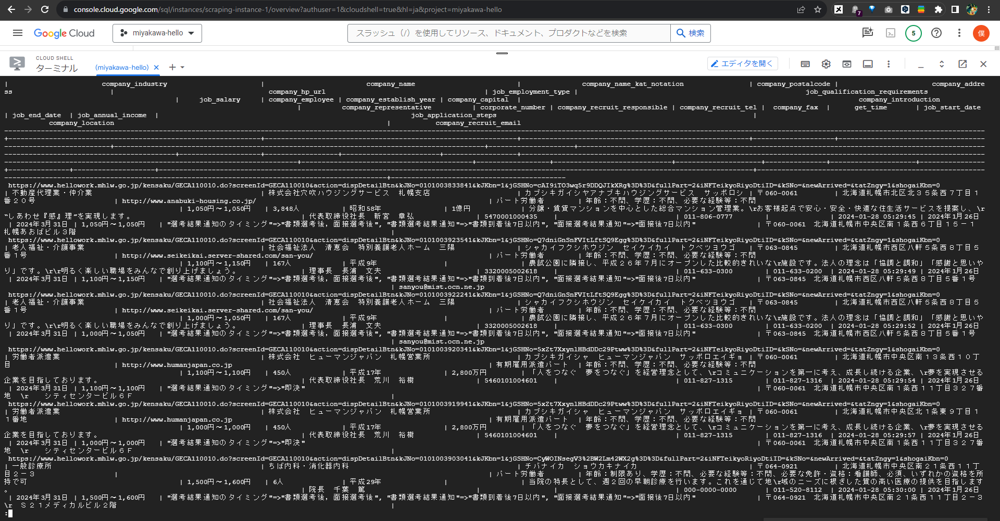

# 目次

0. [結論](#結論)
1. [概要](#概要)
2. [ワークログ](#ワークログ)
    - [hstoreという型](#hstoreという型)
    - [hstoreという型を使う際の罠](#hstoreという型を使う際の罠)
    - [罠の潜り方](#罠の潜り方)

# 0. 結論
文字コードのままデータベースに格納されるバグが解消した.



# 1. 概要
[F.16. hstore ](https://www.postgresql.jp/docs/9.6/hstore.html)

[PostgreSQLをPythonからpsycopg2を使っていじる — そこはかとなく書くよん。  ドキュメント ](https://tdoc.info/blog/2012/12/05/psycopg2.html)
 

[INTERN-190: 文字コードのまま保存されるバグを解消完了](https://remotesalesproject.atlassian.net/browse/INTERN-190)
 
# 2. ワークログ
前回のチケットでは，データベースにjsonファイルを保存するまで進んだ．

[INTERN-120: GCSのjsonデータをcloudSQLにインポートする完了](https://remotesalesproject.atlassian.net/browse/INTERN-120)
 
しかし，文字コードのままSQLに格納されるため，本チケットで解決に当たった．

## 2.0. hstoreという型
調査の中でhstore型を偶然発見．辞書のようにkeyとvalueをまとめて扱えるようだ．

以下は，前回の修正に更に修正を加えたjson_to_sql.pyだ．

```
import pandas as pd
from sqlalchemy import create_engine
from sqlalchemy.dialects.postgresql import HSTORE


# データベース接続情報
db_user = 'postgres'
db_password = 'パスワード'
db_name = 'scraping-result-db'
db_instance_ip = 'XX.XXX.XX.XX'
db_instance_name = 'SQLのインスタンス名'

# Google Cloud Storageからデータを読み込む
#json_file_path = f'gs://hellowork-bucket/scraping-log/test.json'

json_file_name = get_recently_log_filename()
print(json_file_name)

# Google Cloud Storageからデータを読み込む
json_file_path = f'gs://hellowork-bucket/test.json'
print(json_file_path)
df = pd.read_json(json_file_path, encoding='utf-8', orient='records')
print("read_jsonまで完了")
# DataFrameの処理
df['get_time'] = pd.to_datetime(df['get_time']).dt.strftime('%Y-%m-%d %H:%M:%S')

# SQLAlchemy Engineの作成
engine = create_engine(f'postgresql+psycopg2://{db_user}:{db_password}@{db_instance_ip}/{db_name}', echo=True)

# DataFrameのデータをCloud SQLのテーブルに挿入する
df.to_sql('scraping_result_tbl00', con=engine, if_exists='append', index=None, method='multi', chunksize=5000,
          dtype={'job_application_steps': HSTORE, 'company_recruit_responsible': HSTORE})

```

# 2.1. hstoreという型を使う際の罠
pandas.to_sqlはデータベースに指定したscraping_result_tbl00というテーブルがなくても，自動でデータベースにテーブルを作成してくれる．

しかし，HSTORE型を指定したto_sqlを実行する場合，テーブルがないままだとエラーになる．

sqlalchemy.exc.ProgrammingError: (psycopg2.errors.UndefinedObject) type "hstore" does not exist
LINE 19:  company_recruit_responsible HSTORE, 

 

> [SQL:
> CREATE TABLE scraping_result_tbl01 (
>         source_job_url TEXT,
>         company_industry TEXT,
>         company_name TEXT,
>         company_name_kat_notation TEXT,
>         company_postalcode TEXT,
>         company_address TEXT,
>         company_hp_url TEXT,
>         job_employment_type TEXT,
>         job_qualification_requirements TEXT,
>         job_salary TEXT,
>         company_employee TEXT,
>         company_establish_year TEXT,
>         company_capital TEXT,
>         company_introduction TEXT,
>         company_representative TEXT,
>         corporate_number TEXT,
>         company_recruit_responsible HSTORE,
>         company_recruit_tel TEXT,
>         company_fax TEXT,
>         get_time TEXT,
>         job_start_date TEXT,
>         job_end_date TEXT,
>         job_annual_income TEXT,
>         job_application_steps HSTORE,
>         company_location TEXT,
>         company_recruit_email TEXT
> )
>
> ]

エラーと一緒にSQL文が表示され，誘導されるが，以下のようにエラーになる．

> ERROR:  type "hstore" does not exist
> LINE 18:         company_recruit_responsible HSTORE,

#  2.2. 罠の潜り方
```
CREATE TABLE scraping_result_tbl01 (
        source_job_url TEXT, 
        company_industry TEXT, 
        company_name TEXT, 
        company_name_kat_notation TEXT, 
        company_postalcode TEXT, 
        company_address TEXT, 
        company_hp_url TEXT, 
        job_employment_type TEXT, 
        job_qualification_requirements TEXT, 
        job_salary TEXT, 
        company_employee TEXT, 
        company_establish_year TEXT, 
        company_capital TEXT, 
        company_introduction TEXT, 
        company_representative TEXT, 
        corporate_number TEXT, 
        company_recruit_responsible TEXT, 
        company_recruit_tel TEXT, 
        company_fax TEXT, 
        get_time TEXT, 
        job_start_date TEXT, 
        job_end_date TEXT, 
        job_annual_income TEXT, 
        job_application_steps TEXT, 
        company_location TEXT, 
        company_recruit_email TEXT
);
```

HSTORE型の設定もTEXT型でテーブルを作成してみると，hstore型でテーブルに格納できる． 

これは仕様なのかバグなのか情報が見当たらなかった．記事になりそうである．
