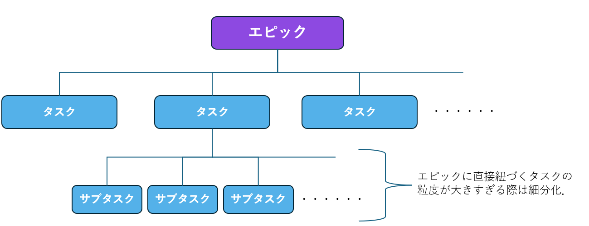

1. [結論](#0-結論)
2. [概要](#1-概要)
3. [ワークログ](#2-ワークログ)
    - [事前準備](#20-事前準備)
    - [オンボーディング内容](#21-オンボーディング内容)
        - [Slack](#210-slack)
        - [Jira](#211-jira)
        - [Jiraでのチケット作成ハンズオン](#212-jiraでのチケット作成ハンズオン)
        - [アカウント作成](#213-アカウント作成)
        - [Confluence](#214-confluence)
        - [Confluenceで自己紹介](#215-confluenceで自己紹介)
        - [Wantedlyでプロフィール作成](#216-wantedlyでプロフィール作成)
        - [スライドで自己紹介ページを作成](#217-スライドで自己紹介ページを作成)
        - [Eightの登録](#218-eightの登録)
        - [朝会の概要](#219-朝会の概要)
        - [GitHub Copilotの登録](#2110-GitHubCopilotの登録)
     
# 0. 結論
オンボーディングの事前準備と進行についてまとめた．

# 1. 概要
INTERN-257: オンボーディングの前準備と進行内容をコンフルに上げる
完了
 

# 2. ワークログ
## 2.0. 事前準備
オンボーディングの前に，メールアドレス・名刺の発行，稼働表への追加をカズさんにお願いしておく．

# 2.1. オンボーディング内容

### 2.1.0. Slack
オンボーディング対象がゲストアカウントであれば，pantarhei.coのアカウントでサインアップする．以下の閲覧していいチャンネルをカズさんに設定してもらう．

・general: 株主を含めた社内の全員が見る場所（基本的にここでメッセージを打つことはない）

・random: X（旧ツイッター）のようにつぶやいて会社を盛り上げる場所．

・stackoverflow: 質問する場所．

・インターン: インターン生は基本的にここでメッセージをやり取りする．

・タスク管理: Jiraのログが残る．

・思い出写真一覧: イベントなどの写真を共有する場所．

・git-log: githubのログが残る．

メンション(@名前)を付けて書き込むことを忘れないように

### 2.1.1. Jira
まずは，Jiraのプロジェクトに招待してもらう．

弊社のJiraでは基本的にBACKLOG，TO DO，進行中，レビュー中，完了の５つのフェーズを左から右へ進めていく．ただし，場合によってはフェーズを戻ることがある．

業務をする前に，BACKLOGのスペースでチケットを作成する．チケットには，エピックとタスクの２種類がある．

| 項目 | エピック | タスク |
|------|----------|--------|
| マーク | エピックマーク | タスクマーク |
| 期間の規模 | 1ヶ月から2ヶ月まで | 最大2週間まで |
| 時間の管理 | Story pointと期限を設定する （Story pointについては表の右側で記述） | Story point(単位:時間)をフィボナッチ数列(1,2,3,5,8,13)から設定する （フィボナッチ数列の値はタスクの細分化がしやすいため） |
| 制約 | 子課題としていくつかのタスクを追加する。 | タスクが大きい場合は、エピックにすることがある。また、1つのタスク業務を分担する場合、子課題としてタスクを追加できる。ただし、タスクの子課題は1階層のみ。 |

また，エピックもタスクもどちらも担当者と優先度を設定する．親チケットには，業務をする背景とゴールを設定する．

### 2.1.2. Jiraでのチケット作成ハンズオン
オンボーディングについてのエピックをオンボーディング担当者が作成して．2.1.3.から実施することをJiraでチケット作成してみる．

### 2.1.3. アカウント作成
以下のアカウントをpantarhei.coのアドレスで作成する．

・wantedly（後に自己紹介ページを作成）

・qiita

・GitHub

※組織の紐づけも実施する．

### 2.1.4. Confluence
pantarhei.coのアドレスでアカウントを作成したら，インターンチームに招待してもらう．
Confluenceはマニュアルや作業ログを残しておくのに利用する．

書き方にはいくつか形式や決まりがある．

・見出しには番号をつける

・jiraとの紐づける（Confluenceの概要にjiraのURLを貼り付ける）

・題名の書式は”INTERN-番号 jiraのチケット名”

### 2.1.5. Confluenceで自己紹介
Confluenceの書き方をハンズオンするために，Confluenceで自己紹介ページを作成する．既存の自己紹介ページのレイアウトを真似て作成する．

### 2.1.6. Wantedlyでプロフィール作成
作成したアカウントでWantedlyのプロフィールページを作成する．

### 2.1.7. スライドで自己紹介ページを作成
インターン生紹介スライド(以下にURLあり)にも，インターン生の紹介ページを作成する．既存のページをコピーして修正すると良い．

[https://docs.google.com/presentation/d/1GKnf-_hsHWS8yKLq7g5AZggbvkBGxKQv/edit#slide=id.g2675183ab00_0_28](https://docs.google.com/presentation/d/1GKnf-_hsHWS8yKLq7g5AZggbvkBGxKQv/edit#slide=id.g2675183ab00_0_28)`ご使用の Google アカウントを接続`

### 2.1.8. Eightの登録
名刺が発行されたら，Eightの登録をする．名刺を半自動的に電子化する事ができる．

### 2.1.9. 朝会の概要
朝会では，状態・今日までやったこと・今日やること・今日のゴール・その他お知らせを簡単に発表する．状態には，ディレイ・オンスケ・巻きがある．

| 状態 | 説明 |
|------|------|
| ディレイ | 予定より遅れて進行中 |
| オンスケ | 予定通り |
| 巻き | 予定より進んでいる |

### 2.1.10. GitHubCopilotの登録
学生無料でできるのでその申請を行う（下記のリンク参照）
[https://qiita.com/SNQ-2001/items/796dc5e794ac3f57a945]

