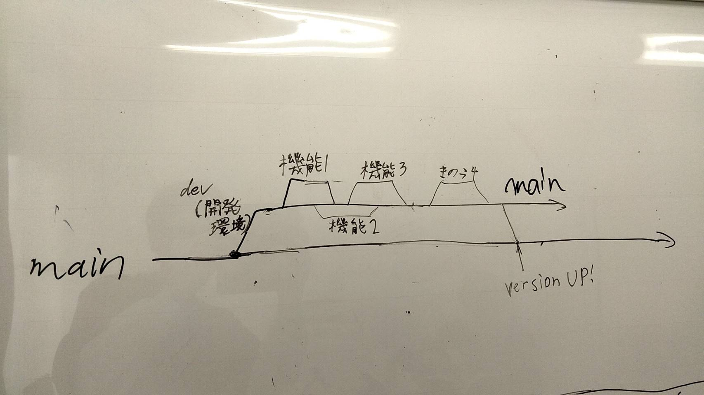

- [0. 結論](#0-結論)
- [1. 概要](#1-概要)
- [2. ワークログ](#2-ワークログ)
  - [2.0. GitとGitHub](#20-gitとgithub)
  - [2.1. 用語の確認](#21-用語の確認)
  - [2.2. ブランチの全体像](#22-ブランチの全体像)
  - [2.3. ファイル（フォルダ）更新の流れ（クローン作成からマージまで）](#23-ファイルフォルダ更新の流れクローン作成からマージまで)
    - [2.3.0. GitHubと自分のPCをSSH接続しておく。](#230-githubと自分のpcをssh接続しておく)
    - [2.3.1. GitHubからクローンを作成する。もしくは、リモートのブランチをpullする。](#231-githubからクローンを作成するもしくはリモートのブランチをpullする)
    - [2.3.2. リポジトリの内容を変更（編集・追加・削除）する。](#232-リポジトリの内容を変更編集追加削除する)
    - [2.3.3. 変更したファイルをステージング状態にする。](#233-変更したファイルをステージング状態にする)
    - [2.3.3. コミットする。](#233-コミットする)
    - [2.3.4. 変更をGitHub上に公開しよう。](#234-変更をgithub上に公開しよう)
    - [2.3.5. 責任者に確認する。](#235-責任者に確認する)
  - [2.4. その他のコマンド](#24-その他のコマンド)
    - [2.4.0. git init](#240-git-init)
    - [2.4.1. データを元に戻す](#241-データを元に戻す)
    - [2.4.2. ブランチ名の変更](#242-ブランチ名の変更)
    - [2.4.3. ステージングの取り消し](#243-ステージングの取り消し)
    - [2.4.3. コミットの取り消し](#243-コミットの取り消し)
  - [2.5. コンフリクト解消](#25-コンフリクト解消)
  - [2.6. “.gitignore”](#26-gitignore)

# 0. 結論
・最初はgitのコマンドは5つ+「pull request」覚えればいい。

  ・git pull

  ・git checkout

  ・git add

  ・git commit

  ・git push

・GitHubを用いたファイル・フォルダ更新の流れを理解しよう。

・大まかに理解したら使ってみよう。

# 1. 概要
[INTERN-61: GitHubの概要についてまとめる完了](https://pantarhei-hub.atlassian.net/browse/INTERN-61)
 
[INTERN-259: GitHubの使い方完了](https://pantarhei-hub.atlassian.net/browse/INTERN-259)
 
[【Git】Windows環境でGitHubにSSH接続してコミットするまでの手順 - Qiita ](https://qiita.com/hollyhock0518/items/a3fee20951cd92c87ed9)

[Git.gitignoreの仕様詳解 - Qiita](https://qiita.com/anqooqie/items/110957797b3d5280c44f) 

かずさんからGitHubの概念について教えをいただいた。


# 2. ワークログ
## 2.0. GitとGitHub
・Git：ソースコードのバージョンを管理するツール。以下のメリットがある。

  ・変更してはいけないコードを変更してしまったときにもとに戻せる。

  ・変更前のソースコードとの違いがわかる。

・GitHub：Gitで管理されているソースコードをWeb上でアップロードして、共有するプラットフォーム。また、他者が作ったソースコードをダウンロードすることで変更が可能。バックアップとして使用することもできる。

 
## 2.1. 用語の確認
・リポジトリ：　管理したいコードやフォルダの1まとまりのこと。

・ブランチ（branch）：　英語では枝という意味。分岐させた変更の履歴のこと。

・コミット（commit）：　変更・追加・削除の内容を保存すること。

・マージ（merge）：　新しいブランチでの変更部分を派生元ブランチに反映すること。pullリクエストが承諾されて初めてマージされるようにする。（後述あり）

## 2.2. ブランチの全体像



・main（master）ブランチ：　公開して共有しているリポジトリのこと。このブランチから直接、ソースコードの変更・追加してはいけない。ソースコードの変更・追加をするためには後述する更新の流れに従わなければならない。

・devブランチ：　mainブランチから派生させたブランチのこと。開発環境として利用される。機能を追加したい際、ここから新しいブランチを派生させる。いくつか機能をdevに追加したら、まとめてmainブランチにマージする。

・新しいブランチ（featureブランチ）：　機能毎に作られるブランチ。必ずdevブランチから派生させる。mainブランチをベースにdevブランチを作ってソースコードの変更・追加をしていく。pullリクエストが承諾されてから変更や追加がdevブランチに反映させる（マージ）。

 ## 2.3. ファイル（フォルダ）更新の流れ（クローン作成からマージまで）

 

 ### 2.3.0. GitHubと自分のPCをSSH接続しておく。
今後のことを考えて、PCをSSH接続しておくと良い。Windowsの場合は以下の記事が参考になる。公開鍵を作るまで進めておこう。

[【Git】Windows環境でGitHubにSSH接続してコミットするまでの手順 - Qiita  ](https://qiita.com/hollyhock0518/items/a3fee20951cd92c87ed9)

### 2.3.1. GitHubからクローンを作成する。もしくは、リモートのブランチをpullする。

```
git clone GitHubのURL(SSH)
```

これによりクローンとしてGitHubのリポジトリ全体をローカルに作成できる。ただし、これは最初の1回だけ行う。

2回目以降は下のコードで、他者が変更したブランチだけをローカルにダウンロードする。

```
git pull origin ブランチ名
```

こうすることで作成または更新されたローカルリポジトリはセーブされた状態になる。（originはリモートリポジトリのデフォルトの名前）

下のコードでローカルリポジトリのブランチの確認ができる。

```
git status
```

gitコマンドの入力が拒否される場合，環境変数に以下を追加する．

```
C:\Program Files\Git\cmd
 C:\Program Files\Git\mingw64\bin
 C:\Program Files\Git\usr\bin
```


### 2.3.2. リポジトリの内容を変更（編集・追加・削除）する。
リポジトリの内容を変更する前に、ブランチを作成しよう。まずは、

```
git branch
```

で今いるブランチを確認する。

**新しいブランチを作成するときは、そのブランチの派生元のブランチにいることを確認しよう。**
派生元のブランチにいることが確認できたら、下のコードを実行し、現在いるブランチから新しいブランチを作成する。

```
git checkout -b 新しいブランチ名

例）git checkout -b feature/機能名
#  git checkout -b feature/login_page
```

派生元のブランチにいない場合は、下のコードを実行することで現在いるブランチを変更できる。

```
git checkout 移動先のブランチ名
```

その後、新しいブランチで必要に応じて、リポジトリの中のコードを編集したり、新しくファイルを作成したり削除したりする。

### 2.3.3. 変更したファイルをステージング状態にする。
変更が済んだらこれからcommitするが、その前に、変更対象のファイルまたはフォルダを予約しておく必要がある。コミットの予約をしている状態を
**ステージング**
という。

ローカルリポジトリのファイルまたはフォルダをステージング状態にしたいときは、以下のコードを実行する。

```
git add ファイル名またはフォルダ名
```

また、変更のあった全てのファイルをaddする場合は以下のコードを実行する。

```
git add -A
# または git add .
```

git add -Aとgit add .は厳密には違う。

### 2.3.3. コミットする。
ステージング状態のファイルやフォルダをローカル上でセーブ状態にしよう。以下のコードを実行し、コミットする。

```
git commit -m ”変更内容に関するメッセージ”
```

### 2.3.4. 変更をGitHub上に公開しよう。
ローカル上でcommitが終わったら、GitHub上に公開する（push）。

```
git push リポジトリ名 ローカルブランチ名

例) git push origin main
```

参照：[【Gitの使い方②】git pushコマンド | エンベーダー ](https://envader.plus/course/5/scenario/1056)

### 2.3.5. 責任者に確認する。
ここまでいけば、あと少し。開発したブランチを責任者に反映してもらうためにプルリクエスト（プルリク）を送る。これは忘れてmergeしてはいけない。必ずプルリクを出して、責任者やチームメンバにOKがもらえてからマージしよう。プルリクとマージはコマンドよりUIで出すことが多い。

どのブランチからどのブランチにマージしているかに注意！！！

## 2.4. その他のコマンド
### 2.4.0. git init

カレントディレクトリの中をGitで管理するようになる。

```
git init
```

これを実行すると、カレントディレクトリの中に”.git”が追加される。

ディレクトリをGitで管理しなくなった際は、”.git”を削除することで叶う。

### 2.4.1. データを元に戻す
変更した内容がおかしくなってしまったので、変更前に戻したいという場合は、

```
git log
```

で戻したいcommitのコミットIDを調べて、

```
git reset --hard コミットID
```

を実行することで、指定したコミットの状態に戻すことができる。

hardを指定すると、データをある地点に戻したというlogは残らないので注意。

### 2.4.2. ブランチ名の変更
下のコマンドで、現在いるブランチの名前を変更することができる。

```
git branch -m 新しいブランチ名
```

### 2.4.3. ステージングの取り消し
[git add を取り消す - Qiita ](https://qiita.com/yukure/items/89562e5eb1d03995dc5b)

2.4.3. コミットの取り消し
[Gitコミットの取り消し、打ち消し、上書き - Qiita ](https://qiita.com/shuntaro_tamura/items/06281261d893acf049ed)

## 2.5. コンフリクト解消
コンフリクトが起きた場合、リモート上での解消はなるべくせず、ローカル上でコンフリクトを解消しよう。

1.git pull origin ブランチ名

2.git merge 修正したブランチ名でローカル上でmerge

3.コンフリクト解消

4.git push リポジトリ名 ローカルブランチ名でリモートへpush

5.pull request & merge

2.6. “.gitignore”
.gitignoreにファイルやフォルダを登録しておくことで、Gitで管理しないようできる。一般的に".gitignore“は".git“があるフォルダと同じフォルダに置いておく。

登録対象が、ファイルの場合は

```
/ファイル名
```

フォルダの場合は

```
/フォルダ名/
```

と記入する。

.gitignoreがあるディレクトリからの相対パスで書く。

詳細：[Git .gitignoreの仕様詳解 - Qiita ](https://qiita.com/anqooqie/items/110957797b3d5280c44f)
