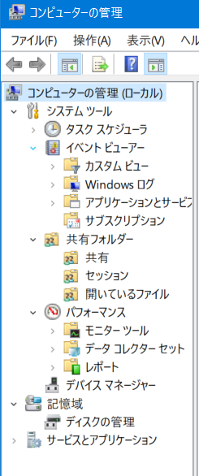

# 目次

0. [結論](#結論)
1. [概要](#概要)
2. [ワークログ](#ワークログ)

# 0. 結論
Docker環境が整った．

[よく使うDockerコマンド - Qiita ](https://qiita.com/tera_shin/items/8a43e904bd15990d3129)

[【入門】VSCodeでDocker環境構築 - Qiita](https://qiita.com/tsuyotobi26/items/9d48fa676f4d55170b5e)

[Dockerを起動したら、docker-usersをグループにいれてと言われたときの対処方法 - Qiita  ](https://qiita.com/mNaga/items/5403e5d1aa18aba5e35c)

[Docker for Windowsで起動時に「Docker for Windows - Access denied」と表示される場合の対処法 - Qiita  ](https://qiita.com/toro_ponz/items/d75706a3039f00ba1205)

[Windows での Docker クライアント エラーのトラブルシューティング - Visual Studio  ](https://learn.microsoft.com/ja-jp/troubleshoot/developer/visualstudio/ide/troubleshooting-docker-errors)

# 1. 概要
[INTERN-323: DockerのインストールとVSCでのセットアップ完了](https://remotesalesproject.atlassian.net/browse/INTERN-323)
 

# 2. ワークログ 
Docker desktopのインストールまでは問題なくできた．しかし，Docker desktop起動すると，次のエラーが出てしまい，うまく起動されない．

調べてみると，実行するユーザーが管理者ユーザー出ない場合は，Docker-groupにユーザーを追加する必要があるようだ．

そこで，Docker-groupにユーザーを追加する方法を調べた．

[Dockerを起動したら、docker-usersをグループにいれてと言われたときの対処方法 - Qiita ](https://qiita.com/mNaga/items/5403e5d1aa18aba5e35c)

[Docker for Windowsで起動時に「Docker for Windows - Access denied」と表示される場合の対処法 - Qiita ](https://qiita.com/toro_ponz/items/d75706a3039f00ba1205)

上の記事では「コンピューターの管理」の「ローカルユーザーとグループ」から操作するようだが，どう見ても「ローカルユーザーとグループ」という項目が存在しない．

 どうやら，Windows10 homeにはないので，下のサイトのようにコマンドで実行するしかないようだ．

Windows での Docker クライアント エラーのトラブルシューティング - Visual Studio 

上のサイトを見て，管理者としてコマンドプロンプトを起動し，ユーザーを追加できた．

しかし，Docker Desktopが以前と同じエラーにより，起動しない．

結局，Docker Desktopを管理者として実行することで，無事に開くことができた．

 

