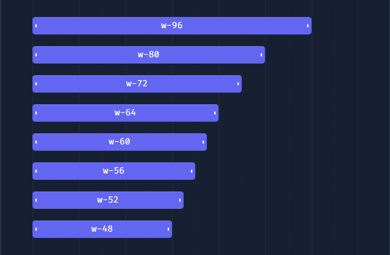

*   1 [0\. 結論](#0.-結論)
*   2 [1\. 概要](#1.-概要)
*   3 [2\. 技術一覧表](#2.-技術一覧表)
*   4 [2\. メモ](#2.-メモ)
    *   4.1 [フォント](#フォント)
        *   4.1.1 [Google Font API](#Google-Font-API[inlineCard])
    *   4.2 [その他](#その他)
        *   4.2.1 [Prism](#Prism[inlineCard])
        *   4.2.2 [Webpack](#Webpack[inlineCard])
    *   4.3 [JavaScriptグラフィックス](#JavaScriptグラフィックス)
        *   4.3.1 [Chart.js](#Chart.js[inlineCard])
    *   4.4 [CDN](#CDN)
        *   4.4.1 [Cloudflare](#Cloudflare[inlineCard])
        *   4.4.2 [cdnjs](#cdnjs[inlineCard])
        *   4.4.3 [jsDelivr](#jsDelivr[inlineCard])
    *   4.5 [JavaScriptライブラリ](#JavaScriptライブラリ)
        *   4.5.1 [Zepto](#Zepto[inlineCard])
        *   4.5.2 [core-js](#core-js[inlineCard])
    *   4.6 [UIフレームワーク](#UIフレームワーク)
        *   4.6.1 [Tailwind CSS](#Tailwind-CSS[inlineCard])

# 0\. 結論

*   Vue
    
*   Nuxt
    
*   Tailwind CSS
    
*   sass
    

を使用しいる。

# 1\. 概要

[INTERN-62: leadknock-frontendの調査Done](https://remotesalesproject.atlassian.net/browse/INTERN-62)

# 2\. 技術一覧表

[Find out what websites are built with - Wappalyzer](https://www.wappalyzer.com/)  
上記を使用したところ、

Open image-20231027-125516.png


こんな感じらしい。  
Versionが書かれてないので、`leadknock-frontend/package.json`を見てわかるやつだけ抜粋。

*   Vue : `2.6.14`
    
*   Nuxt : `2.15.8`
    
*   Webpack : `4.46.0`
    
*   Chart.js : `2.7.1`
    
*   core-js : `3.19.3`
    
*   Tailwind CSS : `5.0.2`
    

となっている。

Node.jsに関しては特に指定はなかったが、最新バージョンでやったら`yran install`ではじかれたので`v16.20.2`で実装している。

上記の図以外にも使われていたのでメモ

*   sass : `1.50.0`
    

`leadknock-frontend/assets/css`に`scss`ファイルが記述されている。  
[https://zenn.dev/milkandhoney995/articles/75880432c6c186](https://zenn.dev/milkandhoney995/articles/75880432c6c186)

  
自分で確認できる範囲だと

*   Vue
    
*   Nuxt
    
*   Tailwind CSS
    
*   sass
    

は、確定で使っていることが分かった。

# 2\. メモ

## フォント

### Google Font API[https://developers.google.com/fonts?hl=ja](https://developers.google.com/fonts?hl=ja)

[https://developers.google.com/fonts/docs/getting\_started?hl=ja](https://developers.google.com/fonts/docs/getting_started?hl=ja)

```
<html>
    <head>
        <meta charset="utf-8">
        <link rel="stylesheet" href="https://fonts.googleapis.com/css?family=Tangerine">
        <style>
            body {
                font-family: 'Tangerine', serif;
                font-size: 48px;
            }
        </style>
    </head>
    <body>
        <div>Making the Web Beautiful!</div>
    </body>
</html>
```

`link`タグの`href`で使いたいフォントの`url`を指定するだけで使える。

## その他

### Prism[https://prismjs.com/](https://prismjs.com/)

[https://qiita.com/taqumo/items/825c862517ba9d8567a1](https://qiita.com/taqumo/items/825c862517ba9d8567a1)  
よくわからんけど、シンタックスハイライトとやらができるらしい。

**シンタックスハイライト**  
テキストエディタの機能であり、テキスト中の一部分をその分類ごとに異なる色やフォントで表示するもの。

### Webpack[https://webpack.js.org/](https://webpack.js.org/)

webpack とは、一言で言うと JavaScript 向けのモジュールバンドラーです。  
複数の JavaScript モジュールを一つ（またはいくつか）のファイルへバンドル（=bundle: 束にする、包む）してくれます。


_複数の JS モジュールを（場合によっては CSS や画像などのアセット類も）一つにまとめる_

**メリット**

*   モジュールを 1 つ（もしくは少数）にまとめることでブラウザからのリクエスト数を減らし、ファイル転送の効率が向上
    
*   ES Modules や CommonJS 形式のモジュールなど、さまざまな形式のモジュールに対応
    
*   上記の JS モジュールのみならず、CSS や画像ファイルもバンドルすることができる
    

[https://zenn.dev/sprout2000/articles/9d026d3d9e0e8f](https://zenn.dev/sprout2000/articles/9d026d3d9e0e8f)

## JavaScriptグラフィックス

### Chart.js[https://www.chartjs.org/](https://www.chartjs.org/)

Chart.jsを使用すると、簡単に、綺麗なグラフを描画することができる！  
例えば以下の5種類グラフの描画などができる。

*   折れ線グラフ
    
*   棒グラフ
    
*   円グラフ
    
*   レーダーチャート
    
*   散布図
    

[https://qiita.com/Haruka-Ogawa/items/59facd24f2a8bdb6d369](https://qiita.com/Haruka-Ogawa/items/59facd24f2a8bdb6d369)

leadknockだとKPIのページで使ってそう。

## CDN

**CDNとは**[https://qiita.com/kannagi/items/c132b594720d9965509e#:~:text=2021%2D06%2D24-,CDN%E3%81%A8%E3%81%AF%EF%BC%9F,%E3%81%AA%E3%81%A9%E3%81%AE%E5%88%A9%E7%82%B9%E3%81%8C%E3%81%82%E3%82%8B%E3%80%82](https://qiita.com/kannagi/items/c132b594720d9965509e#:~:text=2021%2D06%2D24-,CDN%E3%81%A8%E3%81%AF%EF%BC%9F,%E3%81%AA%E3%81%A9%E3%81%AE%E5%88%A9%E7%82%B9%E3%81%8C%E3%81%82%E3%82%8B%E3%80%82)  
CDNとはContent Delivery Networkの略で、ウェブコンテンツを高速かつ効率的に配信できるように最適化されたネットワーク。

JavaScriptのCDNの場合、下記のようなやつ  
`<script src="https://ajax.googleapis.com/ajax/libs/jquery/3.3.1/jquery.min.js"></script>`  
  

### Cloudflare[https://www.cloudflare.com/ja-jp/](https://www.cloudflare.com/ja-jp/)

よくわからんけど、セキュリティ対策できらしい。  
無料で結構使えるらしい。

### cdnjs[https://cdnjs.com/](https://cdnjs.com/)

cdnjsは3000以上のJavaScriptライブラリがCDNとして集約されている。  
[https://blog.ver001.com/cdnjs\_jsdelivr/](https://blog.ver001.com/cdnjs_jsdelivr/)

めちゃ便利やん。

### jsDelivr[https://www.jsdelivr.com/](https://www.jsdelivr.com/)

必要なパッケージをまとめてインポートできるらしい。

[https://note.com/shun535/n/nb4a20b3930c0](https://note.com/shun535/n/nb4a20b3930c0)

cdnjsに入っていないライブラリが欲しい時に使うのかな？

## JavaScriptライブラリ

### Zepto[https://zeptojs.com/](https://zeptojs.com/)

jQueryを軽量化したライブラリらしい

[https://monomonotech.jp/kurage/old\_contents/konashi\_jquery.html](https://monomonotech.jp/kurage/old_contents/konashi_jquery.html)

### core-js[https://github.com/zloirock/core-js](https://github.com/zloirock/core-js)

core-jsはオープンソースのJavaScriptライブラリであり、古いブラウザでもJavaScriptの最新機能を使えるようにする。

[https://jipsti.jst.go.jp/sti\_updates/2023/03/14075.html#:~:text=core%2Djs%E3%81%AF%E3%82%AA%E3%83%BC%E3%83%97%E3%83%B3%E3%82%BD%E3%83%BC%E3%82%B9,%E4%BE%9D%E5%AD%98%E9%96%A2%E4%BF%82%E3%81%8C%E3%81%82%E3%82%8B%E3%81%A8%E3%81%84%E3%81%86%E3%80%82](https://jipsti.jst.go.jp/sti_updates/2023/03/14075.html#:~:text=core%2Djs%E3%81%AF%E3%82%AA%E3%83%BC%E3%83%97%E3%83%B3%E3%82%BD%E3%83%BC%E3%82%B9,%E4%BE%9D%E5%AD%98%E9%96%A2%E4%BF%82%E3%81%8C%E3%81%82%E3%82%8B%E3%81%A8%E3%81%84%E3%81%86%E3%80%82)

IEとかからのアクセスされてもある程度の動作を保証するてきなやつ。

## UIフレームワーク

### Tailwind CSS[https://tailwindcss.com/](https://tailwindcss.com/)

**TailwindCSS**はclassの中にstyleを指定していく。



右を実行すると上記のようになる。

めちゃ簡単

```
<div class="space-y-4">
    <div class="w-96 bg-white shadow rounded">
        w-96
    </div>
    <div class="w-80 bg-white shadow rounded">
        w-80
    </div>
    <div class="w-72 bg-white shadow rounded">
        w-72
    </div>
    <div class="w-64 bg-white shadow rounded">
        w-64
    </div>
    <div class="w-60 bg-white shadow rounded">
        w-60
    </div>
    <div class="w-56 bg-white shadow rounded">
        w-56
    </div>
```