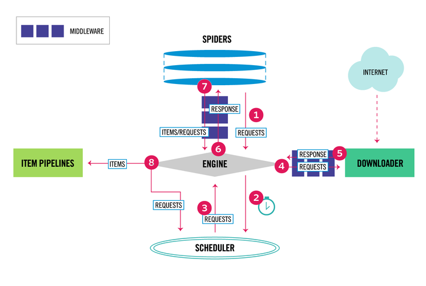
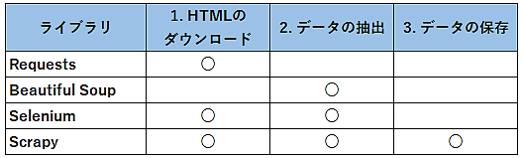

*   1 [0\. 結論](#0.-結論)
*   2 [1\. 概要](#1.-概要)
*   3 [2\. 用語](#2.-用語)
    *   3.1 [クローリングとスクレイピングとパース](#クローリングとスクレイピングとパース)
    *   3.2 [SpiderとItemsとPipeline](#SpiderとItemsとPipeline)
    *   3.3 [その他](#その他)
*   4 [3\. スクレイピングのライブラリ](#3.-スクレイピングのライブラリ)
*   5 [4\. 流れ](#4.-流れ)
    *   5.1 [htmlの取得](#htmlの取得)
    *   5.2 [データの抽出](#データの抽出)
    *   5.3 [データの保存](#データの保存)
*   6 [99\. 参考文献](#99.-参考文献)

# 0\. 結論

スクレイピング関連の用語と全体像を理解した。結果を以下にまとめておく。

# 1\. 概要

知識ゼロからスクレイピング関連の用語やスクレイピングの流れを理解したのでまとめておく。

[INTERN-63: スクレイピングの全体像と用語Done](https://remotesalesproject.atlassian.net/browse/INTERN-63)

# 2\. 用語

## クローリングとスクレイピングとパース

似た言葉だが、きちんと理解したほうがいいだろう。

*   クローリング： Web上の複数のサイトを巡回し、htmlを取得し、保存すること。
    
*   スクレイピング： 取得したhtmlから特定の情報をピックアップする技術。
    
*   パース： スクレイピングによってピックアップした情報を解析すること。
    

※ ただ文脈によっては、スクレイピングをクローリングも含めて広義に扱われることもあるようだ。

## SpiderとItemsとPipeline

[10分で理解する Scrapy - Qiita](https://qiita.com/Chanmoro/items/f4df85eb73b18d902739) を熟読し、簡単にまとめた。

*   Spider： どのようにサイトを巡って（リクエスト）、ページの内容（リスポンス）をどう解析（パース）するのかについて記述したもの。
    
*   Items： スクレイピングで取得したデータをどのように蓄積させるか定義したモデル。スクレイピングで取得したデータはこのItemsに保管される。パースしやすいようにItemsを決めよう。
    
*   Pipeline： Items内のデータを受け取り、何らかの処理を行うコード。
    

[アーキテクチャ概観 — Scrapy 1.7.3 ドキュメント](https://doc-ja-scrapy.readthedocs.io/ja/latest/topics/architecture.html)

詳しくは、ドキュメントのアーキテクチャ概観を参照。

## その他

*   クレンジング：破損したデータ、不正確なデータ、無関係のデータを特定して解決する手法。
    

# 3\. スクレイピングのライブラリ

スクレイピング・クローリングには、様々なライブラリがあるが、ライブラリscrapyはスクレイピング・クローリングの一部始終を担当できる。

[図解！Python Scrapyの使い方を徹底解説！(サンプルコード付きチュートリアル)](https://ai-inter1.com/python-scrapy-for-begginer/#st-toc-h-1)

# 4\. 流れ

## htmlの取得

Webサイトのhtmlを取得する。

## データの抽出

htmlのtagやclass・idなどの情報を使ってデータを抽出する。

## データの保存

データレイクに保存する。

# 99\. 参考文献

[図解！Python Scrapyの使い方を徹底解説！(サンプルコード付きチュートリアル)](https://ai-inter1.com/python-scrapy-for-begginer/#st-toc-h-1)

[知らないと危ない？Webスクレイピング開発のメリットと注意点を解説 - システム開発のプロが発注成功を手助けする【発注ラウンジ】](https://hnavi.co.jp/knowledge/blog/scraping-development/#title1)

[クローリングとスクレイピングの違いとは？意味から具体的な例まで解説します。 | GeeklyMedia(ギークリーメディア) | Geekly（ギークリー） IT・Web・ゲーム業界専門の人材紹介会社](https://www.geekly.co.jp/column/cat-technology/1912_011/#-)

[10分で理解する Scrapy - Qiita](https://qiita.com/Chanmoro/items/f4df85eb73b18d902739)