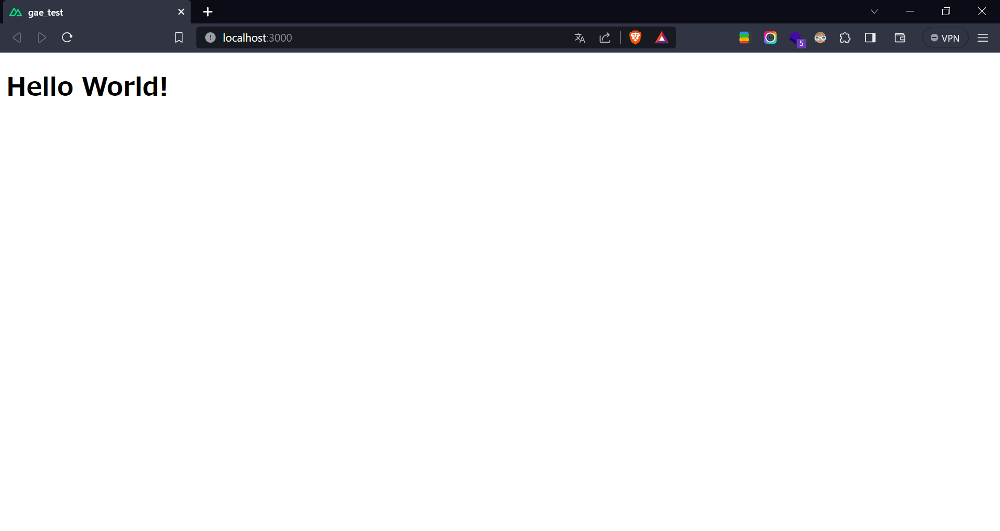
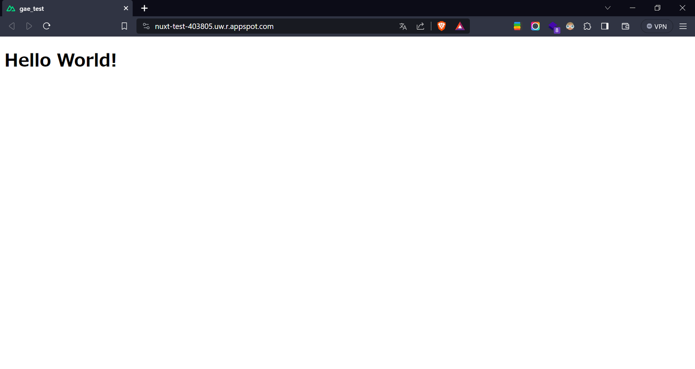

*   1 [0. 結論](#0.結論)
*   2 [1. 概要](#1.概要)
*   3 [2. メモ](#2.メモ)

# 0. 結論

できた

https://nuxt-test-403805.uw.r.appspot.com/ 

# 1. 概要

https://pantarhei-hub.atlassian.net/browse/INTERN-87 

参考
https://qiita.com/shin1kt/items/a523475f5e16f6ee43a0 

https://v2.nuxt.com/ja/deployments/google-appengine/ 

# 2. メモ

leadkockに習ってNuxt2でプロジェクト作成


とりあえずHello Worldでローカルで実行を確認

Qiitaを参考にしながらapp.yaml作成

```
runtime: nodejs16

instance_class: F1

handlers:
  - url: /_nuxt
    static_dir: .nuxt/dist/client
    secure: always

  - url: /(.*\.(gif|png|jpg|ico|txt))$
    static_files: static/\1
    upload: static/.*\.(gif|png|jpg|ico|txt)$
    secure: always

  - url: /.*
    script: auto
    secure: always

env_variables:
  HOST: '0.0.0.0'
```

nodeのversionは16に書き換えてる
GCPで`nuxt-test`というプロジェクトを作成

1.`gcloud init`で初期化してプロジェクト選択

2.`gcloud app create --project=nuxt-test-403805サーバはus-west1`を

3.`ビルドしてデプロイするためのファイルを書き出しyarn build`

4.デプロイ 　`gcloud app deploy`

5.閲覧 `gcloud app browse`


