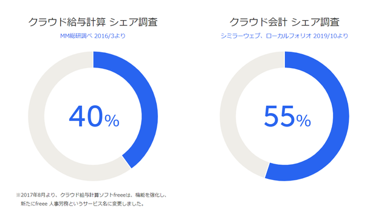

- [0. 結論](#0-結論)
- [1. 概要](#1-概要)
- [2. ワークログ](#2-ワークログ)

# 0. 結論

 トップページは動画のほうが良い。文字のない動画が良い。近未来的な動画か、プロジェクションで投影している動画など良いのでは。目に見えないものを映し出すみたいな。

# 1. 概要

[INTERN-56: 商材を取り扱う会社のホームページの特徴分析Done](https://remotesalesproject.atlassian.net/browse/INTERN-56)

 saas企業に絞り使われている画像などを調べる。

項目

aトップページに使われている画像

b会社理念に使われている画像

c商材の所に使われている画像

# 2. ワークログ

 [今年注目の国内SaaS企業15選！提供サービスや企業の特徴をご紹介 | 株式会社キャリア・エックス](https://career-x.co.jp/saas/article2/)

ここに上がっている会社を調べる。

1.  [サイボウズ株式会社](https://cybozu.co.jp/)
    
    1.  イベント紹介、TVCM
        
    2.  文字が主体で背景が水玉模様
        
    3.  デバイス（パソコンとスマホ）に商材の画面表示
        
    4.  トップページに会社概要など書いてなかった
        
2.  [Sansan株式会社](https://jp.corp-sansan.com/)
    
    1.  企業動画[Sansan 2023 企業ブランドCM「新しい景色へ」篇 30秒](https://www.youtube.com/watch?v=oK68XJcf79Q) (電車通勤、オフィスでの仕事など仕事関係の動画)
        
    2.  オフィス街の夕焼けの空（文字が多い、基本的に画像なし）
        
    3.  各部門ごとに動画があってその動画を張っている。（あまり参考にできない、動画を作る時間がない）
        
    4.  トップページに会社概要など書いてなかった
        
3.  [企業の成長を支援するクラウドサービス | 株式会社ラクス](https://www.rakus.co.jp/)
    
    1.  広告など
        
    2.  トップページでは会議をしているときの写真を使っている。
        
        1.  オフィス街の空（企業の成長を継続的に支援なのでせいちょうしてオフィス街になるようなイメージ）
            
    3.  クラウド事業ではスマホの画像とそのシステムのホームページの画像、IT人材派遣事業では人の画像を載せている。
        
4.  [フリー株式会社](https://corp.freee.co.jp/)
    
    1.  取引会社の画像
        
    2.  トップページにはない
        
        1.  
            
    3.  このページみたいにあるみたいに現状などを載せてもいいかもしれない
        
        1.  [サービス | フリー株式会社](https://corp.freee.co.jp/service/)
            
        2.  Open image-20231028-063445.png
            
            
